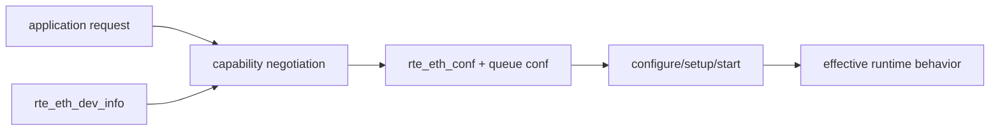
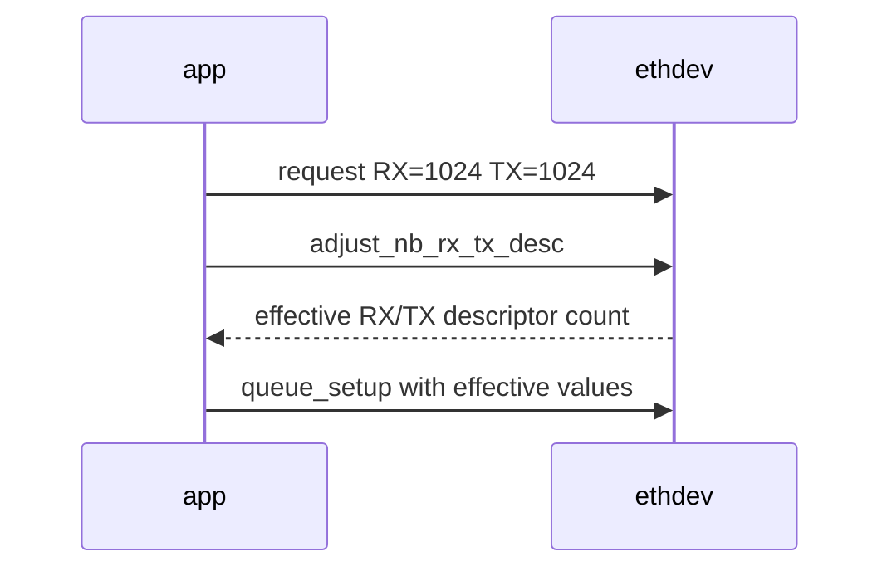
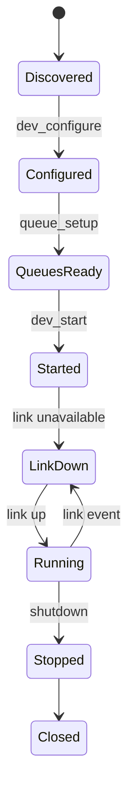

# Ethdev 能力协商与端口配置

## 1. 核心原则

DPDK 应用不能假设“代码写了一个配置，所有 PMD 都支持”。正确模型是：读取 capability，计算应用请求与设备支持的交集，调整 descriptor/queue 参数，再启动并记录最终配置。



## 2. 初始化顺序

```text
rte_eth_dev_info_get
-> choose RX/TX queue count
-> intersect requested offloads with capabilities
-> rte_eth_dev_configure
-> rte_eth_dev_adjust_nb_rx_tx_desc
-> RX queue setup with mempool
-> TX queue setup
-> set MTU/promiscuous when required
-> rte_eth_dev_start
-> query link and stats baseline
```

每个调用都检查返回值。失败信息应包含 port、queue、requested capability 和返回码，避免只有一个“port init failed”。

## 3. `rte_eth_dev_info_get()` 提供什么

常见信息包括：

- 最大 RX/TX queue 数。
- RX/TX descriptor 数量上下限和对齐约束。
- RX/TX offload capability。
- RSS hash capability 与 RETA size。
- 默认 RX/TX queue configuration。
- 最大 RX packet length、buffer/scatter 能力。
- 对应 driver/PMD 信息。

字段会随 DPDK 版本演进；当前仓库以 21.11.9 的 header 和 PMD 行为为准，不从其他版本文档复制 struct 初始化器。

## 4. Offload 协商

```c
requested_rx &= dev_info.rx_offload_capa;
requested_tx &= dev_info.tx_offload_capa;
```

真实应用通常还要区分 required 和 optional：

```text
required unsupported -> fail fast with clear error
optional unsupported -> disable and record fallback
supported + enabled   -> configure port/queue and mbuf metadata
```

静默丢掉 required capability 会让程序“能启动但语义不正确”；无条件请求所有 capability 又会降低跨 PMD 可移植性。

## 5. Descriptor 数量

应用请求的 `rx_desc/tx_desc` 可能不满足设备最小值、最大值或 alignment。`rte_eth_dev_adjust_nb_rx_tx_desc()` 用于让 PMD 调整到合法值；应记录 requested 和 adjusted 值。



descriptor 增多可以容纳更多在途 packet，但也增加内存、cache 工作集和排队空间；它不是无条件性能增益。

## 6. RX Queue 与 Mempool

RX queue setup 时提供 mempool，因为 PMD 要从池中取得 buffer 发布到 RX descriptors。检查：

- pool 所在 NUMA socket。
- data room 是否能容纳目标 frame。
- pool 总容量是否覆盖所有 queue descriptor 和在途对象。
- scattered RX 是否启用/支持。
- mempool cache 是否适合 worker 数和 pool 大小。

## 7. TX Queue Configuration

TX queue 通常使用 `dev_info.default_txconf` 作为基础，再叠加已协商 offload。不要把某个 PMD 的 threshold 参数硬编码成“通用最优值”。

TX descriptor reclaim 策略影响何时释放已发送 mbuf；应用仍只依据 `tx_burst` 返回值处理未接受的 mbuf，不能直接推断具体硬件 completion 时刻。

## 8. RSS 与 Queue 数

请求多个 RX queue 不等于 RSS 已正确工作。还需确认：

- `max_rx_queues` 足够。
- PMD 支持目标 RSS hash fields。
- `mq_mode` 和 RSS configuration 生效。
- RETA 将 hash bucket 映射到预期 queue。
- 应用真的在轮询每个 queue。

基础 track 只建立 capability 思维；RETA、多流分布和多 worker 实测放在 `track-dpdk-advanced/lab-dpdk-rss-multiqueue`。

## 9. MTU、Promiscuous 与 Link

- MTU 配置失败必须显式报错，不能继续假设 jumbo 可用。
- promiscuous 适合实验，但生产环境会扩大接收范围和 CPU 压力。
- `rte_eth_dev_start()` 成功不等于 link 已 up；需要 link status 检查或等待策略。
- 虚拟 PMD 的 link/统计语义可能与真实 NIC 不同。



## 10. Stats 与 Xstats Baseline

port start 后先清零或读取 baseline，再开始测试：

- `rte_eth_stats_get()`：标准 packets/bytes/errors/no-mbuf 等。
- `rte_eth_xstats_get*()`：PMD/设备扩展计数。

xstats 名称依 PMD 而异，测试记录要保存 name/value 对，不把某个网卡字段写成通用标准。

## 11. 配置结果应该怎样打印

```text
port=0 driver=net_vmxnet3 queues=1/1 socket=0
rx_desc requested=1024 effective=512
tx_desc requested=1024 effective=512
rx_offloads requested=... effective=...
tx_offloads requested=... effective=...
mtu=1500 promisc=on link=up
```

这类 marker 比只打印 `port started` 更有学习和排障价值。

## 12. 当前项目审查清单

检查 l2fwd、fastpath、media gateway 的 port setup：

1. 是否调用 `rte_eth_dev_info_get()`。
2. 是否使用 default queue conf。
3. descriptor 是否经过 adjust。
4. offload 是否与 capability 求交集。
5. queue/socket/mempool 是否同 NUMA。
6. start 后是否检查 link。
7. error path 是否逆序 close 已创建 port。

当前基础代码以可读和单 PMD smoke 为主；未实现的协商项应写成 capability boundary，而不是默认“所有网卡都能跑”。

## 13. 自测

1. 为什么 `rte_eth_dev_configure()` 成功仍不代表 link up？
2. required offload 不支持时应 fail 还是静默关闭？
3. descriptor 为什么需要 PMD 调整？
4. 多 RX queue 配置成功为什么仍可能只有 queue 0 收到包？
5. stats 与 xstats 的可移植性差别是什么？
