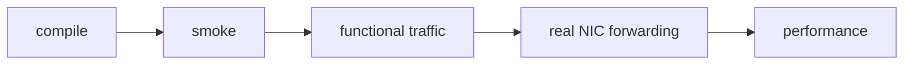
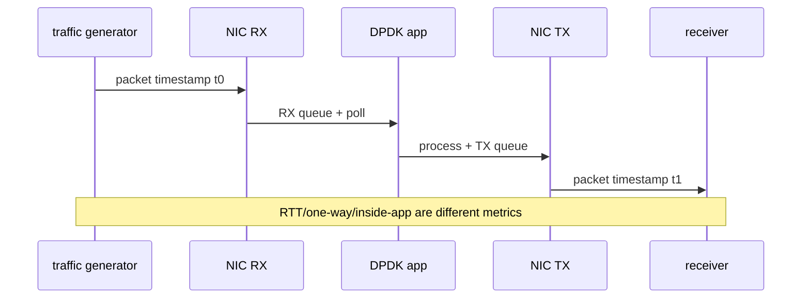

# DPDK 性能测量与可观测性

## 1. 先区分四类证据



| 证据 | 说明 |
|---|---|
| compile | API、header、library 基本匹配 |
| smoke | EAL/port/loop 能启动和退出 |
| pcap functional | parser/action/ownership 在软件输入下闭环 |
| real NIC forwarding | 外部流量、DMA、PMD 和线端输出闭环 |
| performance | 固定环境、方法和负载下的可重复吞吐/延迟 |

pcap infinite replay 的大计数不能直接除以时间后宣称 NIC Mpps，因为它没有真实 wire、PCIe RX 和外部流量源约束。

## 2. Mpps 与 Gbps

以 10 GbE、最小 64-byte Ethernet frame 为例，线端还包含 8-byte preamble/SFD 和 12-byte inter-frame gap：

```text
wire bytes per minimum frame = 64 + 8 + 12 = 84 bytes
pps = 10,000,000,000 / (84 * 8)
    ~= 14.88 Mpps
```

报告必须说明 Gbps 口径：

- L1 wire rate：包含 preamble/IFG。
- L2 frame rate：通常从 destination MAC 到 FCS。
- L3/L4 payload throughput：只计算协议 payload。

不写口径的“10 Gbps”无法复核。

## 3. 基础指标

```text
throughput: packets/s, Mpps, bit/s, Gbps
cost: cycles/packet, instructions/packet, CPU utilization
latency: p50, p90, p99, p99.9, max
loss: RX missed/error/no-mbuf, software drop, TX partial/error
resource: mempool available, ring occupancy, descriptor pressure
```

平均延迟不能替代尾延迟。数据面在 ring 堆积、burst 等待或偶发 cache miss 时，p99 可能恶化而平均值变化不大。

## 4. Cycles per Packet

单 worker 稳态处理 `N` 个 packet 时可估算：

```text
cycles_per_packet = (end_tsc - start_tsc) / N
```

注意：

- 测量区间不要包含日志、初始化和 sleep。
- TSC 频率和跨 core 同步要确认。
- 空轮询周期是否计入必须说明。
- compiler optimization、CPU frequency governor、turbo 和 VM steal time 都会影响结果。

## 5. 延迟测量位置



- 应用内部时间只覆盖 software processing，不含 NIC/queue/wire。
- RTT 容易测，但包含回程。
- 单向延迟需要时钟同步或硬件 timestamp。
- sampling 本身有开销，不能无说明地每包打印时间。

## 6. 可复核测试流程

1. 固定硬件、BIOS、电源模式、kernel、DPDK、PMD 和 firmware。
2. 记录 PCI/NUMA、queue/lcore/mempool 映射。
3. 固定 packet size、flow count、RSS、burst 和 descriptor。
4. warm up，让 cache、mempool 和 link 进入稳态。
5. 运行固定 duration，收集 generator、应用和 NIC 三侧统计。
6. 至少重复多次，报告中位数和离散程度。
7. 检查 packet conservation 和 drop，再解释吞吐。
8. 保存完整命令和原始 marker。

## 7. 三侧计数守恒


只看应用 `tx` 不够：某些 PMD 接受 mbuf 后下游仍可能丢包。性能证据应尽量同时保存 generator sent、ingress NIC、app、egress NIC 和 receiver counters。

## 8. DPDK 观测接口

- `rte_eth_stats_get()`：标准 port 统计。
- `rte_eth_xstats_get*()`：设备扩展统计。
- mempool available/in-use count：观察对象压力。
- software per-lcore stats：parser/action/drop/backpressure。
- telemetry：进程外获取部分运行状态，具体命令依版本和组件。
- `perf stat/record`：cycles、instructions、cache/TLB 和热点。

fast path 不应逐包打印；使用 per-lcore counter，控制线程按周期聚合。

## 9. 调优实验矩阵

每次只改变一个主变量：

| 维度 | 示例 |
|---|---|
| packet size | 64/128/512/1500 bytes |
| burst | 1/8/16/32/64 |
| RX/TX descriptors | 256/512/1024 |
| flow count | 1/64/1024 |
| worker/queue | 1/2/4 |
| NUMA | local/remote |
| offload | checksum on/off |

结果表必须记录 drop；“吞吐更高但丢 20%”不是同一服务质量下的提升。

## 10. 当前环境边界

```text
pcap PMD: deterministic parser/action regression
null PMD: TX ownership and software pipeline sink
vmxnet3 in VMware: virtual PMD/device behavior
real NIC + external generator: hardware forwarding evidence
dedicated generator + controlled host: performance evidence
```

当前基础 track 的 pcap 大计数只能归为 `PASS_PCAP_*`。真实 Mpps/Gbps/p99 需要独立硬件拓扑和测试记录。

## 11. 推荐报告模板

```text
environment:
topology:
DPDK/EAL command:
packet size and flow count:
queue/lcore/NUMA mapping:
warmup/duration/repetitions:
generator sent:
app rx/tx/drop:
receiver received:
Mpps/Gbps/cycles-per-packet/p50/p99:
limitations:
```

## 12. 自测

1. 10 GbE 最小帧为什么约为 14.88 Mpps，而不是按 64 字节直接相除？
2. pcap infinite replay 为什么不能证明真实 NIC 吞吐？
3. 应用 TX counter 非零为什么不等于接收端收到？
4. cycles/packet 测量为什么要排除初始化和日志？
5. 一个性能结果至少要记录哪些负载与环境变量？
