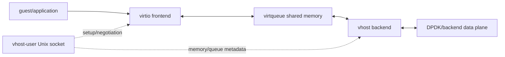
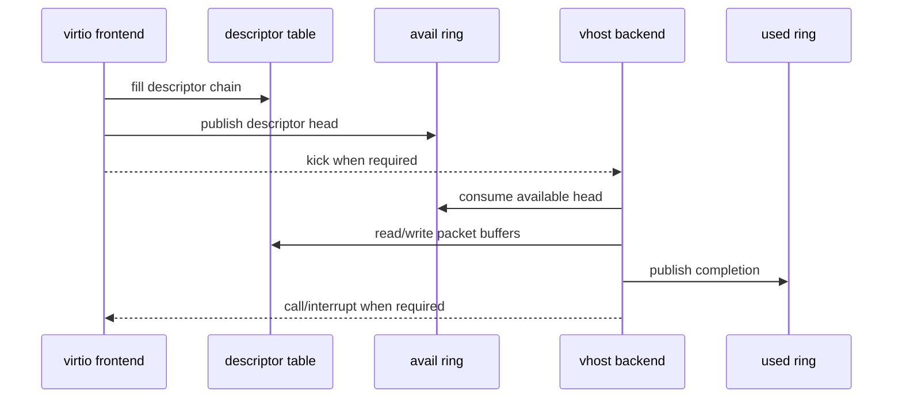
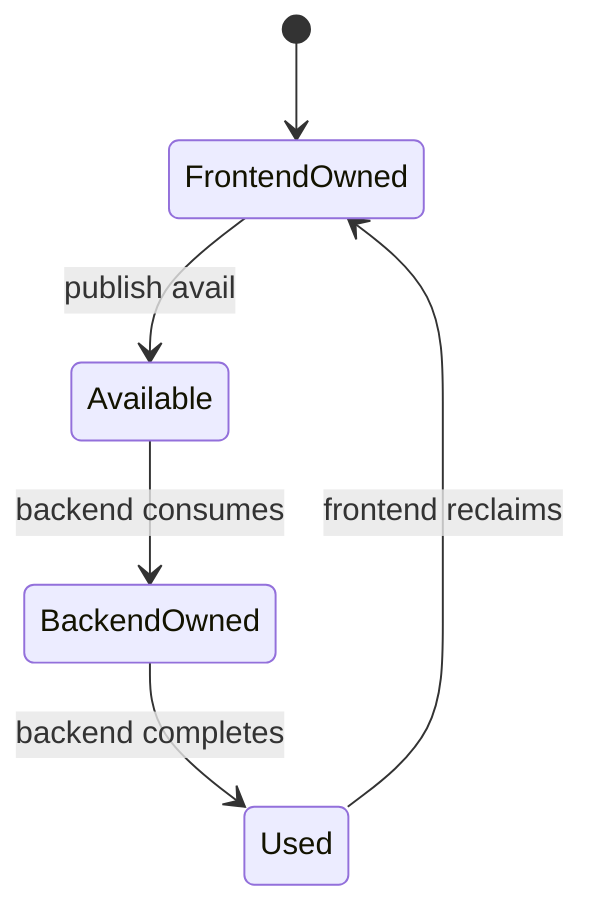

# Virtio、Vhost-user 与 Virtqueue 数据路径

## 1. 四个角色



- virtio：前后端共同遵守的虚拟设备规范。
- virtqueue：共享内存中的 descriptor/queue 数据结构。
- vhost：后端加速机制。
- vhost-user：把 vhost backend 放到用户态，并通过 Unix socket 完成控制协商。

## 2. Split Virtqueue 心智模型

```text
Descriptor Table: buffer 地址、长度、flags、next
Available Ring:    frontend 发布“哪些 descriptor 可处理”
Used Ring:         backend 发布“哪些 descriptor 已完成”
```



真实实现需要规定 memory ordering，不能只更新 index 而不保证 descriptor 内容先可见。DPDK/virtio library 封装了多数细节，但理解 publish/consume 顺序有助于定位“socket 已连、queue 不动”。

## 3. Vhost-user Socket 传什么

Unix socket 主要交换：

- protocol/features negotiation。
- memory region 信息和 file descriptor。
- vring 地址、大小、base 和 enable 状态。
- kick/call eventfd。
- backend/frontend 状态变化。

packet bytes 通常位于共享 memory/virtqueue buffer，不是每包通过 Unix stream socket 复制。因此：

```text
socket exists != features agreed
features agreed != vring ready
vring ready != packets forwarded
```

## 4. Kick 与 Call

- kick：frontend 通知 backend 有新 available work。
- call：backend 通知 frontend 有 used completion。

双方可以通过 event suppression/batching 减少通知。忙轮询 backend 可能不需要每次 kick，但具体行为取决于协商 feature 和实现模式。

类比：shared ring 是共享任务板，kick/call 是门铃；门铃只提示“可能有新状态”，任务本身仍在共享板上。

## 5. Packet Buffer 所有权

virtqueue descriptor 描述的 memory 属于共享 guest/frontend address space 映射。backend 只能在 descriptor 有效且 ownership 已发布时访问；完成后写 used ring，frontend 才能安全复用。



这与 DPDK mbuf ownership 思想相同：资源复用必须发生在 completion 之后，不能凭“函数已经返回”猜测另一端不再访问。

## 6. Packed Ring

packed virtqueue 将 available/used 状态压缩在一个 ring 中，以 wrap counter/flags 区分 ownership，改善 cache locality。基础 track 先理解 split ring；看到 packed ring feature 时应知道它不是简单的 split ring 字段改名。

## 7. Vhost-user 建链时序

```mermaid
sequenceDiagram
    participant C as frontend/client
    participant S as Unix socket
    participant B as backend/server
    C->>S: connect
    C<->>B: negotiate features/protocol features
    C->>B: share memory regions
    C->>B: configure vring num/addr/base
    C->>B: set kick/call fds
    C->>B: enable vring
    Note over C,B: data path may start only after queues are ready
```

server/client 角色取决于启动参数和组件，不要把“frontend 永远是 socket client”当成协议定律；测试时记录实际命令和 socket owner。

## 8. 当前实验映射

| 项目 | 验证层 |
|---|---|
| `lab-vhost-user-basic` | socket 创建、backend 基础启动 |
| `lab-virtio-user-vhost` | virtio-user frontend 与 vhost-user backend 对接 |
| vdev/null/pcap tests | 用户态软件 port/queue 功能路径 |

`PASS_WITH_WARN` 应保留原始 feature/queue 警告，不能只因为进程未崩溃就升级为完整 packet path。

## 9. 分层验收

```text
L0 socket: path exists, roles and permissions correct
L1 negotiation: features/protocol messages accepted
L2 memory: regions mapped, vring addresses valid
L3 queue: vring enabled, kick/call active
L4 packet: RX/TX counters and payload evidence
L5 performance: controlled packet rate and latency
```

## 10. 常见故障

- socket path 已存在但旧进程仍占用。
- frontend/backend server/client 角色相同。
- shared memory 权限或 file descriptor 传递失败。
- negotiated feature 不兼容。
- queue 未 enable 或 vring address/base 错误。
- kick/call fd 未建立，双方都在等待通知。
- packet 到达 queue 但应用没有轮询对应 port/queue。

## 11. 自测

1. packet 为什么不必经过 vhost-user Unix socket 逐包传输？
2. descriptor、avail ring、used ring 分别负责什么？
3. kick/call 与 packet buffer 是什么关系？
4. socket 文件存在后，还要验证哪四层才能证明 packet path？
5. backend 什么时候才能访问、什么时候必须停止访问共享 buffer？
