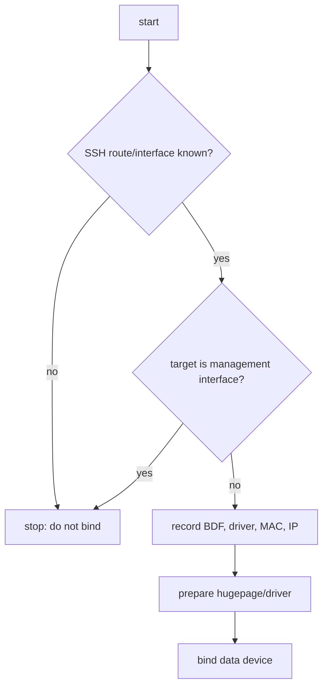

# DPDK 环境安全准备与恢复

## 1. 当前实验环境

```text
host: 192.168.65.135
OS: Ubuntu 22.04.5 / Linux 6.8
DPDK: 21.11.9
management: ens33 / e1000
DPDK data port: ens192 / vmxnet3 / 0000:0b:00.0
lab binding: uio_pci_generic
```

这些值是当前测试机记录，不是通用默认。任何 bind 操作前都重新发现设备，不能只复制 BDF。

## 2. 第一原则：先证明 SSH 不走目标端口

```bash
ip route get 192.168.65.1
ip -br addr
ethtool -i ens33
ethtool -i ens192
lspci -nnk -s 0000:0b:00.0
```



远程环境中最好保留 console/VM 控制台作为恢复通道。脚本应要求显式 `DPDK_BDF`，不自动选择第一块网卡。

## 3. 记录原始状态

```bash
mkdir -p records/env
date -Is | tee records/env/timestamp.txt
ip -d link show | tee records/env/ip-link-before.txt
ip route show table all | tee records/env/routes-before.txt
lspci -nnk | tee records/env/lspci-before.txt
dpdk-devbind.py --status | tee records/env/devbind-before.txt
```

恢复需要知道原 kernel driver 名称。只记录“绑定成功”而不记录原 driver，会让回滚依赖猜测。

## 4. Hugepage 准备

检查：

```bash
grep -E 'HugePages|Hugepagesize' /proc/meminfo
for n in /sys/devices/system/node/node*/hugepages/hugepages-*; do
  echo "$n $(cat "$n/nr_hugepages")"
done
mount | grep hugetlbfs
```

分配前估算项目需求并检查 NUMA，不默认申请 2 GiB。测试结束后是否归还由共享环境策略决定，不能删除其他 DPDK 进程正在使用的 hugepage。

## 5. VFIO 与 UIO 选择

优先级通常是：

```text
VFIO + IOMMU available -> preferred isolation
controlled VM/lab without VFIO -> documented UIO fallback
pcap/null vdev -> safest non-destructive functional test
```

检查 VFIO：

```bash
test -d /sys/kernel/iommu_groups && find /sys/kernel/iommu_groups -maxdepth 2 -type l | head
lsmod | grep vfio
```

当前 VMware 环境使用 UIO 是环境边界，不应写成生产推荐。

## 6. Bind 前后检查

```bash
sudo modprobe uio_pci_generic
sudo dpdk-devbind.py --bind=uio_pci_generic 0000:0b:00.0
dpdk-devbind.py --status
test -L /sys/bus/pci/devices/0000:0b:00.0/driver
```

bind 后 kernel netdev 可能消失。确认 SSH 仍在线，再启动最小 testpmd/应用；失败时先恢复 driver，不在不确定状态连续尝试更多系统修改。

## 7. 恢复 Kernel Driver

假设原 driver 已记录为 `vmxnet3`：

```bash
sudo modprobe vmxnet3
sudo dpdk-devbind.py --bind=vmxnet3 0000:0b:00.0
ip -br link
lspci -nnk -s 0000:0b:00.0
```

随后按原记录恢复 link、IP、route。不要把 `ens192` 名称写死为恢复成功条件，设备重新 probe 后名称可能受系统规则影响。

## 8. 非破坏性 vdev 路径

学习 parser、rule、rewrite 和 ownership 时优先：

```text
--no-pci
--no-huge
--vdev net_pcap0,...
--vdev net_null0
```

它不触碰物理端口，适合 CI/回归；代价是不能验证真实 NIC DMA、link、RSS 和 performance。

## 9. 多进程与残留资源

每次测试使用唯一 `--file-prefix`，退出后检查：

```bash
pgrep -a -f 'testpmd|fastpath|media-gateway'
ls -l /var/run/dpdk 2>/dev/null
ss -xl | grep vhost
```

只清理当前测试创建并已确认路径的 socket/runtime 文件，不使用模糊通配符删除共享目录。

## 10. 凭据和 sudo

- 密码通过交互或临时环境注入，不写入脚本、README、record。
- sudo 命令集中在环境准备阶段，fast path 应尽量以所需最小权限运行。
- 测试记录保存命令结构时使用 `<password>` 占位。

## 11. 执行前 Checklist

```text
[ ] management route/interface confirmed
[ ] target BDF/interface confirmed
[ ] original driver/MAC/IP/routes recorded
[ ] console or recovery path available
[ ] hugepage and NUMA requirement checked
[ ] VFIO/UIO choice documented
[ ] unique file-prefix selected
[ ] rollback commands prepared
[ ] evidence scope declared: vdev or real NIC
```

## 12. 自测

1. 为什么 BDF 必须每次发现而不是永久写死？
2. bind 前至少保存哪些恢复信息？
3. UIO 在当前 VM 可用，为什么仍不能作为通用生产建议？
4. `--no-pci --no-huge` 能验证和不能验证什么？
5. 为什么清理 `/var/run/dpdk` 不能使用未经确认的递归通配删除？
