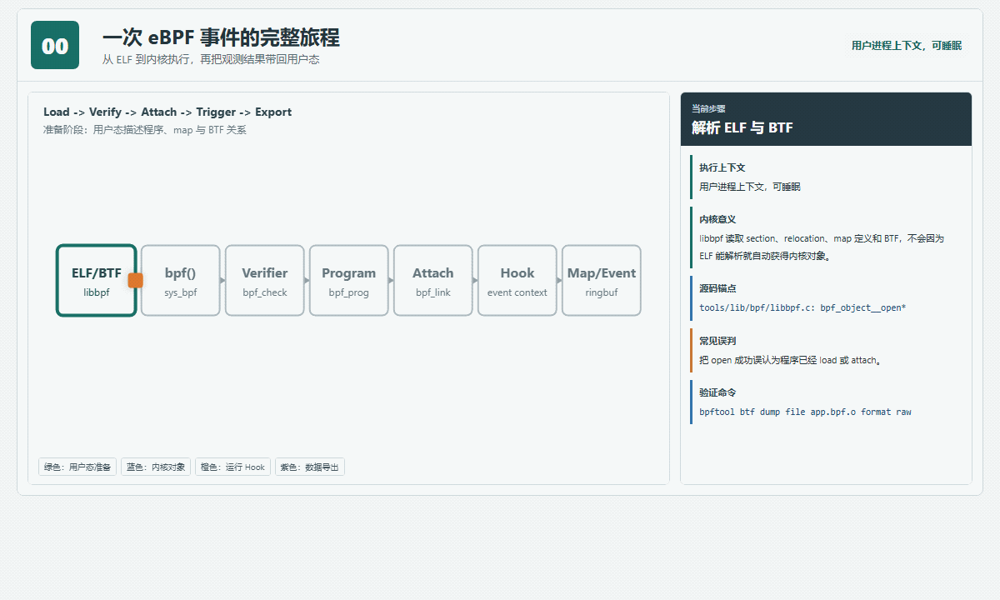
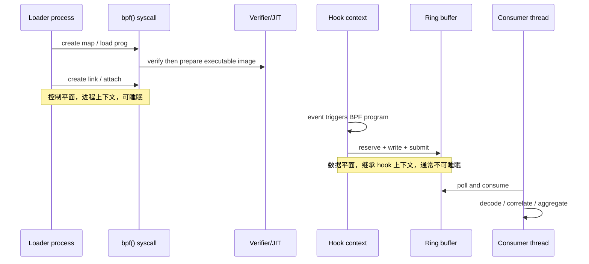
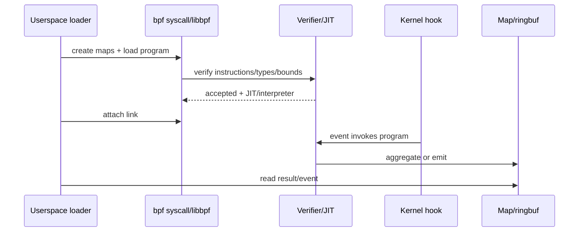
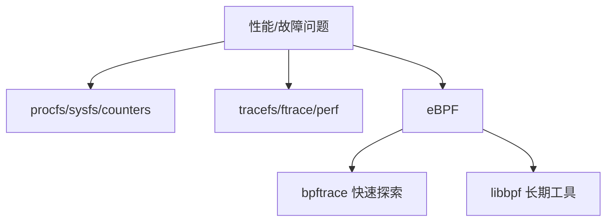
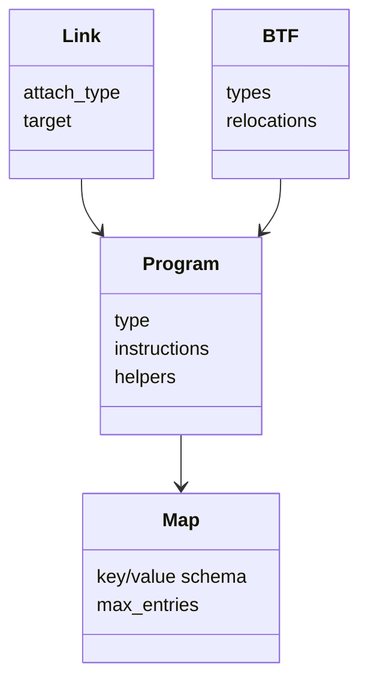
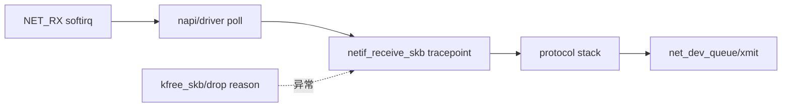
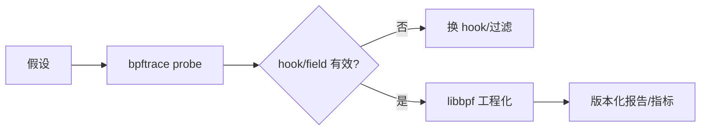

# 00：15 分钟建立 eBPF 可观测性心智模型

## 先看动态图：一个事件如何走完闭环

- [打开交互式 Canvas，使用播放、暂停、单步和复位](visuals/interactive/00_mental_model.html)
- [查看适合打印和快速预览的静态 PNG](visuals/assets/00_ebpf_event_journey.png)

建议先完整播放一次，再逐步观察右侧的“执行上下文、内核语义、源码锚点、常见误判、验证命令”。动画中的橙色方块不是某个真实结构体，而是“本次控制流或事件”的视觉标记；每个节点对应的对象和函数则是真实内核概念。

## 把动画翻译成内核动作

| 阶段 | 发生了什么 | 关键对象/接口 | 最容易误解的地方 |
|---|---|---|---|
| 编译 | Clang 把受限 C 编译为 BPF 指令与 BTF/重定位信息 | ELF、BTF、BTF.ext | 编译成功不等于 verifier 会接受 |
| 打开 | libbpf 解析 ELF，创建 skeleton 或 object 内存模型 | `bpf_object`、`bpf_program`、`bpf_map` | 此时多数内核对象还未创建 |
| 加载 | 用户态经 `bpf()` 系统调用创建 map、加载 program | `BPF_MAP_CREATE`、`BPF_PROG_LOAD` | 返回 FD 是引用入口，不是对象本体 |
| 验证 | verifier 做控制流、类型、边界和引用状态分析 | `bpf_check()`、verifier state | verifier 证明“在模型内安全”，不证明业务正确 |
| 挂载 | program 通过 link 或旧式 attach 绑定到 hook | `bpf_link`、tracepoint、XDP、TC | loaded 与 attached 是两个状态 |
| 命中 | 目标事件发生，内核在对应上下文执行 BPF 指令 | `bpf_prog`、context、helper/kfunc | 没事件可能是 hook 未命中，不一定是程序错误 |
| 输出 | program 更新 map 或向 ring buffer 提交事件 | map、ringbuf/perfbuf | reserve 成功后必须 submit/discard |
| 消费 | 用户态 poll、解码、关联并形成指标 | ring consumer、schema | 用户态慢会丢事件或扩大观测偏差 |

### 三条边界必须记牢

1. **控制平面与数据平面**：加载、挂载、配置 map 属于控制平面；hook 被触发后的短程序属于数据平面。
2. **用户态与内核态**：libbpf/bpftrace 在用户态；verifier、JIT、map 实现和 hook 调度在内核态。
3. **观测与处置**：tracing 通常记录事实；XDP/TC/LSM 等类型还可能改变包或安全决策，风险等级不同。

## 内核源码导航起点

| 想追的问题 | 推荐入口 | 继续跟踪 |
|---|---|---|
| `bpf()` 如何分发命令 | `kernel/bpf/syscall.c` | `__sys_bpf()`、各 `*_create`/`*_get_fd` 路径 |
| verifier 如何工作 | `kernel/bpf/verifier.c` | `bpf_check()`、状态合并、边界检查 |
| map 如何实现 | `kernel/bpf/` | `arraymap.c`、`hashtab.c`、`ringbuf.c` |
| tracing 如何接入 | `kernel/trace/bpf_trace.c` | tracepoint/kprobe helper 与 attach 路径 |
| 网络程序如何运行 | `net/core/filter.c` | skb/socket 相关 helper 和执行入口 |
| XDP 在驱动哪里触发 | 各网卡驱动的 NAPI RX 路径 | 搜索 `bpf_prog_run_xdp`、`xdp_do_redirect` |

不要一开始通读整个文件。先用 `rg -n "SYSCALL_DEFINE.*bpf|bpf_check|bpf_prog_run_xdp" kernel/ net/ drivers/` 找入口，再沿调用链读取相邻函数。

## 一次事件的上下文切换

这张图解释了为什么 BPF program 里不能照搬普通用户态代码：它没有自己的线程，不能随意阻塞，栈和指令复杂度受限，并且必须遵守当前 program type 允许的 helper/kfunc 集合。

## 一句话定义

eBPF 是内核中的受验证程序运行机制：用户态加载受限程序，内核 verifier 证明其安全并可 JIT，程序挂到 hook 上读取上下文、更新 map 或提交事件，用户态再聚合为指标和诊断结论。

## 最小执行链

## 与传统观测工具的关系

eBPF 不是替代所有工具。已有稳定 counter 能回答时优先 counter；需要动态过滤、关联和低开销聚合时再用 BPF。

## 四个核心对象

| 对象 | 作用 |
| --- | --- |
| program | 在特定 program type/context 下执行逻辑 |
| map | 内核/用户态共享状态、聚合和配置 |
| link | program 与 hook 的可管理 attach 关系 |
| BTF | 类型描述和 CO-RE 重定位基础 |

## 一次网络观测的故事

不同 hook 看到不同抽象：softirq 是调度，NAPI 是 poll 工作，skb tracepoint 是 packet object，TX tracepoint 是排队/发送。它们的计数不应机械一一相等。

## bpftrace 与 libbpf

- bpftrace：用少量语句确认 hook 是否存在、字段是否有值、分布大致如何。
- libbpf：定义稳定事件 schema、显式错误处理、CO-RE、ringbuf consumer、测试和部署。

## 五个必须分开的成功

1. 工具链存在：clang/bpftool/libbpf/BTF。
2. program load 通过 verifier。
3. attach/link 成功。
4. hook 在测试负载中实际命中。
5. 用户态正确消费、聚合并控制丢事件。

只看到“loaded”不能说明有事件；只看到事件也不能说明没有 sampling bias。

## 观察不等于因果

两个事件时间接近，只能先说相关。要推断路径，应定义 correlation key（skb pointer、ifindex、CPU、flow tuple、timestamp window），处理对象复用和缺失 hook，并记录不能关联的比例。

## 阅读项目先找八处

1. program section/program type。
2. attach target 与 fallback。
3. context 字段和 CO-RE 读取。
4. map schema、容量和更新模式。
5. 过滤条件与采样率。
6. event schema 和 ringbuf/perfbuf reserve。
7. 用户态 poll、lost events、退出信号。
8. link/map/program 的清理和 pinning。
