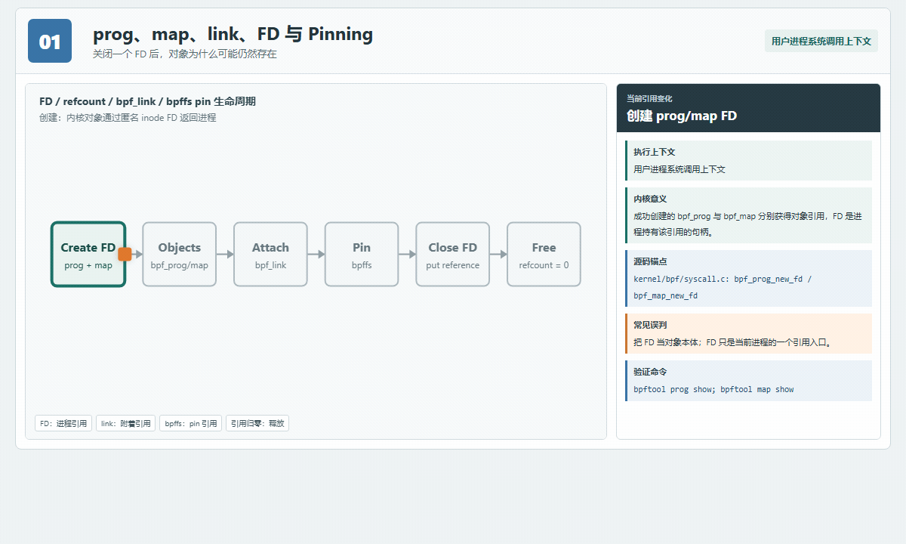
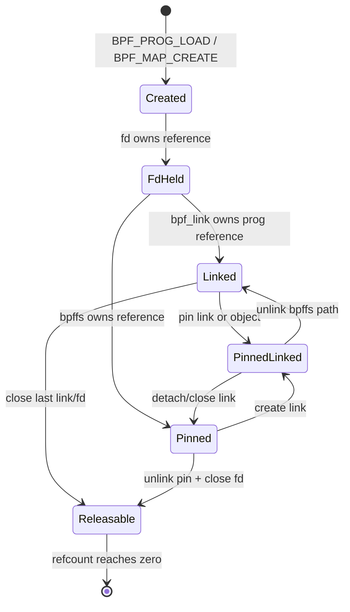
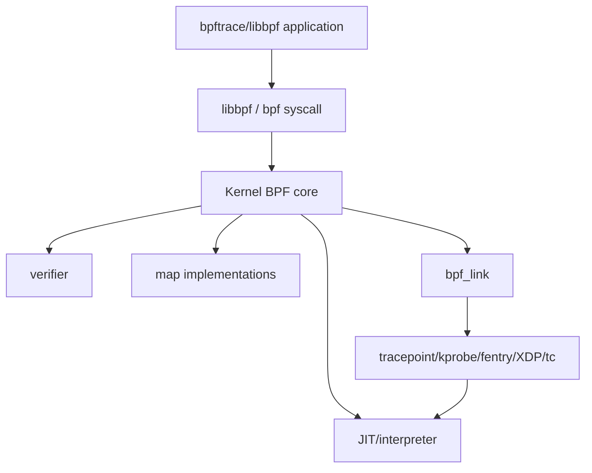
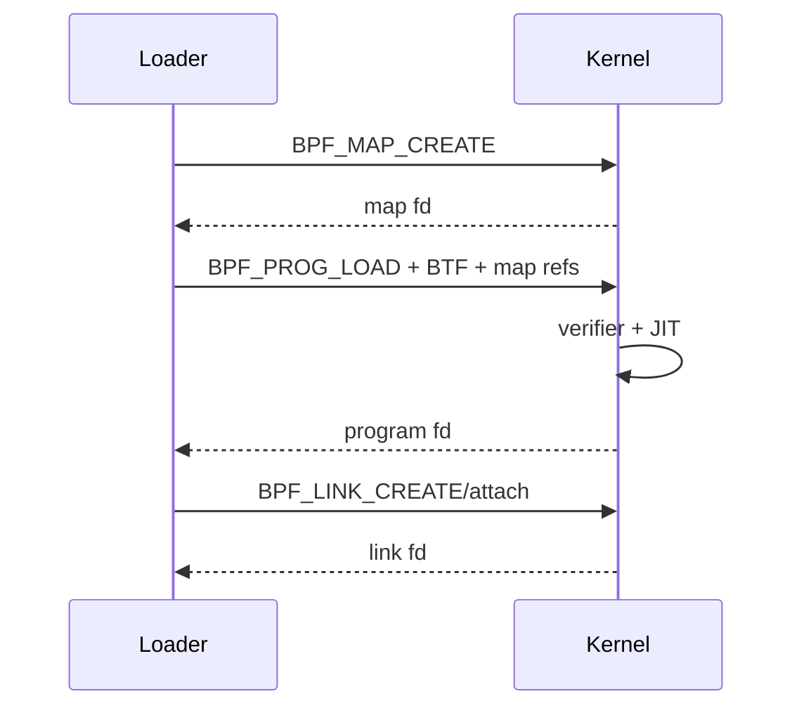
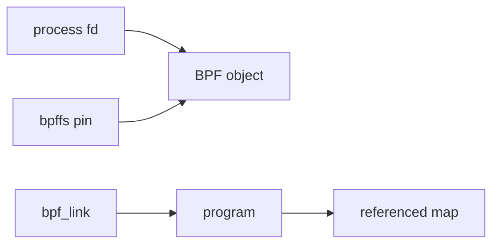
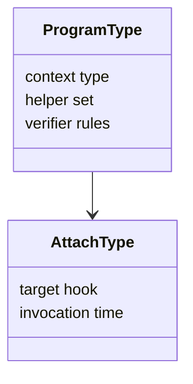

# 01：eBPF 内核架构与对象生命周期

## 先看动态图：关闭 FD 后对象为何还活着



- [打开交互式 Canvas，逐步观察引用如何增加和释放](visuals/interactive/01_kernel_lifecycle.html)
- [查看生命周期静态 PNG](visuals/assets/01_ebpf_object_lifecycle.png)

理解 eBPF 生命周期的关键不是背 API，而是把“内核对象”和“持有它的引用”分开。FD 只是当前进程的一条引用；`bpf_link`、另一个 BPF 对象以及 bpffs pin 都可能继续持有引用。

## 五类对象不要混成一个

| 名称 | 典型内核对象 | 用户态看到什么 | 生命周期要点 |
|---|---|---|---|
| program | `struct bpf_prog`、`bpf_prog_aux` | program FD、ID、tag | verifier/JIT 后可被 link、dispatcher 或其他对象引用 |
| map | `struct bpf_map` + 具体实现 | map FD、ID、pinned path | 可被 program、用户进程、map-in-map 与 bpffs 持有 |
| link | `struct bpf_link` + attach-specific link | link FD、ID、pin | 把 program 与 hook 的关系对象化，关闭最后引用通常自动 detach |
| BTF | `struct btf` | BTF FD、ID | 为 CO-RE、类型化访问与部分 kfunc 提供类型依据 |
| token | `struct bpf_token`（新内核） | token FD | 在受控委托模型中限制可使用的 BPF 能力 |

### FD、ID、pin path 的差别

- **FD**：进程局部句柄，适合做系统调用；`close()` 只释放这一条引用。
- **ID**：内核命名空间内用于枚举和诊断的数值标识，不自动持有永久引用。
- **pin path**：bpffs 中对对象的持久引用，可被另一个进程通过 `BPF_OBJ_GET` 重新取得 FD。
- **tag**：program 指令内容的摘要，适合辨别版本，不代表 attach 位置。

## 引用计数推演



这里的状态是学习模型，不是内核中的单个枚举值。真实实现由不同对象的引用计数、RCU 回收和 attach 子系统共同完成。因此排障时应列出“谁还持有引用”，不要只问“loader 是否退出”。

## 从系统调用追到释放

| 动作 | 源码锚点 | 观察重点 |
|---|---|---|
| 创建 program FD | `kernel/bpf/syscall.c` 的 `bpf_prog_new_fd()` | FD 安装失败时如何回滚对象引用 |
| 创建 map FD | `kernel/bpf/syscall.c` 的 `bpf_map_new_fd()` | map type 对应的 `map_alloc`/`map_free` |
| 校验 program | `kernel/bpf/verifier.c` 的 `bpf_check()` | state、reg type、reference tracking |
| 创建 link | `kernel/bpf/syscall.c` 与具体 attach 子系统 | link 的 `release`、`dealloc`、`detach` 回调 |
| pin/get | `kernel/bpf/inode.c` | bpffs inode 如何持有对象 |
| 释放 program | 搜索 `bpf_prog_put()` | 延迟释放、RCU 与 JIT image 回收 |
| 释放 map | 搜索 `bpf_map_put()` | program 引用 map 时的反向关系 |

## 进程退出与对象残留排障

```bash
# 1. 枚举对象与 link，记录 ID 之间的关系
sudo bpftool -j prog show | jq '.'
sudo bpftool -j map show | jq '.'
sudo bpftool -j link show | jq '.'

# 2. 检查 bpffs 是否仍持有对象
mount | grep ' type bpf '
sudo find /sys/fs/bpf -maxdepth 4 -type f -print

# 3. 查看网络 attach 点，避免只查 tracing
sudo bpftool net
ip -details link show
tc filter show dev eth0 ingress

# 4. 对比 loader 退出前后对象 ID，而不是只比较数量
sudo bpftool prog show
sudo bpftool map show
```

如果对象数量增长，先区分“旧对象仍被 pin”“link 未释放”“应用在重载时重复创建 map”“其他进程共享对象”四类原因。生产工具应输出本次创建的 ID/pin path，并只清理自己拥有的资源。

## 分层位置



libbpf 是用户态加载库，verifier/JIT/map 在内核。bpftrace 是更高层 DSL/运行时，会动态生成并加载 BPF program。

## 加载顺序



fd 是用户态引用；内核对象可被 program、map-in-map、link 或 bpffs pin 持有。关闭 loader fd 不一定销毁 pinned/linked 对象。

## 引用与 pinning



pinning 适合跨进程共享和持久控制面，但必须管理 schema/version/owner。遗留 map 可能让新程序加载失败或读到旧状态。

## JIT 与解释执行

verifier 接受的是 BPF instructions；内核可解释执行，也通常 JIT 为本机指令。JIT 提高执行效率，也受架构、内核配置和安全策略影响。性能报告应记录 JIT 是否启用，而不是只写“eBPF”。

## Helper 与 kfunc

program 不能任意调用内核函数，只能使用该 program type 允许的 helper/kfunc。helper 提供 map、时间、CPU、事件输出等受控能力；kfunc 依赖 BTF 和内核暴露集合，兼容边界更强。

## Program type 与 attach type

program type 决定 context、helper 集和 verifier 规则；attach type 决定具体 hook。一个 tracing program 与 XDP program 即使都是 BPF bytecode，也不能互换 context pointer。



## 权限模型

现代内核可能使用 `CAP_BPF`、`CAP_PERFMON`、`CAP_NET_ADMIN`，旧内核常要求 root/CAP_SYS_ADMIN。unprivileged BPF 还受 sysctl、LSM、lockdown 和容器 namespace/cgroup 限制。能运行某个 tracepoint 不代表能 attach XDP。

## 对象销毁顺序

1. 停止用户态接收和新配置更新。
2. detach/close link，停止新事件。
3. drain ringbuf/perfbuf。
4. close program/map/object fd。
5. 仅删除本工具拥有的 bpffs pin。

异常退出要用 signal handler 触发退出标志，避免在 signal handler 中执行复杂 libbpf 清理。

## 可观测对象

```bash
bpftool prog show
bpftool map show
bpftool link show
bpftool btf show
bpftool net
```

记录 id、tag、type、attach、map ids、JITed size 和 pinned path，可区分“程序未加载”“已加载未 attach”“已 attach但无命中”。
