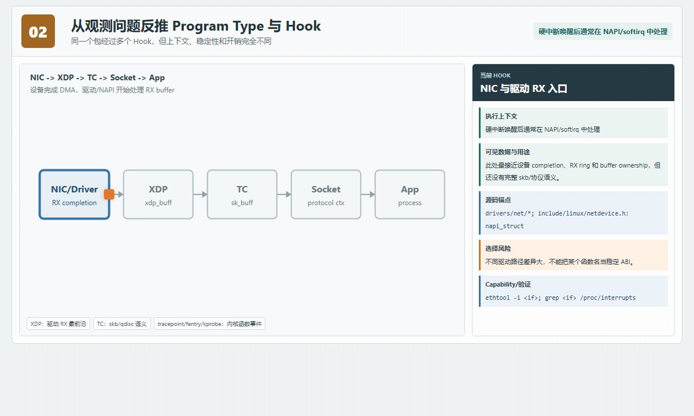
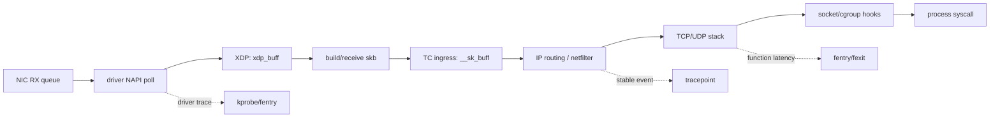
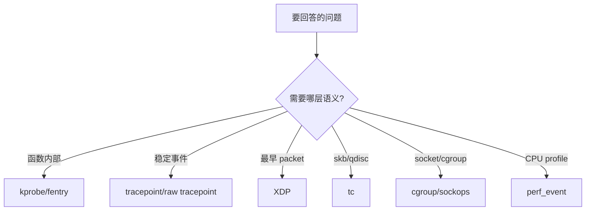
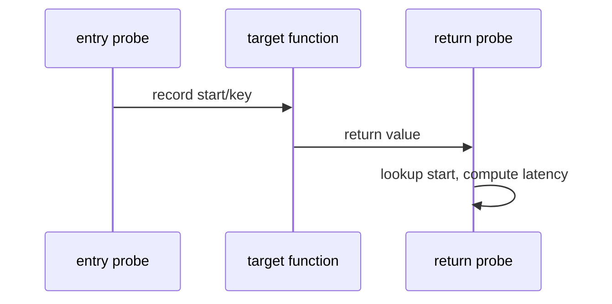
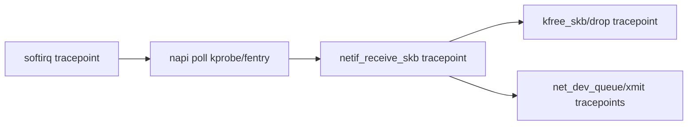

# 02：Program Types 与 Hook 选择

## 先看动态图：同一个包可以在哪些层被观察



- [打开交互式 Canvas，切换丢包、延迟、进程归因目标](visuals/interactive/02_hook_selection.html)
- [查看 hook 路径静态 PNG](visuals/assets/02_ebpf_hook_journey.png)

选择 hook 的本质是选择“在哪一层获得哪种语义，并愿意承担怎样的成本与兼容风险”。越靠近 NIC，包越原始、动作越早、吞吐压力越高；越靠近 socket/函数层，业务语义越丰富，但可能已经看不到早期丢包。

## 从网卡到进程的完整位置



### 每个位置能回答什么

| 位置 | 上下文 | 擅长回答 | 不擅长回答 |
|---|---|---|---|
| XDP | `struct xdp_md` / 驱动内部 `xdp_buff` | 最早收包、DDoS 过滤、redirect、驱动队列问题 | 完整 socket/process 归因 |
| TC | `struct __sk_buff` | skb 元数据、整形前后、容器/虚拟网络路径 | NIC DMA 与 XDP 前丢包 |
| socket filter | `__sk_buff` | 特定 socket 收包过滤与采样 | 全局协议栈瓶颈 |
| cgroup skb/sock | cgroup + socket/network context | 容器租户策略、连接控制、按工作负载归因 | 驱动与硬件队列细节 |
| tracepoint | 稳定 trace event context | 调度、系统调用、部分网络稳定事件 | 没有埋点的内部变量 |
| kprobe/kretprobe | 函数参数/返回现场 | 老内核或无 BTF 环境的函数观测 | 内联函数、签名漂移、稳定性 |
| fentry/fexit | BTF 类型化函数上下文 | 低开销函数入口/返回、CO-RE 类型访问 | 没有 BTF 或不支持 trampoline 的目标 |
| perf_event | sample context | CPU profiling、硬件/软件计数事件 | 精确描述一次完整网络事务 |
| LSM | 安全 hook context | 文件、进程、网络安全决策 | 通用性能剖析 |

## Hook 选择算法

1. **先写问题**：例如“包在哪一层消失”，而不是“我要用 kprobe”。
2. **确定最早和最晚证据点**：丢包问题至少需要成对观测点，单点计数不能定位区间。
3. **优先稳定接口**：有合适 tracepoint 就先用；需要函数细节且有 BTF 时考虑 fentry/fexit。
4. **确认上下文字段**：hook 能触发不等于 context 有 ifindex、PID、tuple 或返回值。
5. **估算频率与预算**：按每秒事件数、单次执行成本、输出字节数估算扰动。
6. **设计 fallback**：BTF、内核版本或驱动能力不足时，明确降级到哪个 hook，以及结论会丢失什么。

## 三类典型问题的组合选点

### 丢包定位

推荐从“区间差分”出发：XDP/驱动统计确认是否进入主机，TC ingress 确认是否进入 skb 路径，协议栈 drop tracepoint 或函数观测定位具体阶段，socket/process 侧确认是否交付。不要把不同采样率的计数直接相减。

### 延迟分解

入口和出口必须共享可靠 correlation key。函数延迟可用 fentry/fexit 或 kprobe/kretprobe；跨层网络路径可组合 skb 指针、五元组、ifindex、CPU 和时间窗口，但必须处理 skb clone、GSO/GRO、重传和对象复用。

### 进程与容器归因

软中断中的收包路径经常没有目标应用的 `current`。应在 socket/cgroup/syscall 等拥有进程语义的位置建立 cookie、socket 或 cgroup 映射，再与包路径关联；不要在 NAPI 上下文直接把 PID 当作收包进程。

## 上下文与睡眠边界

多数 tracing/XDP/TC program 继承被挂载点上下文，不能阻塞等待。即使某类 program 支持 sleepable 变体，也只有标记和 attach 组合允许时才能调用 sleepable kfunc/helper。选择 hook 时至少核对：

- 是否运行在 hardirq、softirq、NAPI、进程或 trampoline 上下文；
- 是否可能迁移 CPU，是否需要 per-CPU map；
- helper 是否属于该 program type 的允许集合；
- 访问的内核对象在当前 RCU/锁语义下是否仍有效；
- 输出失败时是计数、采样还是丢弃，是否有 lost 指标。

## 可执行的选择前检查

```bash
# 内核、BTF 与 JIT 基线
uname -a
test -r /sys/kernel/btf/vmlinux && echo BTF_OK
sudo bpftool feature probe kernel

# 查稳定 tracepoint 与函数/BTF
sudo find /sys/kernel/tracing/events -maxdepth 2 -type d | sort | less
sudo bpftool btf dump file /sys/kernel/btf/vmlinux format raw | grep -m1 'FUNC.*tcp_v4_connect'

# 查网卡 XDP/TC 能力和已有挂载
ip -details link show
sudo bpftool net
tc qdisc show

# 运行后确认真的命中，而不只确认 attach 成功
sudo bpftool prog show
sudo bpftool prog tracelog
```

## 从问题反推 hook



不要先选喜欢的工具再找问题。hook 越早，packet 处理成本越低，但可用高层语义越少；hook 越内部，细节越多但兼容性越差。

## 常用观测 hook 对比

| hook | 稳定性 | context | 适用 |
| --- | --- | --- | --- |
| tracepoint | 相对稳定 | 明确 event schema | 长期统计、跨版本工具 |
| raw tracepoint | 较稳定 hook，原始参数 | 更低抽象 | 低开销/自定义解析 |
| kprobe/kretprobe | 依赖函数符号/ABI | pt_regs/参数 | 快速探索内部函数 |
| fentry/fexit | BTF typed args | 原生类型 | 低开销函数追踪 |
| perf_event | PMU/sample context | stack/IP | CPU profile/采样 |
| XDP/tc | packet context | xdp_md/skb | 数据面处理兼观测 |

## Entry 与 Return



entry/return correlation 常用 `pid_tgid` 或任务/对象 key。函数可递归、迁移 CPU、异常不返回；map 必须处理嵌套和遗留 entry。

## 网络路径选点



每个点回答不同问题：softirq 是否运行、NAPI 谁在 poll、skb 是否进入栈、是否 drop、是否进入 TX。计数差异是正常现象，不应简单相减为“丢包”。

## 稳定性阶梯

长期工具优先级通常是：稳定 tracepoint/LSM/cgroup 接口 -> BTF fentry/CO-RE -> kprobe 内部符号。探索时可反过来，从 kprobe 快速定位，再迁移到稳定 hook。

## Hook 可用性检查

```bash
bpftrace -l 'tracepoint:net:*'
bpftrace -l 'kprobe:*napi*'
bpftool btf dump file /sys/kernel/btf/vmlinux format raw
grep -w '<symbol>' /proc/kallsyms
```

符号存在不保证可 kprobe：可能被内联、notrace、blacklist、优化或 lockdown 限制。attach 结果必须检查返回码。

## 过滤位置


高频 hook 应尽早按 ifindex、PID、cgroup、protocol 或 sample rate 过滤。把所有事件送用户态再过滤，会浪费 ring bandwidth 并扰动目标。

## 选择清单

- 是否有稳定 tracepoint 可直接回答？
- 是否真的需要函数 return/latency？
- context 中是否有过滤所需字段？
- 目标内核是否有 BTF/fentry？
- hook 频率多高，能否只聚合不逐事件输出？
- attach 失败时 fallback 和结论边界是什么？
