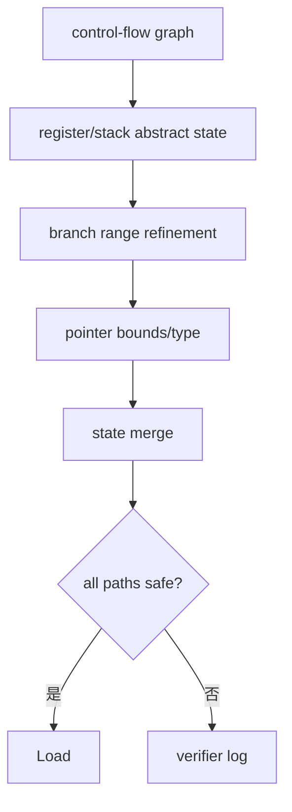
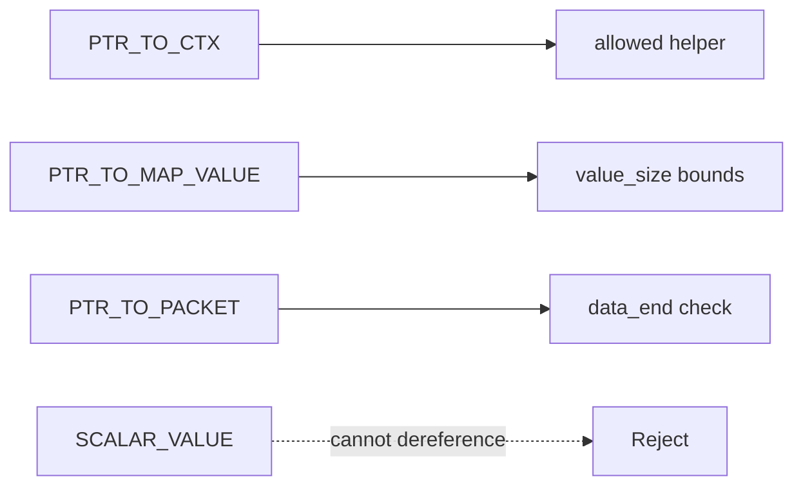
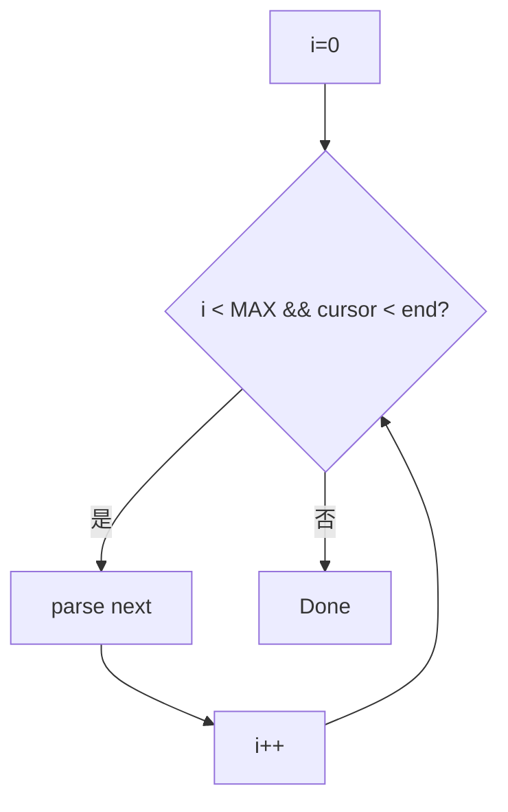
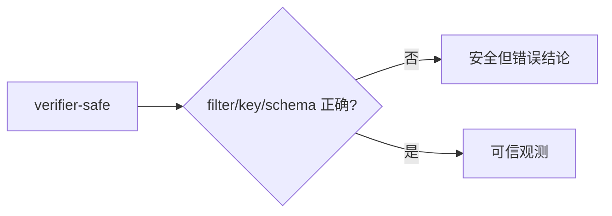

# 03：Verifier、内存与安全模型

## Verifier 做抽象解释

verifier 沿所有可达控制流跟踪寄存器类型、标量范围、指针来源、offset、map value bounds 和引用状态，证明程序在约束内终止且不会非法访问。



## 指针类型不能随意混用

常见类型包括 context pointer、packet pointer、map value pointer、BTF kernel pointer、stack pointer。把标量强转成内核指针不会让 verifier 相信它安全。



## Packet bounds 模式

每次可变长度解析都要先检查：

```c
void *data = (void *)(long)ctx->data;
void *data_end = (void *)(long)ctx->data_end;
struct ethhdr *eth = data;

/* 显式边界让 verifier 和读者都能证明访问安全。 */
if ((void *)(eth + 1) > data_end)
    return 0;
```

用户态测试包始终完整也不能代替静态证明。

## 内核结构读取

直接解引用内核结构受 BTF、地址空间和字段布局影响。libbpf CO-RE 常用 `BPF_CORE_READ()` 或 preserve access index 生成重定位；字符串/用户内存用对应 probe read helper，且检查返回值。

## 栈与大对象

BPF 栈空间有限，大数组/事件应放 map value、per-CPU scratch 或 ringbuf reserve 区。把 4KB event struct 放栈可能直接被 verifier 拒绝，也会增加每次执行成本。

## 循环

现代内核允许 bounded loops，但 verifier 必须证明上界。遍历 packet headers/map entries 时设置小而明确的最大次数；不要信任 packet 字段作为无限循环条件。



## 引用资源

ringbuf reserve、socket reference、dynptr 等 helper 可能返回受跟踪引用。所有控制流必须 submit/discard/release；一个错误分支遗漏会被 verifier 判定 reference leak。

## 常见拒绝信息

| 信息 | 常见原因 |
| --- | --- |
| invalid mem access | pointer 类型/NULL/bounds 未证明 |
| unbounded loop | 循环上界不可证明 |
| stack depth | 局部对象/调用链过大 |
| R? type=scalar expected=ptr | 参数来源错误 |
| helper not allowed | program type 不支持 helper |
| unreleased reference | reserve/acquire 后路径未释放 |

## 阅读 verifier log

先找最后一条错误，再向上定位对应 instruction 和寄存器状态；用 clang 生成带调试信息的 object，配合 `llvm-objdump -S` 映射源码。不要先读数万行完整 log。

## verifier 通过仍可能有逻辑问题



错误 ifindex、字节序、map key、时间单位和 correlation key 都不会被 verifier 自动发现，需要测试与对照计数器。

