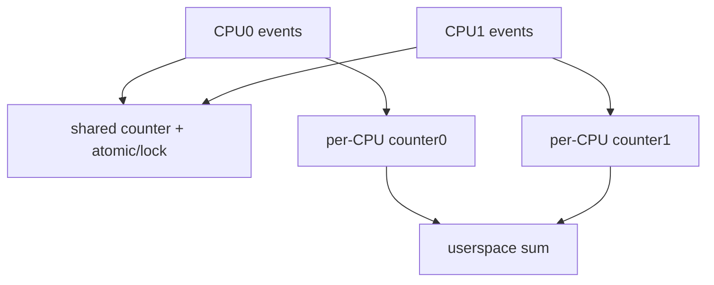
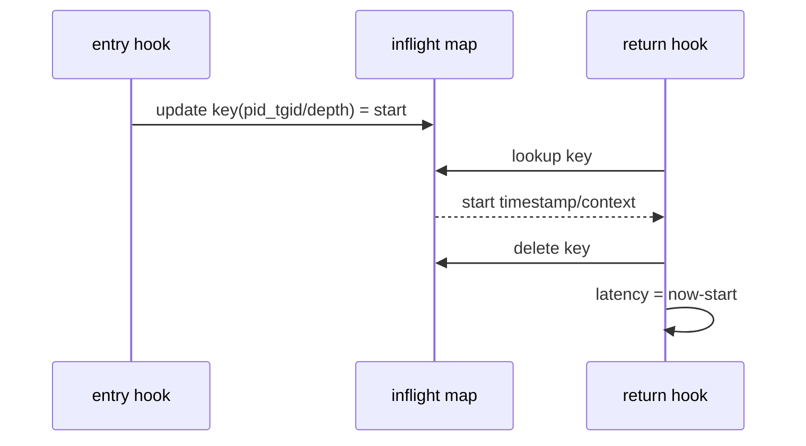
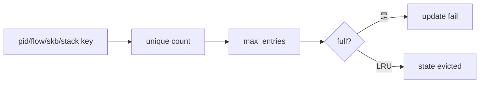
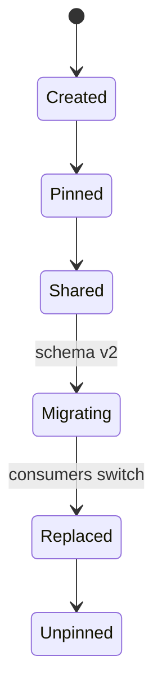

# 04：Maps、状态与并发

## Map 不只是字典

map 是带内核实现语义的共享对象：类型决定分配、并发、淘汰、CPU locality 和用户态访问方式。

| map type | 适用 | 主要边界 |
| --- | --- | --- |
| ARRAY | 固定索引计数/配置 | 容量固定，value 常驻 |
| HASH | 动态 key 状态 | 容量、分配和锁成本 |
| PERCPU_ARRAY/HASH | 高频每 CPU 聚合 | 用户态需汇总所有 CPU |
| LRU_HASH | 有界动态状态 | 淘汰会丢 correlation state |
| RINGBUF | 有序事件流 | 容量和 backpressure |
| PERF_EVENT_ARRAY | per-CPU event/output | 跨 CPU ordering/lost callback |
| STACK_TRACE | stack id -> frames | 容量和碰撞/符号化成本 |

## 共享计数与 per-CPU

高频统计优先 per-CPU，避免 cache line 竞争。读取结果时遍历 possible CPUs，而不是 online CPU 数的错误假设。

## Hash 更新模式

`BPF_ANY` 可创建或覆盖；`BPF_NOEXIST` 只创建；`BPF_EXIST` 只更新。并发 get-then-update 不是自动原子事务，计数可用 atomic builtin、spin lock 或 per-CPU map。

## Entry/Return correlation

线程迁移 CPU 不影响 pid_tgid key，但递归调用需要 depth/stack；函数不返回或探针丢失会留下 entry，应设置容量、超时或 LRU 策略。

## Pointer 作为 key 的风险

skb pointer 可短窗口关联，但对象释放后地址会复用。事件应带 timestamp/generation，并限制相关窗口；不能把指针当永久 packet id，也不应默认跨所有 hook 保持同一 skb。

## Map 容量与 cardinality

必须统计 update failure/eviction。按五元组追踪生产流量时，容量估算和过期机制是设计的一部分。

## 配置 map 与数据 map

控制面写配置 map（ifindex、PID、sample rate），数据面只读；统计 map 由 BPF 写、用户态读。分离能减少权限和 schema 混乱。配置更新可带 generation，避免多个字段部分更新。

## Spin lock 与限制

`bpf_spin_lock` 只适用于允许的 map value 和 program context，锁内不能调用任意 helper。锁会放大高频 hook 开销，优先使用 per-CPU/sharding 或原子字段。

## Map-in-map 与 tail call

map-in-map 可做配置快照/tenant 分片；PROG_ARRAY tail call 可拆程序流水线。两者增加生命周期与失败边界，观测小工具不应为了“高级”而使用。

## Pinning/升级

升级前检查 key/value size、BTF map definition 和 owner。不要复用 schema 不兼容的旧 pin。

## Map 验收清单

- key 是否稳定且字节序明确？
- value 是否包含 version/timestamp？
- 并发更新是否丢计数？
- max_entries 如何估算？
- update failure/eviction 是否可观察？
- 用户态遍历期间数据变化是否可接受？
- 退出时是否只清理本工具拥有的 pin？
