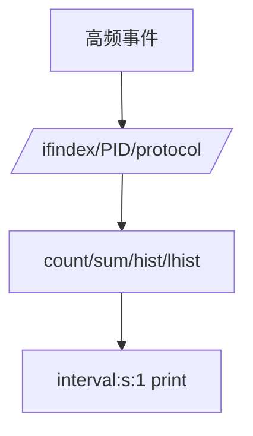
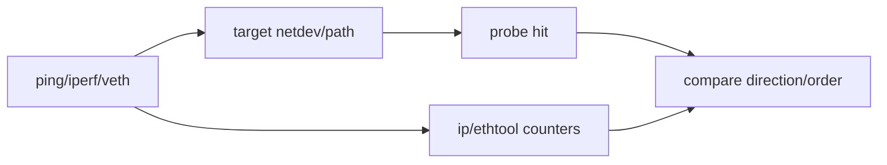

# 05：bpftrace 快速探索工作流

## bpftrace 的定位

bpftrace 适合用一条或一个小脚本验证“hook 是否存在、事件是否发生、参数大致是什么、分布在哪些 CPU”。它不是默认的长期 agent、稳定 schema 或复杂恢复框架。


## 先列出再执行

```bash
bpftrace -l 'tracepoint:net:*'
bpftrace -lv 'tracepoint:net:netif_receive_skb'
bpftrace -l 'kprobe:*napi*'
```

不要照抄其他内核的字段名。`-lv` 或 tracefs format 是当前内核 schema 证据。

## 最小探针

```bpftrace
tracepoint:net:netif_receive_skb
{
    @rx_by_cpu[cpu] = count();
}
```

先只计数，确认 hook 命中；再加 comm、ifindex、len、stack，避免一次引入多个错误源。

## 过滤与聚合



优先 map aggregate，避免每事件 `printf()`。逐事件输出会产生大量用户态搬运和字符串格式化，并可能改变被观测路径。

## 直方图而非平均值

`hist()` 适合 2 的幂次延迟分布，`lhist()` 适合固定线性区间。平均值会掩盖双峰和尾延迟。时间单位必须在变量名/报告中写清 ns/us/ms。

## Entry/Return

```bpftrace
kprobe:some_function { @start[tid] = nsecs; }
kretprobe:some_function /@start[tid]/ {
    @lat_us = hist((nsecs - @start[tid]) / 1000);
    delete(@start[tid]);
}
```

实际工具还需考虑递归、丢失 return、线程退出和 map 上限。

## 测试流量



本机 local route 可能不经过预期 RX netdev；应明确流量拓扑，记录命令、接口和方向。

## 输出证据

每轮保存：内核版本、bpftrace 版本、probe list、脚本、运行命令、流量命令、stdout/stderr、开始结束时间、退出码和结论边界。

## 常见陷阱

| 现象 | 原因 |
| --- | --- |
| probe list 有但 attach 失败 | 权限、lockdown、notrace、BTF/符号限制 |
| count=0 | 无流量、过滤错、路径绕过 hook |
| 参数乱码 | 参数位置/类型不匹配 |
| map 爆大 | key cardinality 无界 |
| 系统抖动 | 高频 printf/stack/字符串 |

## 迁移标准

当 hook/字段/过滤已经验证，需要稳定部署、版本化事件、lost event 统计、CLI/config、测试时，迁移到 libbpf。对应 Phase 1：[../../lab-bpftrace-netdev-observe/README.md](../../lab-bpftrace-netdev-observe/README.md)。

