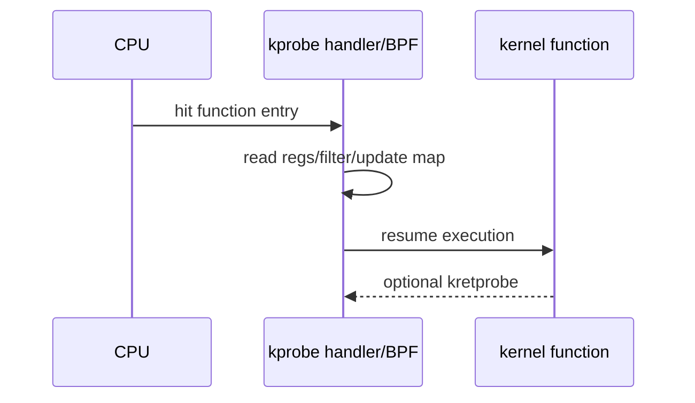
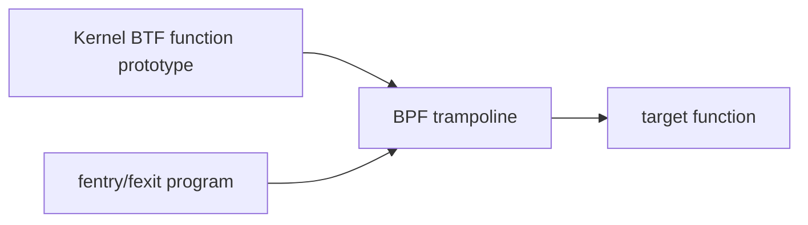
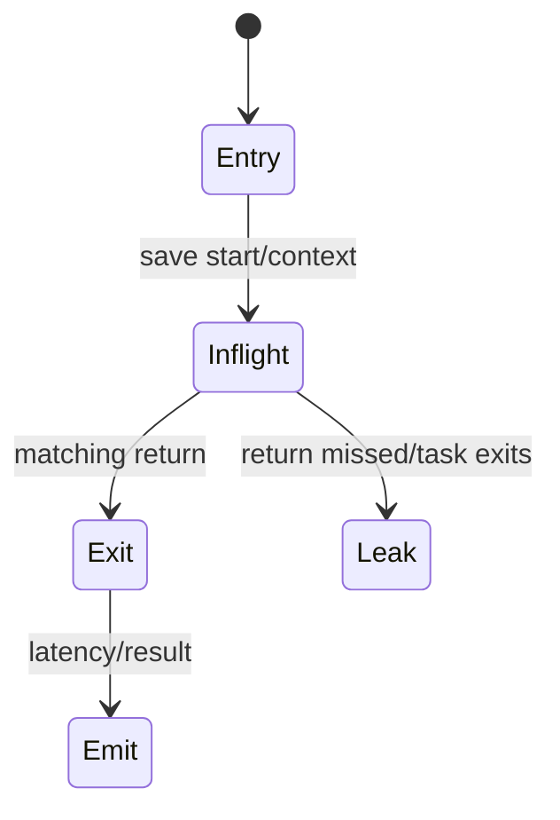
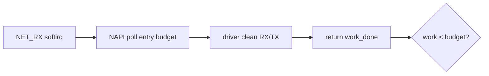

# 06：Kprobe、Fentry/Fexit 与函数追踪

## 三种函数追踪

| 技术 | attach 基础 | 参数访问 | 稳定性/开销 |
| --- | --- | --- | --- |
| kprobe/kretprobe | 符号地址/断点机制 | pt_regs/ABI | 灵活但易受版本、内联影响 |
| fentry/fexit | BTF trampoline | typed args/return | 通常更低开销、更易 CO-RE |
| tracepoint | 显式事件 | 固定 event fields | 稳定但不覆盖任意函数 |

## kprobe 执行模型

kprobe 的参数位置依赖架构 ABI 和内核函数签名；bpftrace 帮助简化，但错误参数索引可能安全执行却得到错误数据。

## 为什么 kprobe 会消失

- 函数被 inline 或编译优化掉。
- 名称在内核版本中变化。
- 函数标记 notrace/blacklist。
- kallsyms/lockdown 权限限制。
- 模块未加载，符号尚不存在。

因此 kprobe 适合探索，验收应有 fallback 或明确 optional。

## fentry/fexit

fentry 通过 BTF 获取 typed args，减少 pt_regs/ABI 猜测；仍依赖目标函数 BTF 可见和内核能力。CO-RE 处理字段布局，不保证函数在所有版本存在。

## Return latency correlation

设计 inflight key 时考虑递归 depth、同线程并发、CPU migration 和超时清理。

## NAPI 观测

对 NAPI poll 可观察 entry budget、return work、CPU 和 duration。但驱动 poll 函数名不同；通用 `napi_poll` 也可能被内联或不适合 kprobe。

`work_done == budget` 只是可能仍有工作，不能单独断言网络拥塞。

## Function graph 不是 packet path

一次函数调用可能处理多个 packet，一个 packet也可能跨多个函数/softirq。函数计数与 packet 计数不能机械相等。需要 skb/flow key、batch context 和 counter 对照。

## 选择策略

1. 有稳定 tracepoint就先用 tracepoint。
2. 需要函数内部参数且有 BTF，优先 fentry/fexit。
3. 需要探索任意符号时用 kprobe，并标记版本依赖。
4. 高频函数先 aggregate/sample，不逐事件 stack trace。

对应 Phase 2：[../../lab-kprobe-trace-napi-poll/README.md](../../lab-kprobe-trace-napi-poll/README.md)。

