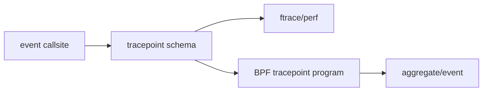
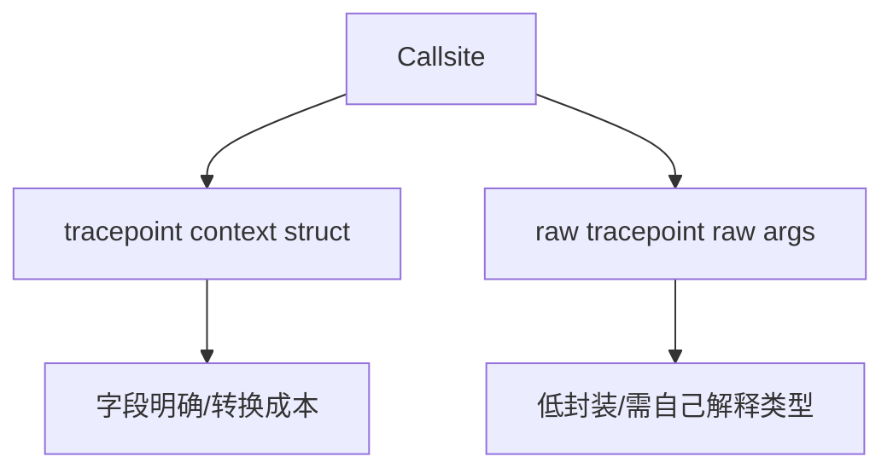
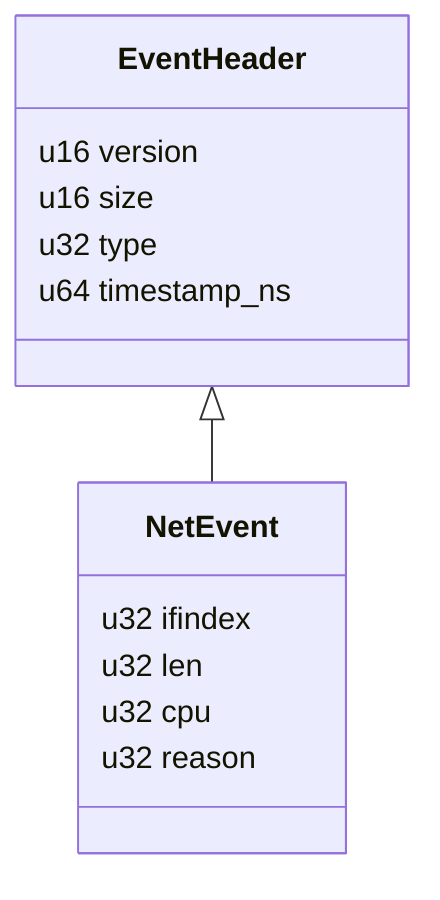
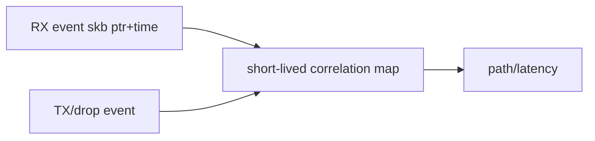

# 07：Tracepoints、Raw Tracepoints 与事件 Schema

## Tracepoint 是显式观测契约

内核在代码中定义 trace event name 和字段，启用时调用。相比任意函数符号，它更适合作为跨版本观测入口，但字段仍可能扩展/变化，必须查看目标内核 format/BTF。



## 查看 schema

```bash
cat /sys/kernel/tracing/events/net/netif_receive_skb/format
bpftrace -lv 'tracepoint:net:netif_receive_skb'
```

字段 offset/size/signed 是运行内核证据。不要把网上脚本字段当固定 ABI。

## Tracepoint 与 raw tracepoint



raw tracepoint 更接近原始参数，可能减少格式化开销，但可移植性和安全读取责任更高。

## 网络常用事件

| 事件 | 能回答 | 不能直接回答 |
| --- | --- | --- |
| `netif_receive_skb` | skb 进入接收处理 | NIC 实际收到的全部包 |
| `net_dev_queue` | skb 进入 TX queue | 已上 wire |
| `net_dev_xmit` | dev xmit 结果 | 对端收到 |
| `kfree_skb`/drop reason | skb 被释放/原因 | 所有硬件/驱动 drop |
| `softirq_entry/exit` | softirq 调度/执行 | 每次处理 packet 数 |

## Schema 版本化

libbpf event struct 应定义固定宽度字段、version/size。用户态先检查 size/version再解析；字符串固定长度并保证终止。内核 tracepoint字段变化通过 CO-RE/条件存在检查适配。



## Drop reason

drop reason 能显著改善诊断，但不同内核支持度/枚举变化不同。未知 reason 应保留 numeric value，不要映射失败后丢事件。

## 时间戳与排序

BPF monotonic time适合单机相对延迟。跨 CPU 事件通过同一 clock 通常可比较，但 ring/perf event transport 和消费顺序仍可能影响输出顺序；跨主机则需要额外时钟同步。

## 事件关联



skb clone、encapsulation、GRO/GSO 会改变一对一关系。报告必须注明 correlation coverage 和未匹配比例。

对应 Phase 3：[../../lab-tracepoint-skb-path/README.md](../../lab-tracepoint-skb-path/README.md)。

