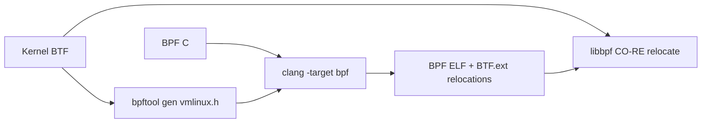
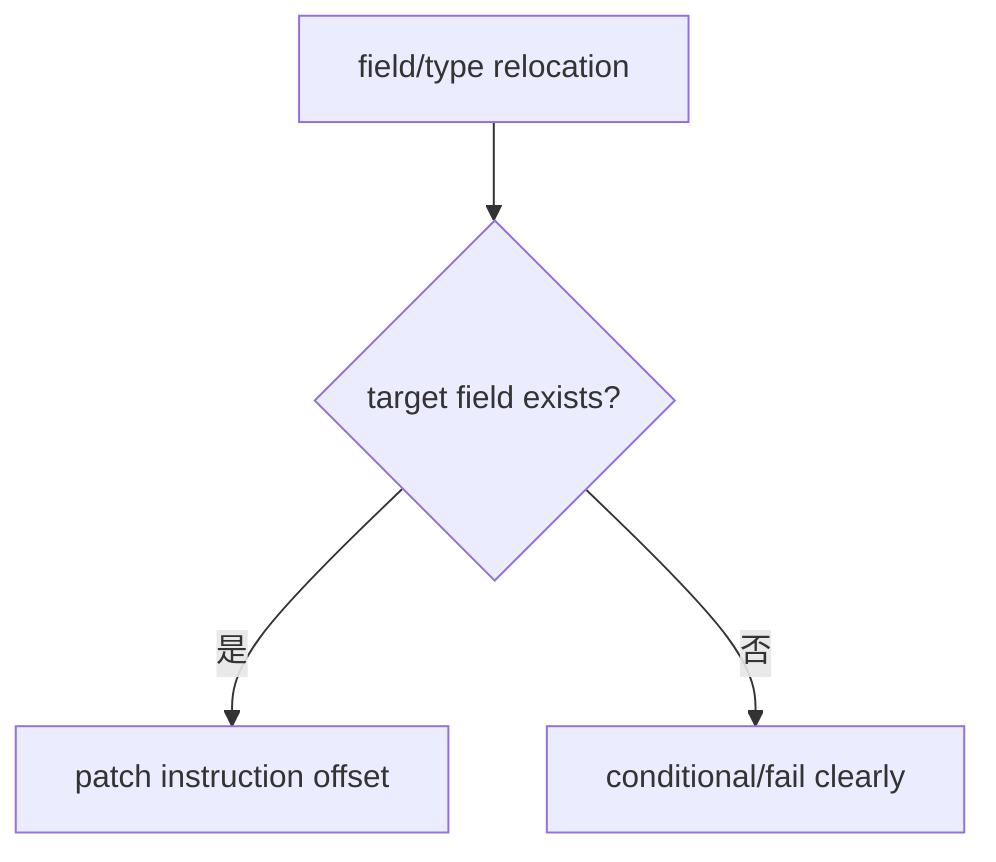
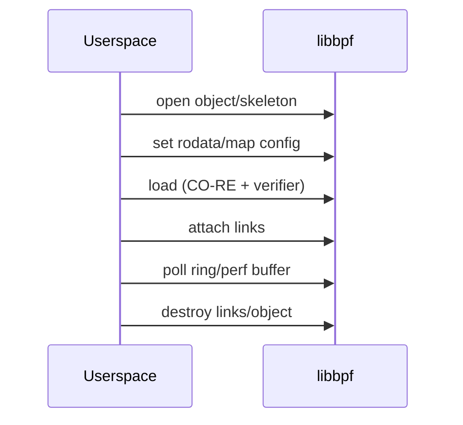
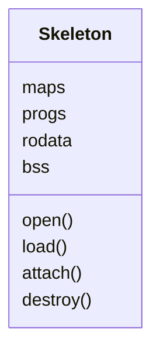

# 08：BTF、CO-RE、libbpf 与 Skeleton

## BTF 提供类型事实

BTF 描述内核/程序类型、函数和行信息。`/sys/kernel/btf/vmlinux` 让工具生成 `vmlinux.h`、做 CO-RE relocation、解析 typed fentry 参数和符号化数据。



## CO-RE 解决什么

Compile Once - Run Everywhere 主要适配结构字段 offset、字段存在性、type size/enum value。它不保证 hook、helper、map type 或语义在所有内核存在。



## `vmlinux.h`

由目标或兼容 BTF 生成，包含内核类型定义。BPF 源通常不再直接包含大量内核 UAPI/internal headers，减少冲突。生成物应有明确更新策略，避免每次构建产生无关大 diff。

## libbpf object 生命周期



open 阶段可配置 map size/rodata；load 后某些参数不可变；attach 后开始产生事件。错误信息要区分 open/load/attach/poll。

## Skeleton

`bpftool gen skeleton` 生成 typed wrapper，把 programs/maps/rodata/bss/link 暴露成结构成员，减少按字符串查找和手工 cleanup。



旧 libbpf 环境可能无现代 skeleton/CO-RE 特性。本仓库已有原生 libbpf 兼容路径，应记录版本边界，不把兼容 workaround 当通用最佳实践。

## Global data

`.rodata` 适合加载前配置，`.bss/.data` 可暴露计数/状态。旧 libbpf 对 global data section 支持有限；长期工具应定义最低版本或提供 map fallback。

## Strict mode 与 API 兼容

libbpf API 会演进，deprecated API 可能仍可编译但产生 warning。记录 `pkg-config --modversion libbpf`，使用 feature probe/条件编译，而不是只按发行版名猜能力。

## 构建链证据

```bash
clang --version
bpftool version
pkg-config --modversion libbpf
test -r /sys/kernel/btf/vmlinux
llvm-objdump -h build/*.bpf.o
```

对应 Phase 4：[../../lab-libbpf-net-observer/README.md](../../lab-libbpf-net-observer/README.md)。

