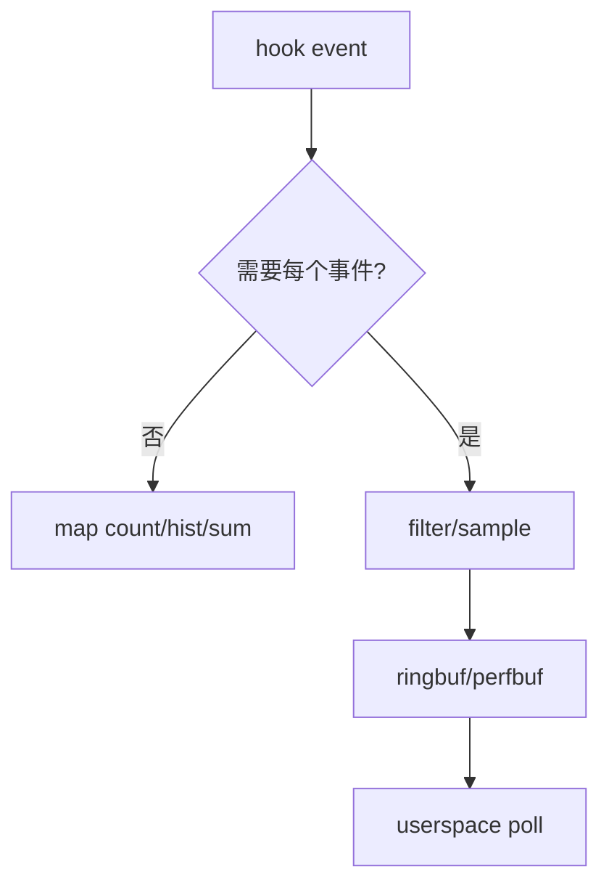
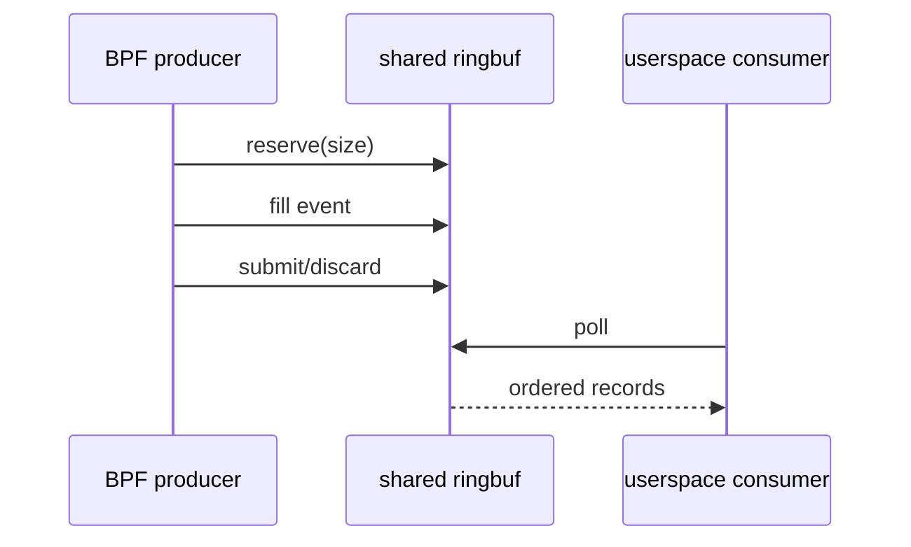
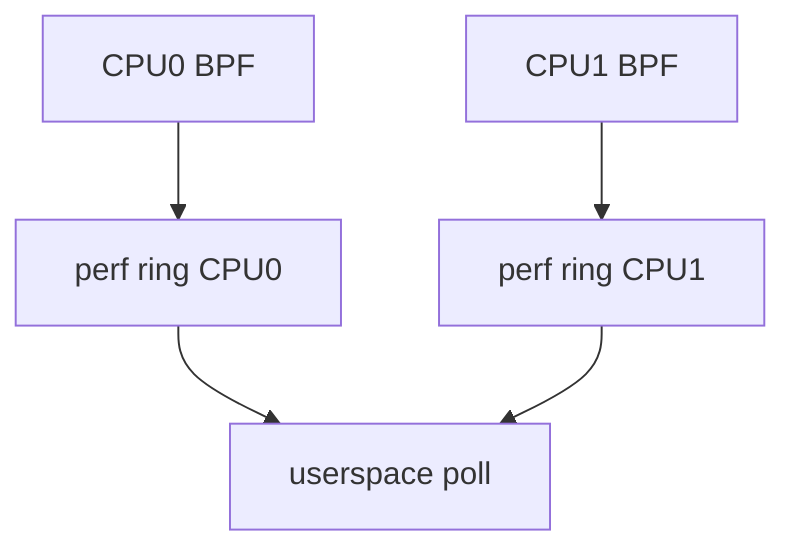
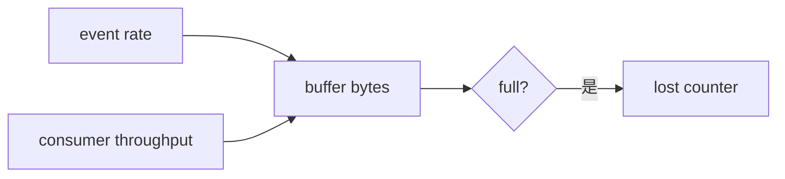
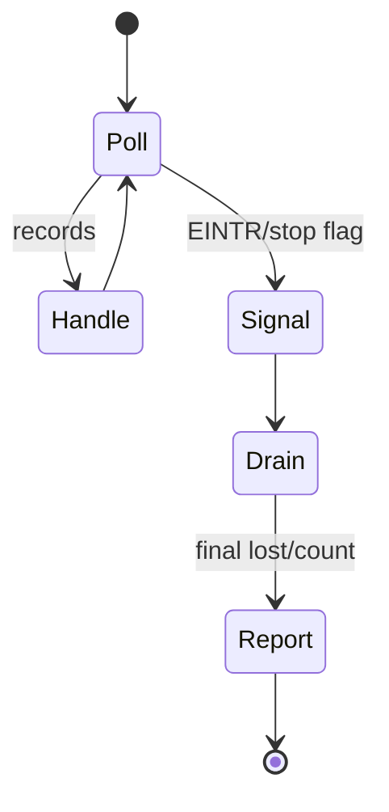

# 09：Ring Buffer、Perf Buffer 与事件传输

## 聚合还是逐事件



能在内核聚合的问题不要逐事件输出。事件流适合需要详细字段、关联或外部处理的少量/采样事件。

## Ringbuf 模型



ringbuf 是跨 CPU 共享 MPSC buffer，可更好保留全局 reserve 顺序。reserve 失败时必须计数 dropped events；所有路径必须 submit 或 discard。

## Perf buffer 模型



perfbuf 通常 per-CPU，扩展性好但跨 CPU 全局顺序需要 timestamp 重排。lost callback 是重要证据，不能忽略。

## Backpressure

BPF hook 不能阻塞等待用户态。buffer 满时 reserve/output 失败，观测丢事件而业务继续。工具必须暴露：submitted、reserve_failed/lost、consumed 和 buffer capacity。



## Event schema

使用固定宽度字段、version、size、type、timestamp、CPU、pid/tgid、ifindex。不要把内核指针无审查地输出到不可信用户，也不要直接传含 padding 的未初始化 struct。

```c
struct event_header {
    __u16 version;
    __u16 size;
    __u32 type;
    __u64 timestamp_ns;
};
```

写事件前清零或逐字段初始化，避免泄露栈/内核数据。

## Variable length 与 dynptr

固定 event 易兼容；variable payload 节省空间但解析复杂。packet sample 应限制最大 snaplen，记录 captured_len/original_len，并考虑敏感数据脱敏。

## 用户态 poll loop



区分 timeout、EINTR 和真正 poll error。退出先 detach 停止新事件，再短暂 drain，最后输出 lost metrics。

## 选择建议

| 需求 | 推荐 |
| --- | --- |
| 高频计数/直方图 | per-CPU map |
| 跨 CPU 事件顺序重要 | ringbuf |
| 兼容旧内核/libbpf | perfbuf 常更普遍 |
| 大 payload/packet sample | 先过滤采样，再有界输出 |

## 性能验证

同一负载比较不 attach、只计数、1/N 采样、全事件输出；记录应用吞吐、CPU、lost events。观测工具必须量化自己的扰动。

