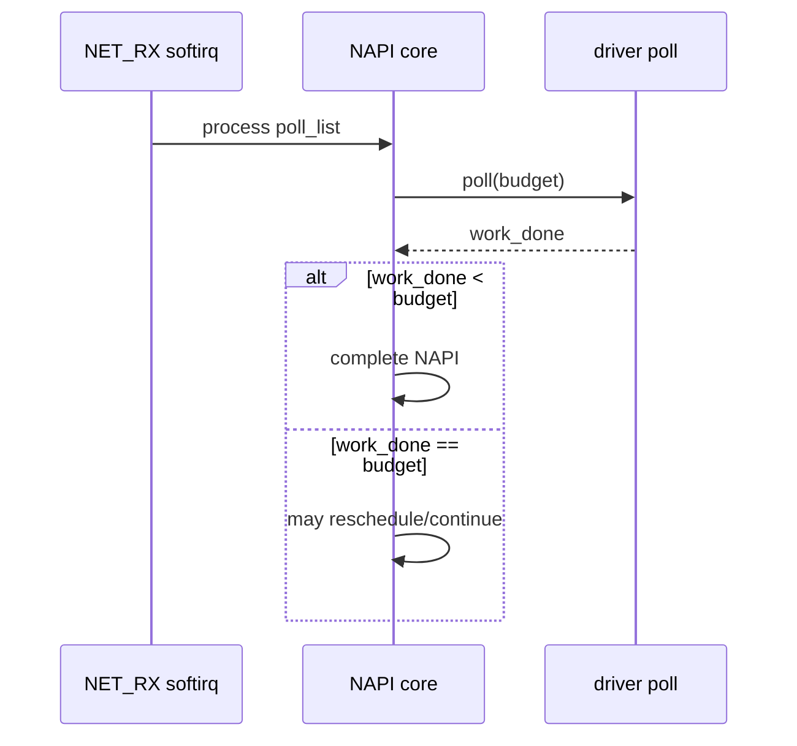
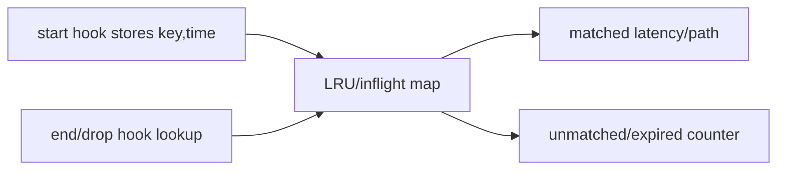

# 10：Linux 网络路径观测与关联

## RX 分层


每层可能 batch、合并、分段或丢弃，所以 IRQ、NAPI calls、skb events、socket messages 不会一一相等。

## TX 分层


`net_dev_xmit` 表示驱动提交结果，不证明 packet 已被对端接收。硬件 drop、link、对端协议仍需其他 counter。

## NAPI 预算



要同时观察 budget、work_done、duration、CPU、softirq time 和 drop counter。单看 poll count 不能判断效率。

## GRO/GSO 改变计数

GRO 可把多个 wire packets 合成较大 skb；GSO/TSO 可把一个大 skb 后续分段。因此 skb tracepoint count 与 NIC packet count 差异可能是 offload，而非漏事件。

## Correlation key

| key | 优点 | 风险 |
| --- | --- | --- |
| skb pointer | 快速、同对象路径 | clone/free/reuse，跨层对象变化 |
| five-tuple | 业务可解释 | fragment/NAT/tunnel、同流多包 |
| seq/id | 精确度高 | 协议解析和加密限制 |
| CPU+time window | 无需深解析 | 只提供弱相关 |



报告 matched ratio、evictions、missing events，不只展示成功样本。

## Drop 定位

drop reason tracepoint、qdisc drops、driver/ethtool counters、XDP stats 和 socket errors覆盖不同层。建立按层 counter，不要把所有 drop 都归于 `kfree_skb`。

## CPU 分布

IRQ affinity、RPS/RFS、NAPI、softirq migration、application affinity 都影响 CPU。按 ifindex/queue/CPU 聚合，结合 `/proc/interrupts`、`/proc/softirqs`、ethtool queue stats 对照。

## 观测矩阵

```text
layer       event/counter                 key fields
IRQ         /proc/interrupts              vector,cpu
softirq     irq:softirq_entry/exit         vec,cpu,time
NAPI        fentry/kprobe poll             napi,dev,budget,work
skb RX      netif_receive_skb              ifindex,len,protocol
drop        kfree_skb/drop_reason          reason,location
TX          net_dev_queue/net_dev_xmit     ifindex,len,rc
driver      ethtool -S                     queue,drop,error
```

对应综合项目：[../../project-linux-network-observability/README.md](../../project-linux-network-observability/README.md)。

