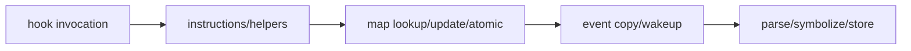
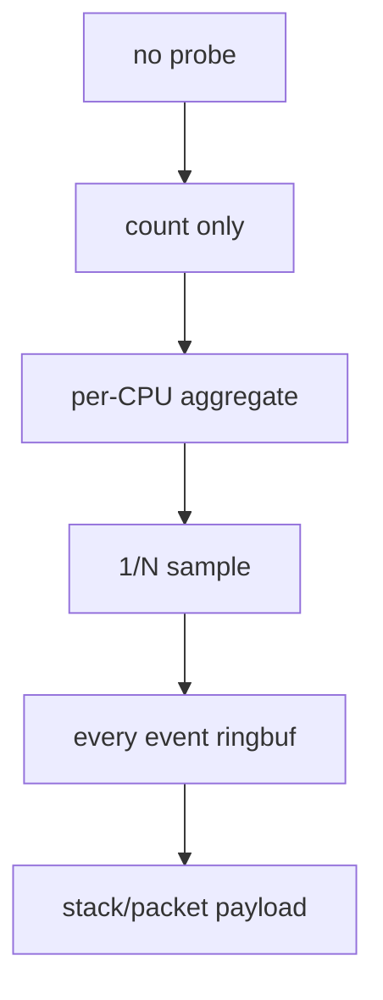
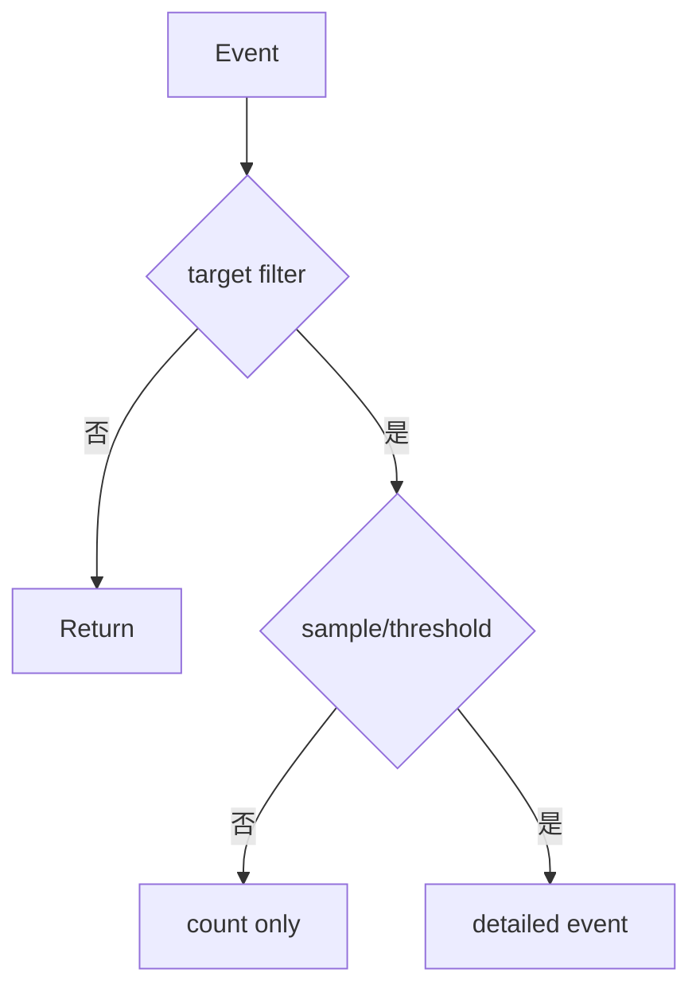
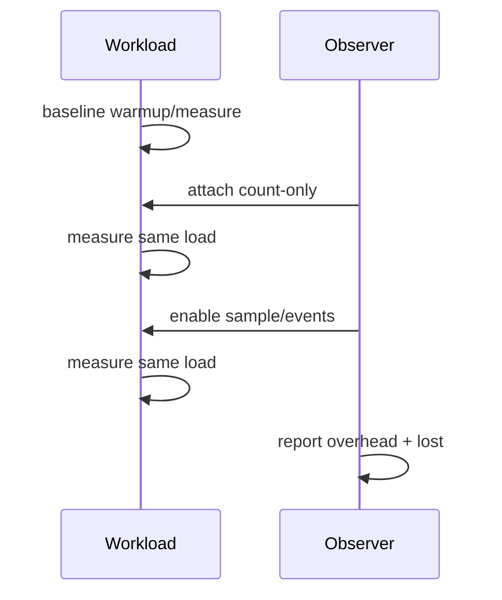

# 11：观测开销、采样与生产化

## 开销从哪里来

高频 hook 上最贵的常是共享 map、stack capture、字符串、逐事件输出和用户态符号化，不只是 BPF instruction 数。

## 开销阶梯

每增加能力都要重新测目标 workload，而不是假设“eBPF 很快”。

## 采样方法

- 随机/伪随机 1/N：减少周期性偏差。
- deterministic hash sample：同 flow 稳定采样。
- time-based：每 key/CPU 每窗口最多一个。
- threshold trigger：只输出高延迟/错误事件。

报告采样算法和 ratio，不能把 sample count 当总体 count。

## Cardinality budget

按 PID/flow/stack/reason 组合 key 会指数增长。对每个维度设 allowlist/top-K/bucket，使用 LRU 时记录 eviction。用户输入成为 key 前要有长度/范围限制。

## 生产安全开关

- 默认过滤目标 cgroup/ifindex/PID。
- 默认只聚合，详细事件需显式开启。
- map/ring 容量有上限。
- 可动态降低 sample rate/disable probe。
- 超过 lost/CPU 阈值自动降级。
- 不默认采集 payload、路径、凭据等敏感数据。

## 基线测量

记录吞吐、p99、CPU、context switch、lost events 和 observer CPU/memory。A/B 顺序可轮换，避免时间漂移。

## 故障隔离

observer 用户态崩溃时 BPF program/link 是否继续存在取决于 pin/link owner。supervisor 要检测 consumer死亡并 detach 或降级，防止 ring 持续满和无用开销。

## 数据治理

事件中的 PID/comm/IP/stack/payload 可能敏感。设计 retention、访问权限、脱敏和 tenant 边界；内核 pointer 应哈希/省略，避免泄露地址布局。

## 版本与发布

工具输出带 tool version、event schema version、kernel/libbpf/BTF identity。滚动升级时新旧 consumer 应能拒绝不兼容 schema，不静默错解字段。

## 能力声明

实验环境 PASS 可以说明 hook、map、事件和报告路径工作；不能声称生产 overhead、跨版本兼容和安全治理已经完成，除非有对应矩阵与长期运行证据。

