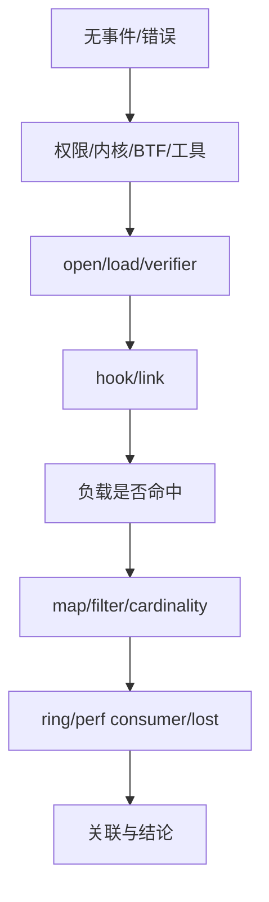
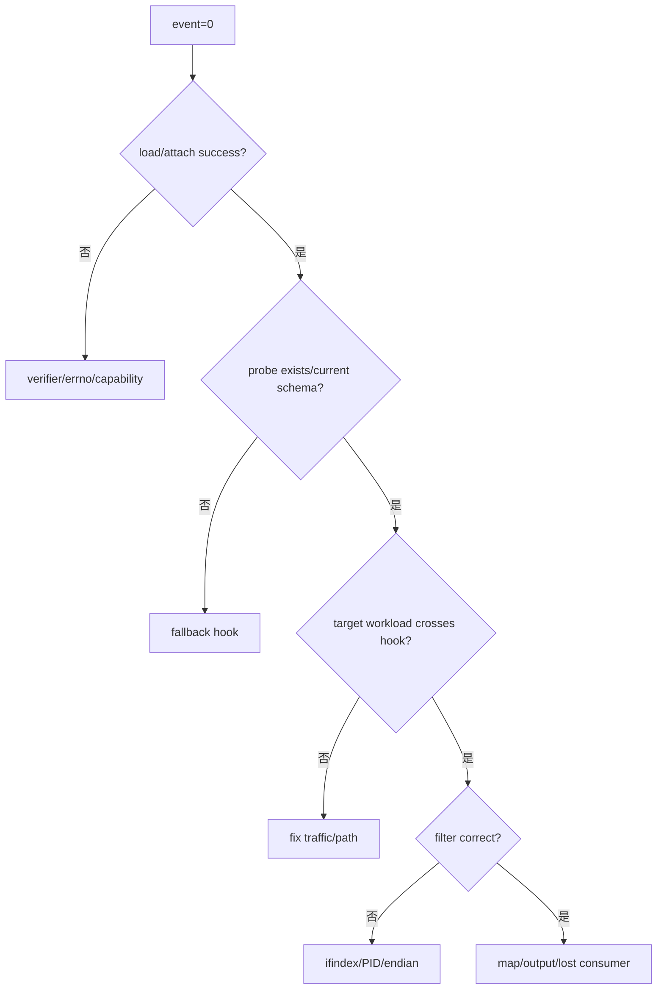
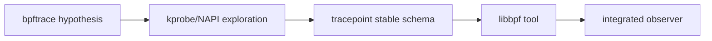

# 12：排障、项目映射与速记卡

## 分层排障



## 环境命令

```bash
uname -a
bpftrace --version
bpftool version
pkg-config --modversion libbpf
test -r /sys/kernel/btf/vmlinux
bpftool feature probe kernel
bpftool prog show
bpftool map show
bpftool link show
```

容器中还要检查 bpffs/tracefs mount、capabilities、seccomp、LSM/lockdown 和 host namespace。

## 无事件决策树



## Project 映射

| Phase | 前置章节 | 关键产物 | 验证能力 |
| --- | --- | --- | --- |
| 1 bpftrace netdev | 02、05、07 | `probes/*.bt` | RX/TX/softirq 快速探索 |
| 2 NAPI poll | 04、06、10 | dynamic kprobe scripts | budget/work/CPU correlation |
| 3 skb tracepoint | 07、10 | tracepoint scripts | RX/TX/drop 稳定事件 |
| 4 libbpf observer | 01、08、09 | `.bpf.c` + loader | BTF/libbpf/event consumer |
| 5 integrated project | 10、11 | observer/report | 多点聚合和工程证据 |



## 一页速记

```text
tracepoint = 显式事件契约，优先长期使用
kprobe     = 任意函数探索，受符号/ABI/内联影响
fentry     = BTF typed function tracing，通常低开销
map        = 状态/聚合/配置，不只是 dictionary
ringbuf    = 跨 CPU 共享有序事件流，满时不能阻塞
CO-RE      = 类型布局重定位，不保证 hook/helper 存在
```

## 高频误区

1. verifier PASS 不等于业务结论正确。
2. probe 命中不等于完整 packet path。
3. 计数差异不一定是 drop，可能是 GRO/GSO/batch。
4. ringbuf 丢事件不应静默忽略。
5. eBPF 不是零开销，高频 printf/stack 会扰动系统。
6. kprobe 脚本能跑不代表跨内核稳定。

## 口述自测

1. 描述 BPF ELF 到 hook 执行的对象生命周期。
2. 为什么 tracepoint 比 kprobe 稳定，仍需检查 schema？
3. 如何关联函数 entry/return 并处理递归/遗留 state？
4. per-CPU map 如何减少竞争，用户态如何汇总？
5. ringbuf 满时发生什么，怎样证明丢事件？
6. softirq/NAPI/skb/NIC packet count 为什么不相等？
7. bpftrace 原型迁移 libbpf 需要补哪些工程能力？
8. 如何测量 observer 自身 overhead？

## 证据清单

- 精确构建/运行命令和版本。
- probe/schema list 与 attach 结果。
- 流量拓扑和对照 counters。
- map/event/lost 统计。
- 清理后的 prog/map/link 状态。
- 明确哪些结论是观测、相关还是因果推断。

完整测试流程见 [../../tests/TEST_FLOW.md](../../tests/TEST_FLOW.md)。

