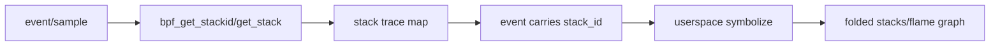
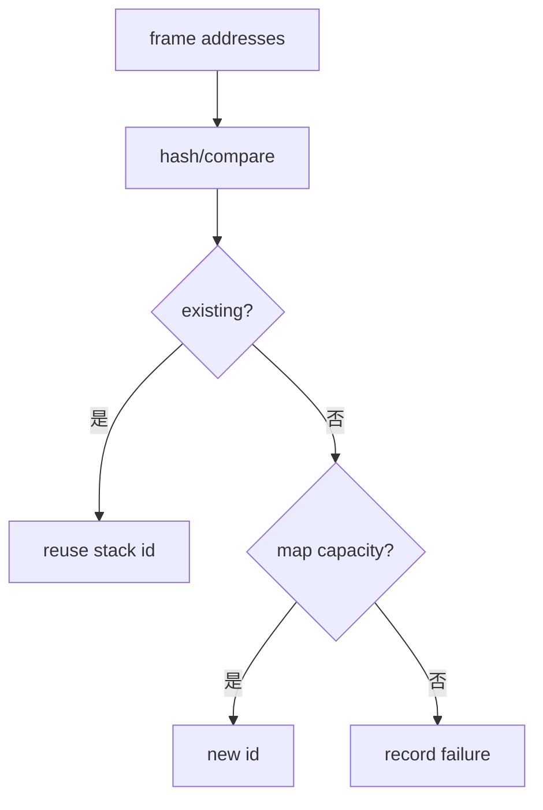
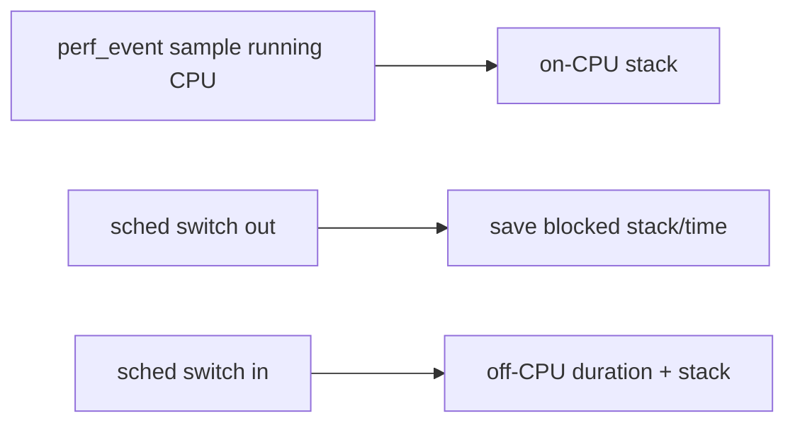

# 13：调用栈、符号化与火焰图

## 栈回答什么

计数告诉“发生多少”，stack 告诉“从哪里调用到这里”。它适合 CPU profile、drop caller、锁竞争来源和异常路径聚类，但采集/存储/符号化成本明显高于计数。

## Kernel 与 User Stack

| 栈 | 需要 | 常见问题 |
| --- | --- | --- |
| kernel stack | kallsyms/BTF/debug symbols | KASLR、模块符号、内联 |
| user stack | 进程 maps、ELF symbols、unwind 信息 | ASLR、JIT、frame pointer、进程退出 |

采集时保存 pid/tgid、comm、cgroup、timestamp 和 build id 上下文，否则离线符号化可能找不到正确二进制版本。

## Stack ID 与冲突

stack trace map 对 frames 哈希并返回 id。容量满、hash collision 或回溯失败都要统计。不要把负 stack id 当普通 key，也不要静默丢弃失败样本。

## Frame pointer 与 ORC/DWARF

内核通常可用 ORC/frame pointer 等机制；用户态 BPF stack walking 受架构和编译选项限制。复杂 DWARF unwind 常需用户态 profiler 支持。无法展开完整栈时应报告 truncated/failed，而不是把短栈当完整调用链。

## On-CPU 与 Off-CPU

on-CPU 火焰图显示 CPU 时间热点；off-CPU 显示等待来源。网络延迟可能来自 softirq CPU、锁、调度或 socket wait，需要选择正确模型。

## 火焰图语义

宽度表示采样/累计权重，不是时间轴；上下表示调用关系，不是“越高越慢”。比较两次火焰图应固定采样频率、负载和符号化质量。

## 高频网络 hook 上采栈

不要每 packet 无条件采集 stack。使用错误/高延迟触发、1/N sampling、目标 ifindex/flow filter，或先聚合 caller IP 再针对热点展开。

## Build ID 与离线符号化

生产工具可记录 build-id 和原始 address/stack id，在低优先级用户态异步符号化。内核态做字符串拼接/符号名输出会放大开销。

## 验收清单

- stack failure/collision/capacity 是否统计？
- kernel/user stack 是否明确区分？
- pid namespace/host pid 是否可映射？
- 二进制和 debug symbols 版本是否保存？
- 采样率和过滤条件是否写入报告？
- 火焰图结论是否避免误读为时间线？

