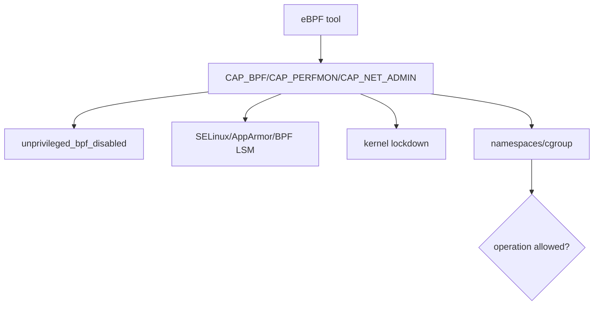
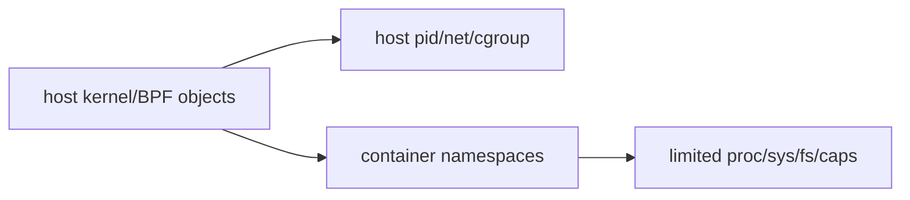
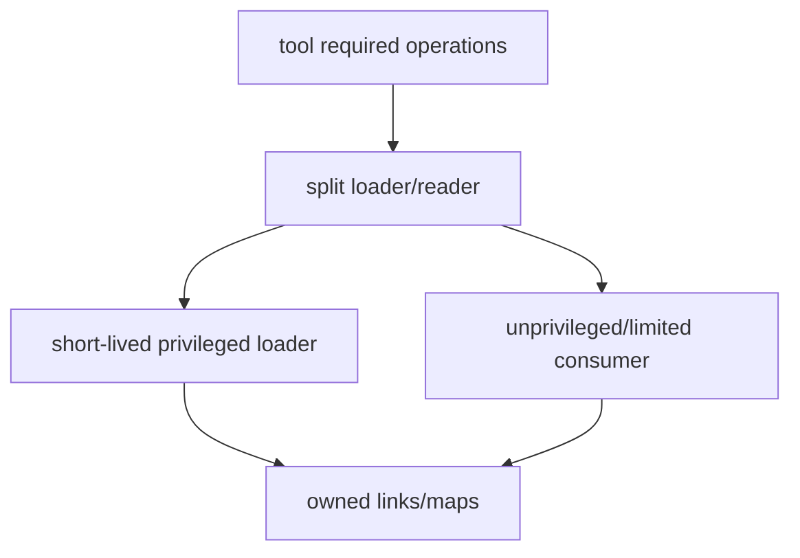

# 14：Capabilities、容器与安全边界

## 为什么 BPF 权限敏感

BPF program 可读取内核/进程上下文、挂到高频路径并影响网络，因此加载、attach、BTF/kallsyms、tracefs 和 map pinning 都受权限与安全策略约束。

旧内核常以 `CAP_SYS_ADMIN` 粗粒度控制；新内核可拆分能力。具体要求取决于 program/attach type 和内核版本，不能给所有工具统一 capability 清单。

## 容器看到哪个内核

容器共享 host kernel，但可能看不到 host pid/net/mount namespace、tracefs、bpffs 和设备。容器内 `ifindex=2` 与 host 语义可能不同；观测 host 网络通常需要进入对应 namespace 或在 host agent 执行。

## PID 与 Cgroup Identity

同一任务在 host 与容器 PID namespace 有不同 pid。事件 schema应明确 host pid/tgid，并可携带 cgroup id、namespace inode、container metadata 映射。仅用 comm 很容易冲突。

## bpffs/tracefs mount

`/sys/fs/bpf` 和 `/sys/kernel/tracing` 是否挂载、是否只读、是否映射进容器直接影响工具。不要让容器工具无范围清理 host bpffs；pin path应按 tenant/tool/version隔离。

## Lockdown 与 kallsyms

Secure Boot/lockdown 可能限制 kprobe、内核地址和 BPF read；`kptr_restrict` 影响符号可见性。tracepoint可用不代表 kprobe/fentry/stack symbolization 均可用。

## 最小权限

可将加载/attach 与事件消费分进程，减少长期高权限；map fd/pin 权限、Unix socket 和 cgroup scope 仍需控制。

## 数据泄露风险

内核地址、用户栈、路径、IP、payload、comm 和 cgroup 可泄露敏感信息。事件字段遵循最小化原则，指针仅作短期关联并哈希/脱敏，packet snaplen 默认关闭。

## 拒绝服务风险

即使 verifier-safe，工具也可能用高频 hook、巨大 map、stack capture、事件风暴消耗 CPU/内存。生产控制面需设置容量、采样、超时、自动 detach 和 watchdog。

## Multi-tenant

按 cgroup/netns/tenant 过滤，map key包含 tenant id，用户态输出做访问控制。不能让一个 tenant读取另一个 tenant 的 socket/stack/path 数据。

## 安全验收

- 明确最低 capability 和原因。
- 非 root 失败路径给出清晰提示。
- 不修改/卸载不属于本工具的 BPF link。
- pin path 有 owner/version，退出策略明确。
- 默认不输出 payload/原始内核指针。
- 容量和采样有硬上限。
- 容器/host identity 在事件中可解释。

