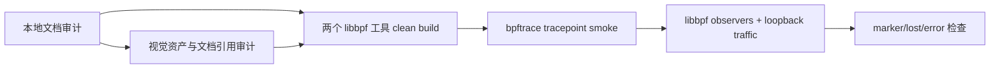

# eBPF Observability Fundamentals 测试流程

## 分层



## 1. 本地审计

```powershell
py linux-driver-lab/track-ebpf-observability/tests/check_fundamentals.py
py linux-driver-lab/track-ebpf-observability/tests/check_visual_assets.py
```

预期：

```text
EBPF_OBSERVABILITY_DOC_AUDIT_PASS files=16 lines>=1400 mermaid>=55 links=pass
EBPF_OBSERVABILITY_FUNDAMENTALS_COMPLETE
EBPF_VISUAL_ASSET_AUDIT_PASS scenes=3 png=3 gif=3 canvas=3
EBPF_VISUAL_LEARNING_PILOT_COMPLETE
```

视觉审计检查 HTML/Canvas/控制按钮、共享 CSS/JS、PNG/GIF 文件头和尺寸，以及 00-02 文档是否同时引用交互页、静态图和动态图。它不会启动浏览器重渲染，因此适合每次软件回归。

## 2. 可重复视觉渲染

Windows 开发机安装 Chrome/Edge 与 `ffmpeg` 后执行：

```powershell
cd linux-driver-lab/track-ebpf-observability
powershell -ExecutionPolicy Bypass -File `
  docs/fundamentals/visuals/tools/render_visuals.ps1
```

只更新生命周期场景：

```powershell
powershell -ExecutionPolicy Bypass -File `
  docs/fundamentals/visuals/tools/render_visuals.ps1 `
  -Scene 01_ebpf_object_lifecycle
```

预期最终 marker：

```text
EBPF_VISUAL_RENDER_PASS scenes=3 frames=24 fps=8
```

## 3. Linux clean build

```bash
cd /home/wq7/workspace/driver-lab/linux-driver-lab/track-ebpf-observability
bash -n tests/*.sh project-linux-network-observability/scripts/02_run_observer.sh
python3 -m py_compile tests/check_fundamentals.py tests/check_visual_assets.py
bash tests/software_regression.sh
```

## 4. Runtime

仅观测 loopback ping，不 attach XDP、不修改网卡：

```bash
printf '%s\n' '<sudo-password>' | sudo -S env EBPF_TEST_DURATION=3 \
  bash tests/runtime_regression.sh \
  > /tmp/ebpf-fundamentals-runtime.log 2>&1
```

日志收敛：

```bash
grep -E 'DOC_AUDIT|BUILD_PASS|RUNTIME_CASE_PASS|SUMMARY|PASS|FAIL|ERROR|lost' \
  /tmp/ebpf-fundamentals-runtime.log
```

最终 marker：

```text
EBPF_OBSERVABILITY_RUNTIME_REGRESSION_PASS
```

## 边界

- loopback smoke 验证当前内核 tracepoint、BPF load/attach、用户态消费路径。
- kprobe/fentry、真实 NIC NAPI/IRQ、drop reason 和生产 overhead 需要对应 workload/硬件复验。
- runtime 不修改 netdev、XDP、PCI、hugepage 或 RDMA 配置。
