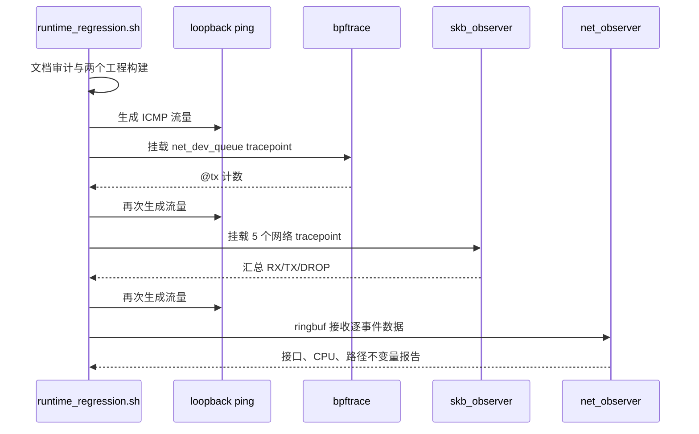

# eBPF Observability 基础知识层测试记录（2026-07-14）

## 1. 测试目标

本次验证用于回答四个问题：

1. `docs/fundamentals/` 的知识层是否完整、可导航、无相对链接断裂；
2. 两个 libbpf 工程是否仍可编译，文档改造是否引入工程回归；
3. bpftrace、独立 `skb_observer`、综合 `net_observer` 是否能在真实内核上装载并收到事件；
4. 测试脚本是否留下稳定 marker，便于后续只用 `grep` 快速判定。

## 2. 测试环境

| 项目 | 值 |
|---|---|
| 本地工作区 | Windows PowerShell，负责文档审计与同步 |
| Linux 主机 | `192.168.65.135` |
| 内核 | `6.8.0-124-generic` |
| bpftrace | `v0.14.0` |
| bpftool | `v7.4.0` |
| clang | Ubuntu clang `14.0.0` |
| libbpf | `0.5.0` |
| 运行流量 | loopback ICMP，测试时长 3 秒 |

环境确认命令：

```bash
uname -r
bpftrace --version
bpftool version | head -n 1
clang --version | head -n 1
pkg-config --modversion libbpf
```

## 3. 本地文档审计

在仓库根目录执行：

```powershell
cd linux-driver-lab/track-ebpf-observability
py tests/check_fundamentals.py
py -m py_compile tests/check_fundamentals.py
```

关键输出：

```text
EBPF_OBSERVABILITY_DOC_AUDIT_PASS files=16 lines=1464 mermaid=59 links=pass
EBPF_OBSERVABILITY_FUNDAMENTALS_COMPLETE
```

审计内容包括必需文件、最小篇幅、Markdown fence、相对链接、入口 marker 和 Mermaid 数量。Windows 环境没有 `bash`，因此 shell 语法检查放到 Linux 主机执行。

## 4. Linux 静态检查与构建

进入远端目录：

```bash
cd /home/wq7/workspace/driver-lab/linux-driver-lab/track-ebpf-observability
chmod +x tests/*.sh project-linux-network-observability/scripts/02_run_observer.sh
bash -n tests/check_fundamentals.sh \
  tests/software_regression.sh \
  tests/runtime_regression.sh \
  project-linux-network-observability/scripts/02_run_observer.sh
python3 -m py_compile tests/check_fundamentals.py
python3 tests/check_fundamentals.py
bash tests/software_regression.sh \
  > /tmp/ebpf-fundamentals-build.log 2>&1
grep -E 'EBPF_.*(PASS|COMPLETE)|error:|FAILED' \
  /tmp/ebpf-fundamentals-build.log
```

关键输出：

```text
EBPF_BUILD_PASS target=lab-libbpf-net-observer
EBPF_BUILD_PASS target=project-linux-network-observability
EBPF_OBSERVABILITY_FUNDAMENTALS_AND_BUILD_PASS
```

## 5. 最小运行回归

使用 root 权限装载 BPF 程序，密码通过交互或临时环境输入，不写入仓库：

```bash
sudo env EBPF_TEST_DURATION=3 bash tests/runtime_regression.sh \
  > /tmp/ebpf-fundamentals-runtime.log 2>&1
grep -E 'EBPF_.*(PASS|COMPLETE)|Attaching|summary' \
  /tmp/ebpf-fundamentals-runtime.log
```

测试流程：



最终 marker：

```text
EBPF_RUNTIME_CASE_PASS name=bpftrace_net_dev_queue
EBPF_RUNTIME_CASE_PASS name=libbpf_skb_observer
EBPF_RUNTIME_CASE_PASS name=project_net_observer
EBPF_OBSERVABILITY_RUNTIME_REGRESSION_PASS
```

观测样本：

| 工具 | RX | GRO | TX-QUEUE | TX-XMIT | DROP |
|---|---:|---:|---:|---:|---:|
| `skb_observer` | 159 | 0 | 160 | 160 | 0 |
| `net_observer` | 158 | 0 | 158 | 158 | 0 |

bpftrace 的 `@tx` 为 151；综合 observer 中 `TX-QUEUE -> TX-XMIT` 为 100%，DROP 为 0。loopback 未经过常见物理网卡 GRO 路径，因此 GRO 为 0 是本次流量模型的预期边界，不代表 GRO probe 失效。

## 6. 首次失败与修复

首次运行在独立 libbpf observer 阶段失败：

```text
libbpf: elf: failed to open build/skb_observer.bpf.o: No such file or directory
```

根因是测试从 track 根目录启动二进制，而程序按项目目录相对路径加载 `build/*.bpf.o`。修复 `run_with_traffic()`，增加项目工作目录参数，并在子 shell 中切换目录后执行。修复后重新执行完整运行回归，三个 case 均通过。

同时将 `project-linux-network-observability/scripts/02_run_observer.sh` 中的硬编码 sudo 密码移除。脚本现在优先使用交互式 `sudo`；自动化环境可显式注入临时 `SUDO_PASSWORD`，仓库不保存凭据。

## 7. 结论与边界

| 检查项 | 结果 |
|---|---|
| 16 个 fundamentals 文件 | PASS |
| 1464 行正文、59 个 Mermaid 图 | PASS |
| 相对链接与入口导航 | PASS |
| shell/Python 静态检查 | PASS |
| 两个 libbpf 工程 clean build | PASS |
| bpftrace tracepoint 运行 | PASS |
| 两个 observer 装载与事件采集 | PASS |

本次结论只覆盖单机 loopback 最小运行。物理 NIC 的 NAPI/GRO 行为、突发高流量下 ringbuf 丢事件、容器 namespace/cgroup 可见性、长期运行开销和安全加固仍需在对应专项实验中验证。
