# ROADMAP

这条路线先学习 RDMA core 原理，再进入代码实验。顺序不能反过来：如果还没理解 MR/QP/CQ/WQE/CQE，就直接写 ping-pong，很容易把环境问题、状态机问题和代码问题混在一起。

## 总路线

```mermaid
flowchart LR
    A[Phase 0: RDMA theory primer] --> B[Phase 1: env capability]
    B --> C[Phase 2: verbs object lifecycle]
    C --> D[Phase 3: memory registration deep dive]
    D --> E[Phase 4: QP state machine]
    E --> F[Phase 5: RC ping-pong]
    F --> G[Phase 6: one-sided RDMA model]
    G --> H["Phase 7: UD/RoCEv2 model"]
    H --> I[Phase 8: summary and interview material]
    I --> J["Phase 9: RC client/server project"]
```



## Phase 0: RDMA theory primer

目标：先建立从硬件、内核、verbs 对象到系统一致性的完整脑内模型，不写数据面业务代码。

| 学习点 | 必须会解释 |
| --- | --- |
| rdma-core | `libibverbs`、provider、kernel RDMA core、`rdma` netlink 的分工 |
| verbs object | device/context/PD/MR/CQ/QP/WR/CQE 的关系 |
| Memory Region | 为什么要 pin memory，`lkey/rkey` 分别给谁用 |
| Queue Pair | SQ/RQ、QP number、QP state |
| Completion Queue | CQE 的 `status/wr_id/opcode/byte_len` 怎么用于验证 |
| Transport | RC/UD/RoCEv2 的基本区别 |
| Soft-RoCE | 能学习什么，不能证明什么 |
| WR 数据路径 | WR/WQE/doorbell/CQE 的分层和异步完成 |
| One-sided consistency | completion、可见性、提交、持久化的边界 |
| Performance | batch/inline/signaling/polling/NUMA 的成本模型 |
| Reliability | RNR、retry、wrong-rkey、断连和 generation 恢复 |

当前文档入口：

```text
docs/fundamentals/README.md
docs/fundamentals/00_15_MINUTE_MENTAL_MODEL.md
docs/fundamentals/01_HARDWARE_KERNEL_USERSPACE_STACK.md
docs/fundamentals/02_VERBS_OBJECTS_LIFECYCLE.md
docs/fundamentals/03_MEMORY_REGISTRATION_DMA_KEYS.md
docs/fundamentals/04_QP_STATE_MACHINE_CONTROL_PLANE.md
docs/fundamentals/05_WR_WQE_CQE_DATA_PATH.md
docs/fundamentals/06_TRANSPORTS_ROCE_NETWORK.md
docs/fundamentals/07_ONE_SIDED_ATOMIC_CONSISTENCY.md
docs/fundamentals/08_PERFORMANCE_TUNING_NUMA.md
docs/fundamentals/09_RELIABILITY_SECURITY_FAILURES.md
docs/fundamentals/10_PROJECT_KNOWLEDGE_MAP.md
docs/fundamentals/11_DEBUGGING_PLAYBOOK.md
docs/fundamentals/12_RECALL_CARDS.md
docs/02_RDMA_CORE_MODEL.md
docs/04_DPDK_TO_RDMA_BRIDGE.md
lab-rdma-env-capability/docs/04_DEEP_LEARNING.md
```

验收入口：

```bash
bash tests/check_fundamentals.sh
bash tests/software_regression.sh
```

当前状态（2026-07-14）：`RDMA_FUNDAMENTALS_COMPLETE`。

## Phase 1: RDMA 环境能力边界

目录：

```text
lab-rdma-env-capability/
```

目标：

- 确认测试机是否有 RDMA HCA 或 Soft-RoCE 能力。
- 确认 `rdma-core`、`libibverbs`、`ibverbs-utils`、provider 是否齐全。
- 确认 `rdma link/dev/resource` 和 `ibv_devices/ibv_devinfo` 的观察结果。
- 把所有操作写入 records，作为后续学习证据。

代码/脚本产物：

| 文件 | 作用 |
| --- | --- |
| `scripts/00_collect_env.sh` | OS/kernel/PCI/netdev/module/command 采集 |
| `scripts/01_collect_rdma_capability.sh` | verbs 和 RDMA netlink 能力采集 |
| `scripts/02_try_soft_roce_boundary.sh` | Soft-RoCE 边界检查和显式 setup |
| `scripts/03_generate_summary.sh` | PASS/BLOCKED summary |
| `scripts/04_install_ibverbs_utils.sh` | 补齐 verbs 诊断工具并记录阻塞 |

证据产物：

```text
records/<timestamp>/ENV_CHECK.log
records/<timestamp>/RDMA_CAPABILITY.log
records/<timestamp>/SOFT_ROCE_BOUNDARY.log
records/<timestamp>/INSTALL_IBVERBS_UTILS.log
records/<timestamp>/OPERATION_LOG.md
records/<timestamp>/SUMMARY.md
```

当前最终结果（2026-07-01）：

```text
PASS_RDMA_TOOLS_PRESENT
PASS_RDMA_DEVICE_PRESENT
PASS_SOFT_ROCE_AVAILABLE
rxe0/1 ACTIVE on ens34
```

复现入口：

```bash
cd /home/wq7/workspace/driver-lab/linux-driver-lab/track-rdma-core/lab-rdma-env-capability
REUSE_LATEST_RECORD=0 bash scripts/00_collect_env.sh
bash scripts/01_collect_rdma_capability.sh
bash scripts/02_try_soft_roce_boundary.sh
bash scripts/03_generate_summary.sh
```

## Phase 2: verbs object lifecycle

计划目录：

```text
lab-rdma-verbs-object-lifecycle/
```

学习目标：

- 写最小 C 程序枚举 verbs device。
- 打开 device/context。
- 分配 PD。
- 创建 CQ。
- 分配一段 buffer 并注册 MR。
- 创建 QP，但暂不收发数据。
- 按反向顺序销毁对象。

核心 API：

```text
ibv_get_device_list
ibv_open_device
ibv_query_device
ibv_query_port
ibv_alloc_pd
ibv_reg_mr
ibv_create_cq
ibv_create_qp
ibv_destroy_qp
ibv_destroy_cq
ibv_dereg_mr
ibv_dealloc_pd
ibv_close_device
```

验证目标：

- 日志打印每个对象的创建结果。
- 打印 MR 的 `addr/length/lkey/rkey`。
- 打印 QP 的 `qp_num`。
- `rdma resource show` 能看到资源变化，或者在 Soft-RoCE 环境下记录看不到的边界。

## Phase 3: Memory Region deep dive

计划目录：

```text
lab-rdma-memory-region-deep-dive/
```

学习目标：

- 对比不同 access flag：
  - `IBV_ACCESS_LOCAL_WRITE`
  - `IBV_ACCESS_REMOTE_WRITE`
  - `IBV_ACCESS_REMOTE_READ`
- 理解为什么 recv buffer 需要 local write。
- 理解暴露 `rkey` 的风险。
- 记录注册大内存、未对齐地址、权限不足时的失败表现。

验证目标：

- 成功注册 MR。
- 故意缺权限时捕获失败或后续 WR error。
- 文档说明 `lkey/rkey` 的用途差异。

当前状态（2026-07-01）：

```text
PASS
```

已完成 5 个真实 RXE MR case：本地写、远端读、缺少本地写的远端写、完整权限、非页对齐地址，并保存完整编译和执行记录。

## Phase 4: QP state machine

计划目录：

```text
lab-rdma-qp-state-machine/
```

学习目标：

- 创建 RC QP。
- 完成 `RESET -> INIT -> RTR -> RTS`。
- 明确每一步需要的参数：
  - port number
  - pkey index
  - QP access flags
  - remote QPN
  - PSN
  - MTU
  - LID/GID
  - retry/timeout

验证目标：

- 每次 `ibv_modify_qp()` 都打印当前状态。
- 故意缺参数时记录失败点。
- Mermaid state diagram 和实际命令结果对应。

当前状态（2026-07-01）：

```text
PASS
```

已在 `rxe0` 上创建两个 RC QP，验证非法 `RESET -> RTR` 被拒绝，并完成双方 `RESET -> INIT -> RTR -> RTS`。测试同时记录了错误 GID index 导致 RTR 超时的边界。

## Phase 5: RC ping-pong

计划目录：

```text
lab-rdma-rc-pingpong/
```

学习目标：

- 一端 post recv。
- 另一端 post send。
- 双方 poll CQ。
- 用 `wr_id` 关联 WR 和 CQE。
- 理解 receiver 必须提前准备 RQ buffer。

验证目标：

- 本机双进程或两端模式跑通。
- 记录 send CQE 和 recv CQE。
- 记录 `byte_len/status/opcode/wr_id`。

当前状态（2026-07-01）：`PASS`。两个本地 RC QP 完成双向 ping/pong，SEND/RECV CQE 与 payload 均验证成功。

## Phase 6: one-sided RDMA model

计划目录：

```text
lab-rdma-one-sided-read-write/
```

学习目标：

- 使用 RDMA WRITE 写远端 MR。
- 使用 RDMA READ 读远端 MR。
- 理解远端 CPU 不参与 data movement 的语义。
- 理解 addr/rkey 交换为什么是安全边界。

验证目标：

- WRITE 后远端 buffer 内容变化。
- READ 后本地 buffer 内容变化。
- 文档说明 Send/Recv 与 RDMA WRITE/READ 的差异。

当前状态（2026-07-01）：`PASS`。已验证 RDMA WRITE 直接修改远端 MR、RDMA READ 拉回远端 MR，并记录 address/rkey、本地 CQE 和 payload。

## Phase 7: UD/RoCEv2 model

计划目录：

```text
lab-rdma-ud-rocev2-model/
```

学习目标：

- 理解 UD QP 和 RC QP 差异。
- 理解 Address Handle。
- 理解 GRH/GID。
- 理解 RoCEv2 的 UDP/IP 封装。

验证目标：

- 如果环境支持，跑 UD send/recv。
- 如果不支持，保留 packet model、命令边界和源码阅读证据。

当前状态（2026-07-01）：`PASS`。RXE 已跑通 UD datagram，验证 AH、Q_Key、remote QPN、40 字节 GRH 偏移和 SEND/RECV CQE，并补充 RoCEv2 UDP/IP packet model。

## Phase 8: summary and interview material

计划目录：

```text
project-rdma-core-summary/
```

输出：

- `RDMA_CORE_FINAL_REPORT.md`
- `EVIDENCE_INDEX.md`
- `INTERVIEW_NOTES.md`
- `RESUME_MATERIAL.md`
- `DPDK_TO_RDMA_COMPARISON.md`

面试讲述主线：

```text
DPDK packet fastpath -> RDMA object model -> MR/QP/CQ -> RC ping-pong -> one-sided semantics -> RoCEv2 model
```

当前状态（2026-07-01）：`PASS`。总报告、证据索引、面试笔记、简历材料和 DPDK/RDMA 对比均已完成，Phase 2-7 最终自动测试全部通过。

## Phase 9: RC client/server engineering project

计划目录：

```text
project-rdma-rc-client-server/
```

学习目标：

- 把同进程里的两个 QP 拆成两个独立进程：`rdma-rc-server` 和 `rdma-rc-client`。
- 使用 TCP 控制面交换 `gid/qpn/psn/address/rkey`。
- 使用 RC 数据面验证 SEND/RECV、RDMA WRITE、RDMA READ。
- 记录断连、超时、错误 rkey、CQE error、资源回收。
- 单机 `192.168.65.135` 跑通后，再迁移到双机 RoCEv2。

项目计划文档：

```text
docs/05_NEXT_PROJECT_RC_CLIENT_SERVER_PLAN.md
```

当前状态（2026-07-11）：`PASS_SINGLE_HOST`。已在 `192.168.65.135` 单机 Soft-RoCE 上跑通两个独立进程，覆盖 TCP 控制面、QP RTS、RC SEND/RECV、RDMA WRITE、RDMA READ 和 wrong-rkey boundary。

第一版验收结果：

```text
TCP_CONTROL_PLANE_PASS
RC_QP_RTS_PASS
RC_SEND_RECV_PASS
RDMA_WRITE_PASS
RDMA_READ_PASS
WRONG_RKEY_BOUNDARY_PASS
RESOURCE_CLEANUP_PASS
```

证据入口：

```text
project-rdma-rc-client-server/tests/TEST_RECORD_20260711.md
```

## Phase 10: RDMA performance tuning

计划目录：

```text
project-rdma-performance-tuning/
```

学习目标：

- 从“功能跑通”进入“性能可测量”。
- 建立 SEND completion latency 基线。
- 明确 latency、bandwidth、CQ polling、batch、inline、selective signaling 的测量边界。
- 保留 Soft-RoCE 与真实 RNIC 的结论边界，不把 RXE 数据包装成硬件性能。

当前状态（2026-07-13）：`PASS_NUMACTL_NODE0_BINDING`。已在 `192.168.65.135` 上完成：

- SEND completion latency baseline
- batch WR
- inline data
- selective signaling
- signal interval matrix
- client-side CQ polling budget matrix
- 可选 RTT phase
- 双机脚本入口（`make dual-server` / `make dual-client`）
- CPU affinity 记录入口
- `numactl` node0 同节点绑定路径验证

第一版验收结果：

```text
TCP_CONTROL_PLANE_PASS
RC_QP_RTS_PASS
PERF_SEND_LATENCY_SERVER_PASS
PERF_SEND_LATENCY_CLIENT_PASS
perf_result test=send_latency iterations=100 avg_ns=7450 min_ns=5009 p50_ns=5681 p95_ns=11801 p99_ns=46625 max_ns=57194
```

证据入口：

```text
project-rdma-performance-tuning/tests/TEST_RECORD_20260711.md
project-rdma-performance-tuning/tests/TEST_RECORD_20260712.md
project-rdma-performance-tuning/tests/TEST_RECORD_20260712_CPU_AFFINITY.md
project-rdma-performance-tuning/tests/TEST_RECORD_20260713_NUMACTL_NODE0.md
```

下一步：

- 真实 `134 -> 135` 双机执行（当前会话对 `134` 登录仍是 `Permission denied`）
- 多 NUMA node 环境下补同节点 / 跨节点对比（135 当前只有 `node0`）

## Phase 11: one-sided KV

目录：

```text
project-rdma-one-sided-kv/
```

Phase 1-6 状态（2026-07-13）：`ONE_SIDED_KV_CURRENT_ENV_COMPLETE`。

- server 将 8 个固定 KV record 注册为一个可远程 READ/WRITE 的 MR。
- client 用 `remote.addr + slot * sizeof(record)` 对 slot 2 执行 RDMA WRITE 与 READ。
- client CQE 证明两个 264 字节 one-sided WR 完成；server 在 TCP ACK 后检查被远端改写的 MR。
- MR re-register 后新 rkey WRITE/READ 成功，旧 rkey 返回 `remote access error`。
- server 授予 4 个应用层 credit，client 链式提交 4 个 WRITE 和 4 个 READ WR，两个链尾 CQE 成功。
- client 使用 remote fetch-and-add 原子减 4 获取 credit，batch 后原子加 4 归还，server counter 恢复为 4。
- CAS 验证 holder 成功、逻辑 contender 拒绝、归还后重试成功和最终 counter 恢复。
- FNV-1a 动态 key directory 完成 PUT/GET，并拒绝同 bucket 的不同完整 key 覆盖。

证据入口：

```text
project-rdma-one-sided-kv/tests/TEST_RECORD_20260713_PHASE1.md
project-rdma-one-sided-kv/tests/TEST_RECORD_20260713_PHASE2_CREDIT_BATCH.md
project-rdma-one-sided-kv/tests/TEST_RECORD_20260713_PHASE3_REMOTE_ATOMIC.md
project-rdma-one-sided-kv/tests/TEST_RECORD_20260713_PHASE4_CAS_CONTENTION.md
project-rdma-one-sided-kv/tests/TEST_RECORD_20260713_PHASE5_DYNAMIC_DIRECTORY.md
project-rdma-one-sided-kv/tests/TEST_RECORD_20260713_PHASE6_RKEY_ROTATION.md
```

当前环境项目已收口。真实双 client、多 QP、断线重连、双机、RNIC 和多 NUMA 性能矩阵作为后续硬件/拓扑扩展，不计入当前完成状态。

## 收敛原则

- 每个 lab 的 `docs/` 不超过 4 个文件。
- `04_DEEP_LEARNING.md` 必须保留原理图、UML/Mermaid 和学习解释。
- 每个项目在 `tests/` 下保留自动测试脚本和可复现的完整测试记录。
- 没有真实硬件时，明确写成 boundary，不包装成硬件 RDMA。
