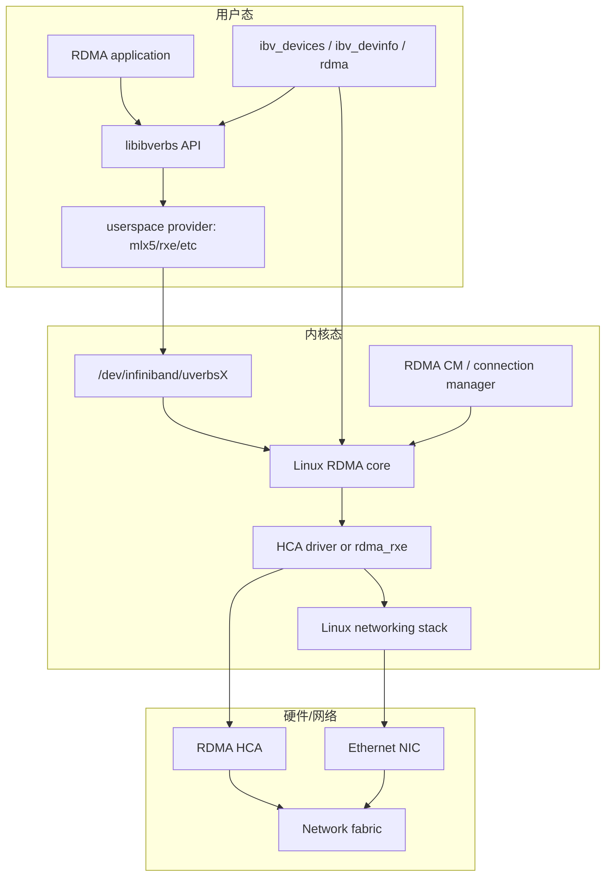
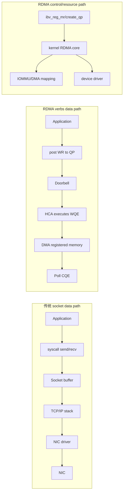
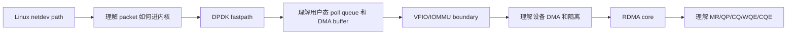
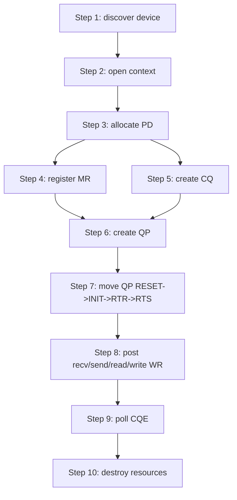
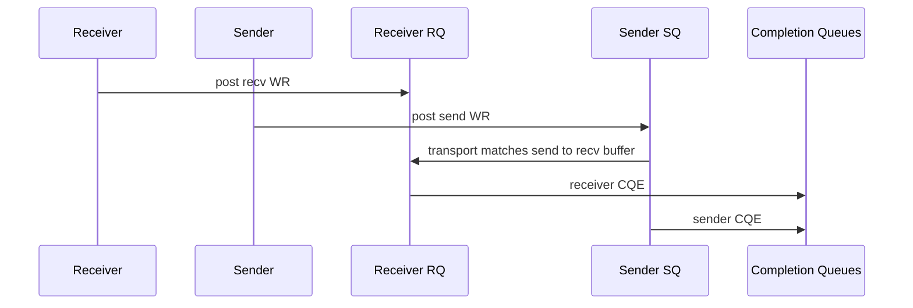
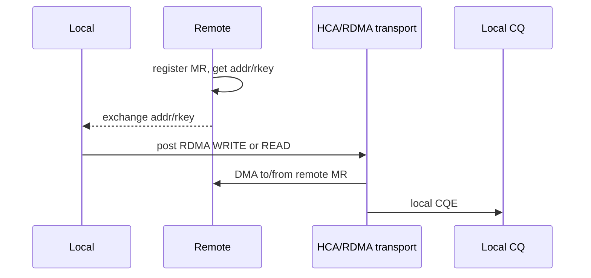
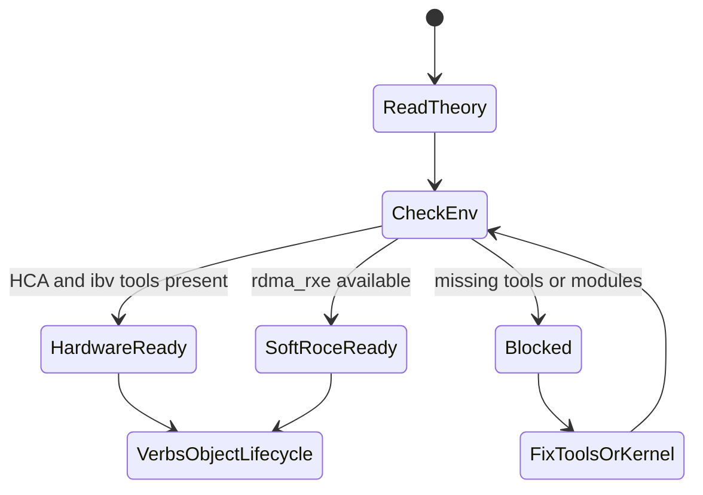

# 01_TRACK_OVERVIEW

## 先回答一句话：RDMA 是什么

RDMA 是 Remote Direct Memory Access，远端直接内存访问。

它的核心思想是：把两台机器之间的数据传输，从“应用把数据交给内核网络栈，再由 TCP/IP 逐层处理”，改成“应用提前注册内存，把要做的动作写成 Work Request，RDMA NIC 或 Soft-RoCE 按队列描述直接搬数据”。

简化对比：

```text
Socket: user buffer -> syscall -> kernel TCP/IP -> NIC -> remote kernel -> remote user buffer
RDMA:   registered memory -> QP/WQE -> HCA DMA/transport -> remote registered memory
```

所以 RDMA 学习的重点不是“又一种 socket API”，而是：

- 内存如何被注册成 NIC 能 DMA 的 Memory Region。
- 队列如何描述一次发送、接收、读、写。
- completion 如何证明一次 work request 已经完成。
- 本地和远端如何交换 QP number、GID/LID、PSN、rkey 等连接信息。

## RDMA 解决什么问题

传统网络 I/O 的成本主要来自：

- syscall 上下文切换。
- 内核协议栈处理。
- socket buffer 和用户 buffer 之间的数据 copy。
- CPU 参与大量 packet 级处理。
- 高速网络下 CPU 成为瓶颈。

RDMA 要解决的是：

| 问题 | RDMA 的方式 |
| --- | --- |
| CPU copy 成本高 | 使用注册内存，让 NIC/HCA 直接 DMA |
| syscall 路径长 | 用户态通过 verbs doorbell 投递 WQE |
| kernel TCP/IP 开销大 | RDMA transport 由 HCA 或 RDMA stack 处理 |
| 低延迟需求 | 应用 poll CQ，减少等待和上下文切换 |
| 高吞吐需求 | 批量 post WR / poll CQ，减少 CPU 参与 |

它常见于：

- 分布式存储。
- 高性能计算。
- 数据库复制。
- GPU/AI 训练集群的数据搬运。
- 低延迟交易和高性能消息系统。

## RDMA 在系统中的位置

RDMA 横跨用户态库、内核 RDMA 子系统、设备驱动、NIC/HCA 和网络。



从这个图看，`rdma-core` 不是一个单独命令，也不是一个单独驱动。它更像 RDMA 用户态和内核态生态的基础包，包含库、provider、工具和服务。

## RDMA 和 Linux 网络栈是什么关系

RDMA 不是完全“绕过 Linux”。它绕过的是传统 socket data path，不是绕过所有内核资源管理。



理解这个分层很重要：

- data path：尽量由用户态队列和 HCA 完成。
- control path：仍然需要内核管理资源、权限、内存 pin、DMA mapping。
- discovery/debug path：通过 `ibv_devices`、`ibv_devinfo`、`rdma link/dev/resource` 观察。

## 从前面项目如何过渡到 RDMA

你前面已经做过 Linux network data plane、DPDK advanced，这些内容不是浪费，它们正好是进入 RDMA 的台阶。



过渡关系：

| 已学内容 | 迁移到 RDMA 的理解 |
| --- | --- |
| netdev RX/TX | RDMA 也依赖设备驱动和队列，但不是 packet-by-packet socket path |
| NAPI/poll | RDMA 应用也常 poll CQ，但 poll 的是 completion，不是 skb |
| DMA | MR 注册的底层同样离不开 DMA mapping 和 page pin |
| DPDK mempool/mbuf | RDMA 更关注 registered memory 和 SGE |
| DPDK RX/TX queue | RDMA 的核心队列是 QP 的 SQ/RQ 和 CQ |
| VFIO/IOMMU | RDMA 同样要关注 DMA 权限、隔离和地址映射 |

## RDMA 总体框架



对应 API：

| 阶段 | 典型 API |
| --- | --- |
| 发现设备 | `ibv_get_device_list` |
| 打开设备 | `ibv_open_device` |
| 查询能力 | `ibv_query_device`、`ibv_query_port` |
| 分配隔离域 | `ibv_alloc_pd` |
| 注册内存 | `ibv_reg_mr` |
| 创建完成队列 | `ibv_create_cq` |
| 创建队列对 | `ibv_create_qp` |
| 修改 QP 状态 | `ibv_modify_qp` |
| 投递请求 | `ibv_post_recv`、`ibv_post_send` |
| 轮询完成 | `ibv_poll_cq` |

## RDMA 的两类数据语义

### Two-sided：Send/Recv

Send/Recv 像消息传递。接收方必须提前 post recv WR，发送方 post send WR。两边都会从 CQ 里看到 completion。



### One-sided：RDMA READ/WRITE

RDMA READ/WRITE 更像远端内存操作。远端提前注册 MR，并把地址和 `rkey` 交给本端。本端 post RDMA READ/WRITE 后，远端 CPU 不需要参与这次数据搬运。



## 为什么当前先做环境能力检查

RDMA 程序失败时，原因可能是：

- 没有真实 HCA。
- 没有 Soft-RoCE。
- 缺 `ibverbs-utils`，看不到 `ibv_devices`。
- 缺 provider，有设备也无法被 libibverbs 使用。
- 没有 `/dev/infiniband/uverbsX`。
- QP 参数不完整。
- MR 权限不正确。

所以当前 track 的第一步是 `lab-rdma-env-capability`。它不是绕路，而是在给后续代码实验排雷。



## 推荐阅读顺序

```text
01_TRACK_OVERVIEW.md
02_RDMA_CORE_MODEL.md
04_DPDK_TO_RDMA_BRIDGE.md
../lab-rdma-env-capability/docs/04_DEEP_LEARNING.md
../ROADMAP.md
```

读完应该能回答：

- RDMA 和 socket 的根本差异是什么？
- RDMA 在 Linux 系统里处在哪几层？
- `rdma-core` 包含哪些东西？
- MR/QP/CQ 分别解决什么问题？
- 为什么要先补 `ibv_devices` / `ibv_devinfo`？
- 为什么 Soft-RoCE 可以学习 verbs，但不能代表硬件性能？
