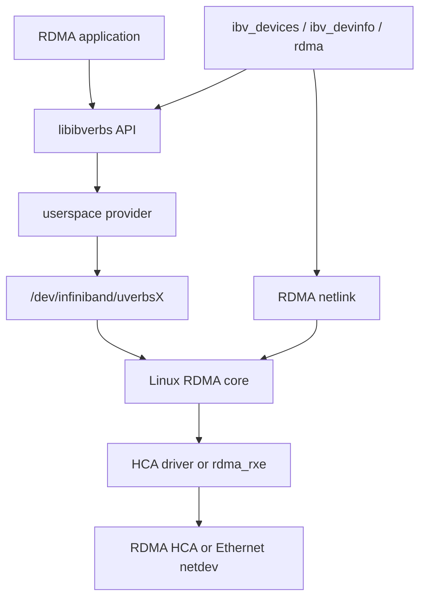
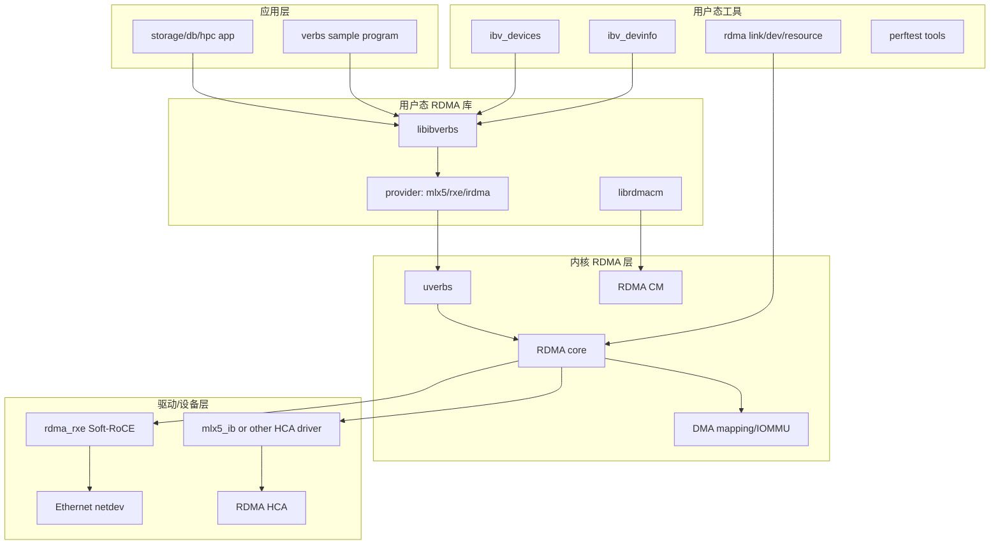
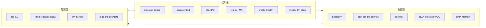
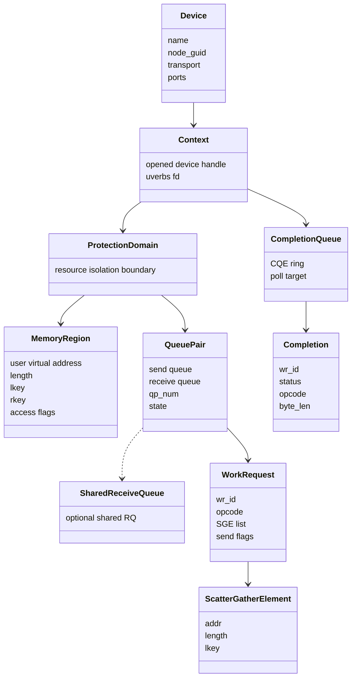
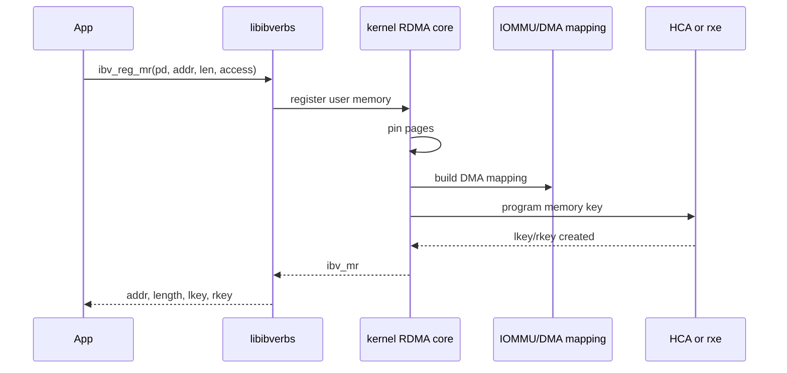
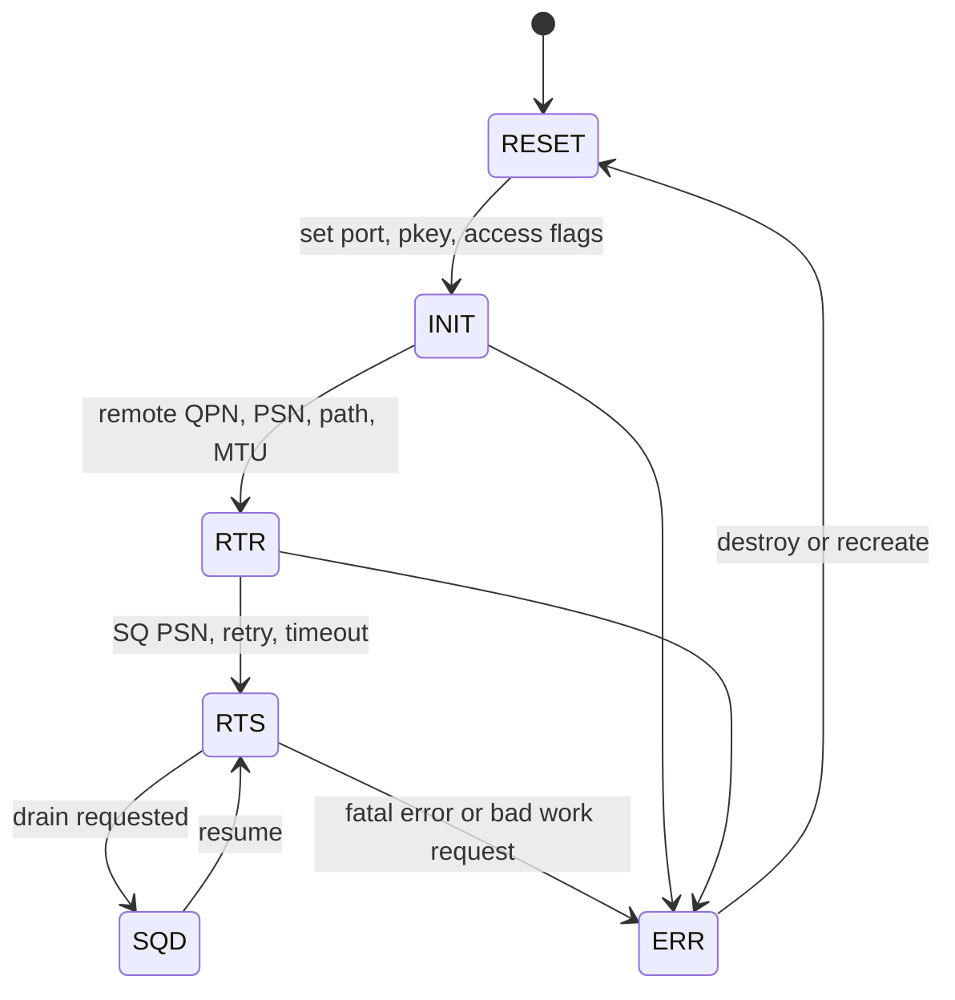
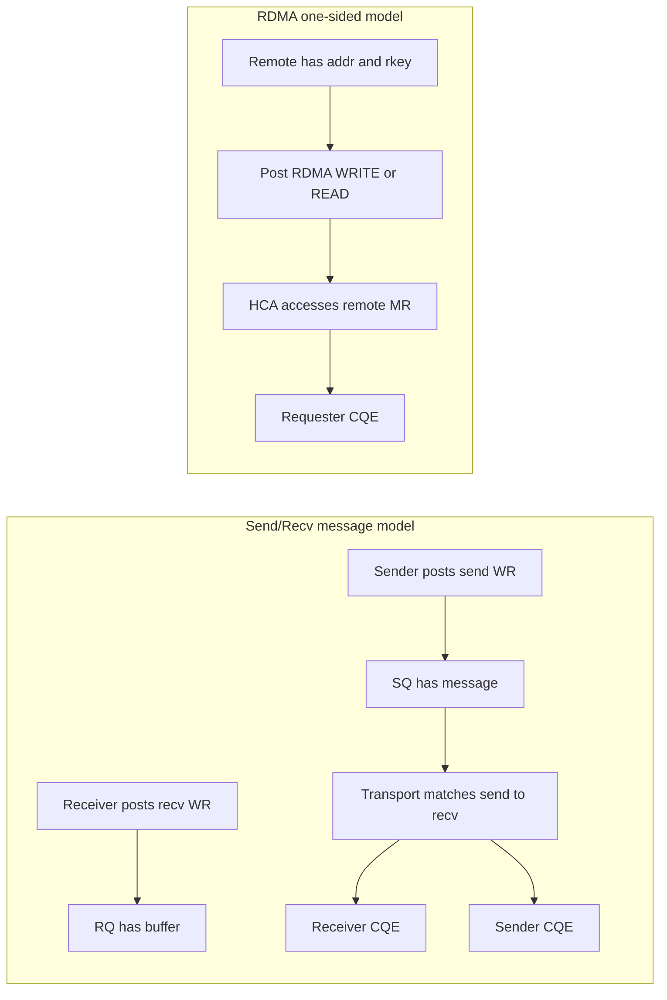
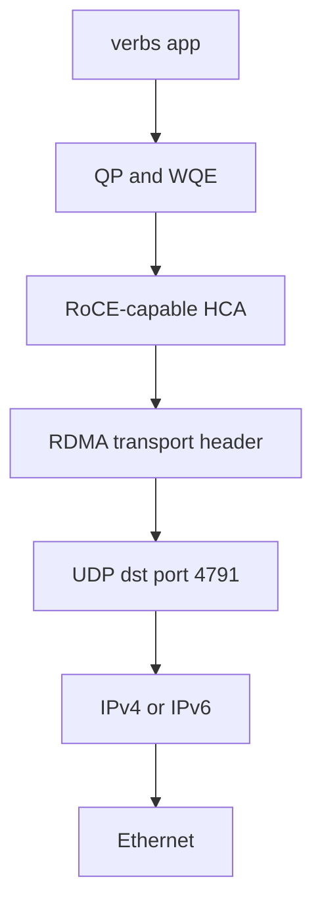
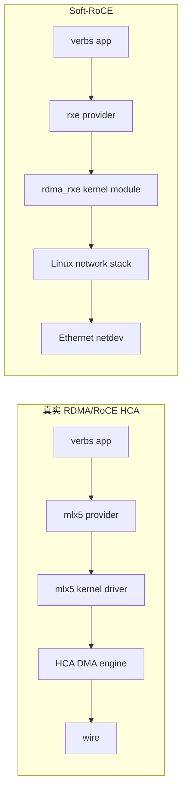
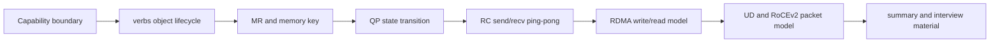

# 02_RDMA_CORE_MODEL

## 先把 RDMA 放到正确位置

RDMA 的核心不是“更快的 socket”，而是把数据搬运路径从内核协议栈和 CPU copy，改成由 RDMA NIC 或 Soft-RoCE 根据 work queue 中的描述去执行。

普通 socket 的典型路径是：

```text
user buffer -> syscall -> kernel socket buffer -> TCP/IP stack -> NIC
```

RDMA verbs 的典型路径是：

```text
registered user memory -> WQE -> QP doorbell -> HCA DMA -> CQE
```

这带来三个学习重点：

- 应用必须显式管理可 DMA 的内存区域，也就是 Memory Region。
- 应用不是 `send()` 一段 bytes，而是向 Queue Pair 投递 Work Request。
- 完成不是靠 syscall 返回，而是应用轮询 Completion Queue。

## rdma-core 到底是什么

`rdma-core` 是 Linux RDMA 用户态基础设施集合，不是一块单独的内核驱动。它把用户态 verbs API、provider、工具命令和内核 RDMA subsystem 接起来。

可以把它拆成三条线：

- 编程线：应用通过 `libibverbs` 创建对象、注册内存、投递 WR、轮询 CQ。
- 资源线：内核 RDMA core 管理设备、ucontext、MR、QP、CQ、DMA mapping。
- 观测线：`ibv_devices`、`ibv_devinfo`、`rdma link/dev/resource` 帮你确认环境和对象是否存在。



## rdma-core 框架分层



这张图对应后续排错顺序：

1. 工具是否存在：`command -v ibv_devices ibv_devinfo rdma`。
2. 用户态库是否安装：`dpkg -l | grep libibverbs`。
3. provider 是否安装：`dpkg -l | grep ibverbs-providers`。
4. kernel RDMA 是否有设备：`rdma dev`。
5. verbs 是否能枚举设备：`ibv_devices`。
6. Soft-RoCE 是否可作为学习替代：`modinfo rdma_rxe`。

## 控制面、数据面、观测面

学习 RDMA 时最好把动作分成三类。



对应理解：

- 控制面失败：通常是工具、设备、权限、参数或状态机问题。
- 数据面失败：通常是 WR、SGE、MR 权限、QP 状态、远端参数问题。
- 观测面不足：通常是缺工具、日志不够、没有 CQE 或没有 resource evidence。

常见组件：

| 组件 | 作用 | 没有它会怎样 |
| --- | --- | --- |
| `libibverbs1` | verbs 用户态库 | 程序无法链接或运行 verbs API |
| `libibverbs-dev` | verbs 头文件和开发文件 | C 程序无法编译 |
| `ibverbs-providers` | mlx5/rxe 等用户态 provider | 有设备也可能无法被 verbs 使用 |
| `rdma-core` | RDMA 用户态基础设施和服务 | RDMA 运行环境不完整 |
| `ibverbs-utils` | `ibv_devices`、`ibv_devinfo` 等诊断工具 | 很难确认 verbs device 能力 |
| `iproute2` | 提供 `rdma` 命令 | 无法通过 netlink 看 RDMA link/dev/resource |

## verbs 对象关系

verbs 编程不是从“收包”开始，而是从对象生命周期开始。最小对象链条如下：



对象含义：

- `Device`：verbs 能看到的 RDMA 设备，可能是真 HCA，也可能是 `rxe`。
- `Context`：打开设备后的上下文，后续对象都依附于它。
- `PD`：Protection Domain，隔离 MR/QP 等资源，防止任意 QP 使用任意 MR。
- `MR`：Memory Region，把用户态 buffer 注册给 RDMA subsystem，得到 `lkey/rkey`。
- `CQ`：Completion Queue，HCA 把完成结果写到这里，应用用 `ibv_poll_cq()` 取。
- `QP`：Queue Pair，一对 Send Queue / Receive Queue，是 RDMA data path 的核心队列。
- `WR/WQE`：应用投递的工作请求，进入队列后成为 NIC 可执行的 Work Queue Element。
- `CQE`：完成事件，告诉应用某个 WR 成功、失败、收到多少字节。

## Memory Region、lkey、rkey

RDMA 不能直接拿任意用户态地址做 DMA。应用必须先注册内存：



两个 key 的意义：

| key | 谁用 | 作用 |
| --- | --- | --- |
| `lkey` | 本地 QP 的 SGE | 证明本地 WR 有权访问这段 MR |
| `rkey` | 远端 RDMA READ/WRITE/atomic | 给远端访问本机 MR 的授权令牌 |

如果只是 Send/Recv，通常关注 `lkey`。如果做 RDMA WRITE/READ，就必须理解 `rkey` 暴露的安全边界。

## Queue Pair 状态机

QP 必须经过状态迁移才能收发。RC QP 的典型状态机如下：



状态含义：

- `RESET`：刚创建，不能收发。
- `INIT`：本地端口、访问权限已设置。
- `RTR`：Ready To Receive，已经知道远端信息，可以接收。
- `RTS`：Ready To Send，可以发送。
- `ERR`：出错态，通常需要销毁或重建 QP。

## Send/Recv 与 RDMA READ/WRITE 的区别



区别：

| 模型 | 接收端是否必须提前 post recv | 远端是否暴露 rkey | 常见用途 |
| --- | --- | --- | --- |
| Send/Recv | 是 | 否 | 消息通知、控制面 |
| RDMA WRITE | 否 | 是 | 数据推送、低延迟写入远端 buffer |
| RDMA READ | 否 | 是 | 拉取远端数据 |

## RC、UC、UD 和 RoCEv2

| Transport | 特点 | 学习优先级 |
| --- | --- | --- |
| RC | Reliable Connected，可靠连接，最常用于入门 ping-pong | 最高 |
| UC | Unreliable Connected，有连接但不可靠 | 了解即可 |
| UD | Unreliable Datagram，无连接消息模型，需要 AH/GRH | 中后期 |
| Raw Packet | mlx5 等设备可支持低层 packet path | 后期 |

RoCEv2 是把 RDMA transport 承载在 UDP/IP 之上。它不是普通 UDP 应用，而是 NIC/RDMA stack 用 UDP/IP 封装 RDMA 语义。



## Soft-RoCE 与真实 HCA 的边界

Soft-RoCE 的 `rdma_rxe` 可以让普通以太网网卡暴露 verbs device，用于学习对象模型和基础 data path。但它不是硬件 offload。



适合 Soft-RoCE 验证的内容：

- `ibv_get_device_list()` 是否能发现 device。
- `ibv_open_device()`、`ibv_alloc_pd()`、`ibv_reg_mr()` 是否能成功。
- QP 状态迁移是否能完成。
- RC ping-pong 的 WR/CQE 语义。

不适合 Soft-RoCE 证明的内容：

- 真实 HCA 延迟。
- PCIe DMA offload 性能。
- RoCE 拥塞控制和交换机 PFC/ECN 效果。

## 和 DPDK 的关键差异

| 维度 | DPDK | RDMA |
| --- | --- | --- |
| 数据单位 | packet / mbuf | WR / WQE / SGE / MR |
| CPU 角色 | poll RX burst，解析报文，决定 TX/drop | 注册内存，投递 WR，poll CQ |
| NIC 角色 | 收发 packet，RSS 分流 | 执行 transport 和 DMA |
| 内存管理 | mempool + mbuf | registered memory + lkey/rkey |
| 队列模型 | RX queue / TX queue | QP SQ/RQ + CQ |
| fastpath 证据 | RX/TX counters、burst matrix、route stats | QP state、posted WR、CQE status |

## 本 track 的学习顺序


