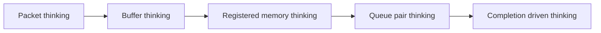
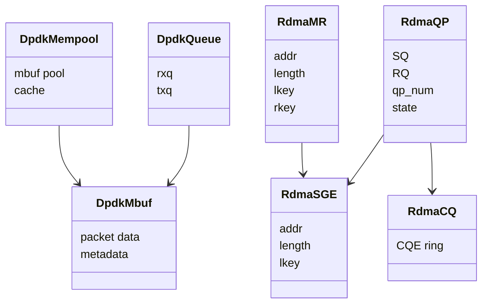
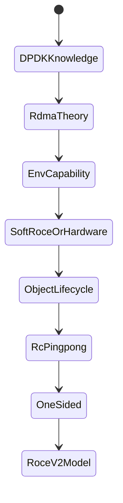

# 04_DPDK_TO_RDMA_BRIDGE

## 为什么要从 DPDK 过渡到 RDMA

DPDK 和 RDMA 都在解决“内核网络栈太重、CPU 成本太高”的问题，但解决方式不同。

- DPDK：把 packet I/O 拉到用户态，应用自己 poll RX/TX queue，自己解析和转发 packet。
- RDMA：把数据搬运描述成 WQE，应用注册内存和投递 WR，让 HCA 或 Soft-RoCE 完成 transport 和 DMA。

一句话：

```text
DPDK 让 CPU 更快地处理 packet。
RDMA 让 NIC/HCA 尽量直接搬 memory。
```

## 三条路径对比

```mermaid
flowchart TB
    subgraph Kernel["Linux kernel networking"]
        K1[App] --> K2[syscall]
        K2 --> K3[socket buffer]
        K3 --> K4["TCP/IP stack"]
        K4 --> K5[NIC driver]
        K5 --> K6[NIC]
    end

    subgraph DPDK["DPDK userspace packet path"]
        D1[App] --> D2[poll RX burst]
        D2 --> D3[mbuf]
        D3 --> D4[parse packet]
        D4 --> D5["route/ACL"]
        D5 --> D6[TX burst]
    end

    subgraph RDMA["RDMA verbs path"]
        R1[App] --> R2[register MR]
        R2 --> R3[post WR]
        R3 --> R4["QP/SQ/RQ"]
        R4 --> R5[HCA executes WQE]
        R5 --> R6[poll CQE]
    end
```



## 已有 DPDK 知识如何迁移

| DPDK 知识 | RDMA 中的新理解 |
| --- | --- |
| hugepage / DMA buffer | MR 注册、page pin、DMA mapping |
| mempool | 资源池概念还在，但 RDMA 更强调 MR 生命周期 |
| mbuf | RDMA 里更像 SGE 指向的 buffer，而不是 packet metadata |
| RX queue / TX queue | QP 的 RQ/SQ |
| burst | 批量 post WR / poll CQ |
| RSS 多队列 | 多 QP、多 CQ、多线程绑定 |
| PMD capability | verbs device capability 和 provider capability |
| VFIO/IOMMU | RDMA 同样依赖 DMA 隔离与地址映射 |
| L3 forwarder | RDMA 不再由 CPU 逐包查路由，而是 transport 层处理连接/路径 |

## 思维方式变化



DPDK 代码里常问：

- 这个 packet 在哪个 queue？
- 这个 mbuf 的 metadata 是什么？
- 这个 packet 是 forward、drop 还是 rewrite？
- burst size 和 cache size 怎么调？

RDMA 代码里常问：

- 这段 buffer 是否注册成 MR？
- SGE 使用的 `lkey` 是否正确？
- QP 是否已经进入 RTS？
- receiver 是否提前 post recv？
- CQE 的 `status` 和 `wr_id` 对应哪个 WR？

## 对象映射图



这个映射不是一一等价，而是帮助理解：

- mbuf 是 packet 容器。
- SGE 是描述某段内存的元素。
- MR 是这段内存能被 RDMA 访问的前提。
- QP 是 work queue 的核心。
- CQ 是完成语义的来源。

## 为什么先不写性能测试

当前测试机没有发现真实 RDMA HCA。没有硬件时，性能数字没有意义。

现阶段最有价值的是：

1. 读懂 RDMA 在系统中的位置。
2. 补齐 `ibverbs-utils`，确认 verbs 观察工具。
3. 用 Soft-RoCE 建立对象模型。
4. 写最小 verbs object lifecycle。
5. 再做 RC ping-pong。



## 面试表达

可以这样说：

“我不是把 RDMA 当成另一个 socket API 学，而是从 DPDK 的用户态队列和 DMA buffer 过渡过去。DPDK 的重点是 CPU 在用户态快速处理 packet；RDMA 的重点是把用户态注册内存、队列和权限交给 HCA，让 HCA 按 WQE 搬数据，再由 CQE 告诉应用完成结果。所以我先做 capability boundary，再学 MR/QP/CQ，最后再做 RC ping-pong 和 one-sided RDMA。”
