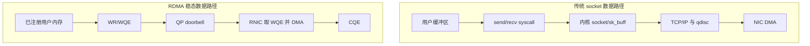
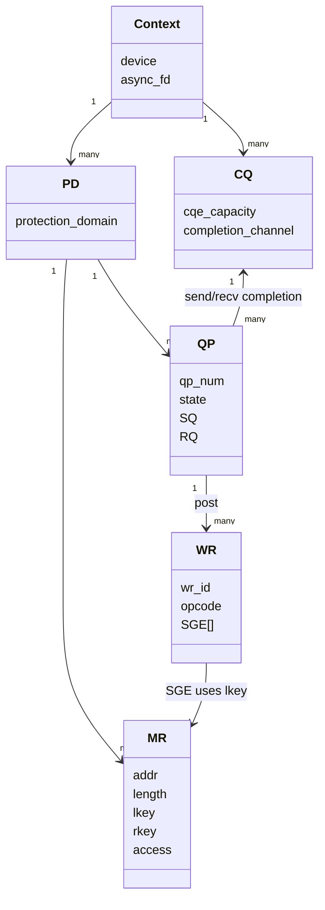
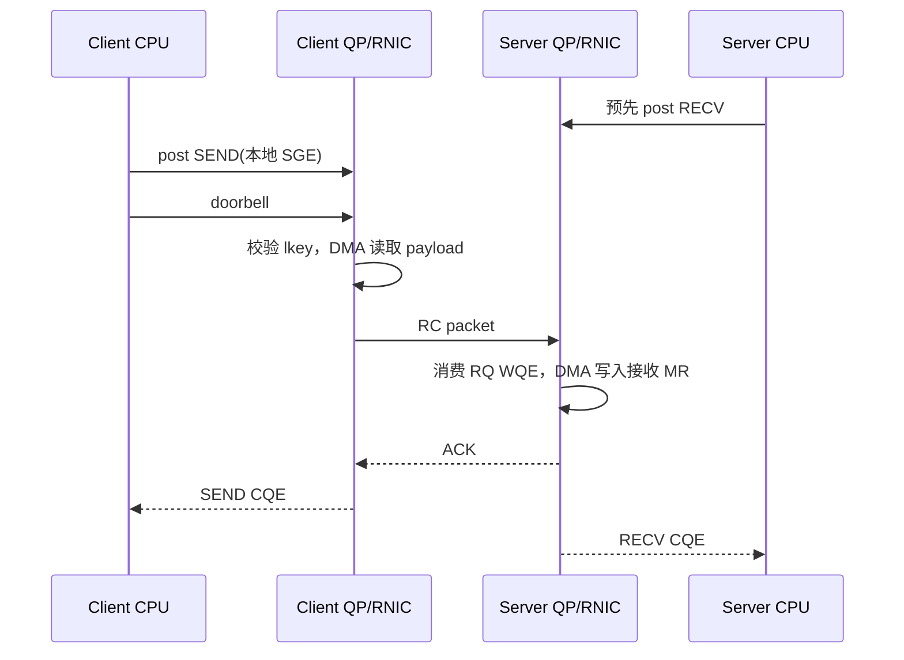
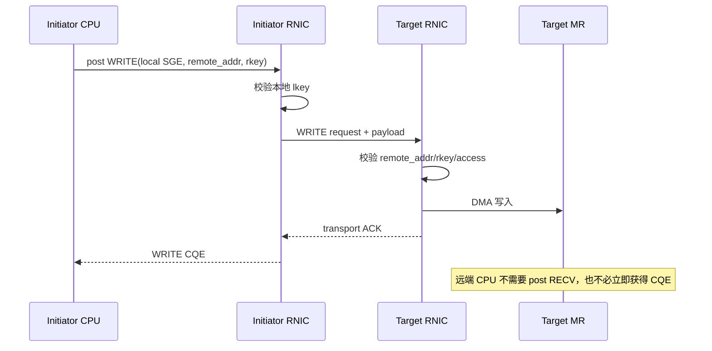

# 00：15 分钟建立 RDMA 心智模型

## 一句话定义

RDMA 是一组让网卡依据用户态提交的工作描述，直接在已注册内存之间搬运数据，并把结果写入完成队列的机制。它减少的是每次数据传输中的 syscall、协议栈处理和 CPU copy，不是把内核、驱动、网络协议和应用协议全部删掉。

## 与 socket 的第一张对照图

这里的“绕过内核”只描述稳态数据面。设备打开、对象创建、内存注册、连接建立、异常处理仍需要 `libibverbs`、provider、uverbs、内核 RDMA core 和设备驱动协作。

## 把 RDMA 想成一套受保护的异步任务系统

可以用“仓库调度”类比，但必须记住类比边界：

| RDMA 概念 | 类比 | 精确定义 |
| --- | --- | --- |
| PD | 安全域 | 限制 MR、QP 等对象能否组合使用 |
| MR | 已登记货架 | 一段可被 RNIC DMA 的虚拟地址区间及权限 |
| lkey | 本地取货凭证 | SGE 引用本地 MR 时由 RNIC 校验 |
| rkey | 远端访问凭证 | 对端执行 READ/WRITE/Atomic 时校验 |
| QP | 双向任务队列 | SQ/RQ 及其传输状态、序号和重试上下文 |
| WR | 软件任务单 | 应用提交的操作描述 |
| WQE | 队列中的硬件任务 | provider 编码后供 RNIC 消费的格式 |
| CQE | 完成回执 | 完成状态、操作码、长度和 `wr_id` |

PD 不是加密机制，rkey 也不是可长期公开的密码。它们是 RNIC 数据面能力控制的一部分，安全仍依赖网络隔离、密钥生命周期和控制面认证。

## 最小对象图

## 一次 RC SEND 的完整故事

关键点：SEND 是 two-sided。发送端需要 SEND WR，接收端必须提前准备 RECV WR；没有接收 WQE 可能触发 RNR NAK 和重试。

## 一次 RDMA WRITE 的完整故事

这就是 one-sided 的含义：远端 CPU 不参与每次操作的发起和接收匹配。它不意味着远端永远不参与，控制面、内存发布、版本更新、回收和故障恢复仍需要协议。

## 五个必须分开的“成功”

这些层次不能互相替代：

- post 成功：参数和队列状态足以接受 WR。
- CQE 成功：满足该 opcode/transport 的完成语义。
- 数据可见：还需考虑操作顺序、并发读写和平台内存模型。
- 业务有效：可能还需 version、commit flag、checksum 或锁。
- 持久化：还涉及远端 cache、持久内存 flush 等额外机制。

## 看到代码先找这七个位置

1. 资源创建顺序和失败回滚。
2. MR 注册地址、长度与 access flags。
3. QP 类型、cap 和状态迁移参数。
4. SGE 的地址、长度、lkey。
5. WR 的 opcode、flags、remote address/rkey。
6. CQ poll 对 `status/opcode/wr_id/byte_len` 的校验。
7. 断连和错误后对象是否按逆序释放。

下一章把这套心智模型放回 Linux 内核和真实 RNIC 的位置。

