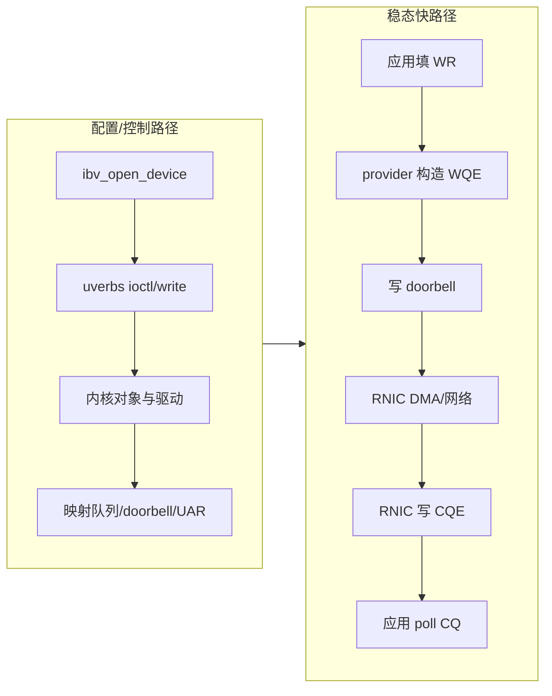
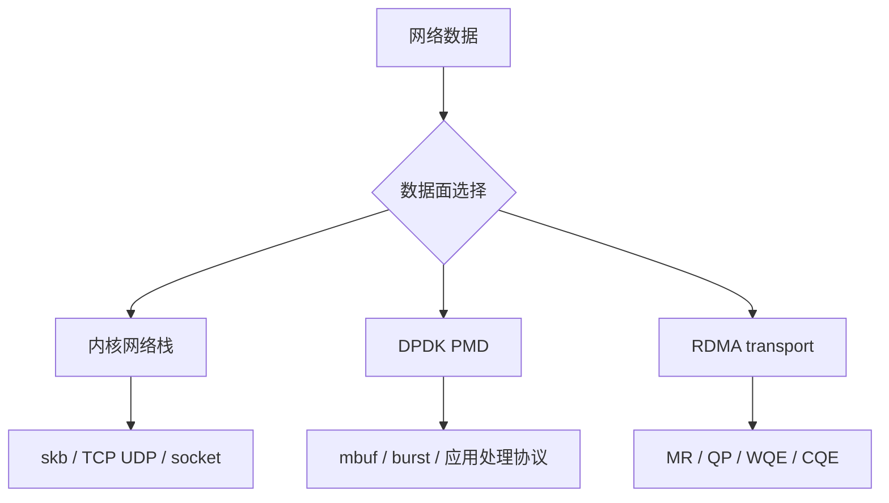
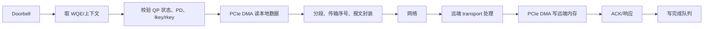
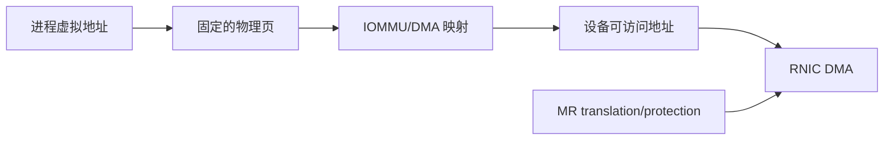

# 01：硬件、内核与用户态分层

## RDMA 在整机中的位置

```mermaid
flowchart TB
    App[数据库/存储/HPC/通信库] --> Verbs[libibverbs / librdmacm]
    Verbs --> Provider[用户态 provider<br/>mlx5/rxe/irdma 等]
    Provider --> Uverbs[/dev/infiniband/uverbsX]
    Uverbs --> Core[Linux RDMA core]
    Core --> HCADrv[HCA 驱动]
    Core --> RXE[rdma_rxe]
    HCADrv --> RNIC[PCIe RNIC]
    RXE --> Netdev[Ethernet net_device]
    RNIC --> Wire[IB/Ethernet fabric]
    Netdev --> Stack[UDP/IP/Ethernet 软件路径]
    Stack --> Wire
```

真实 RNIC 与 Soft-RoCE 共享 verbs 语义，但数据执行位置不同：真实 RNIC 在设备上解析 WQE、做传输与 DMA；RXE 在内核软件中模拟 RDMA transport，最终仍通过普通 netdev 发包。

## 控制路径与快路径



典型硬件 provider 会把 SQ/CQ buffer 和 doorbell page 映射到用户态，使 post/poll 不必每次进入内核。具体格式是 provider 和硬件私有实现，应用应通过 verbs API 使用，而不是假设所有 RNIC 的 WQE 布局相同。

## rdma-core 不是内核模块名

`rdma-core` 通常指用户态软件集合，核心组成包括：

| 组件 | 责任 |
| --- | --- |
| `libibverbs` | 通用 verbs API、对象和 provider 调度 |
| provider | 将通用 verbs 转换为特定设备命令和快路径格式 |
| `librdmacm` | 基于地址/路由的连接管理抽象 |
| `rdma` | 通过 RDMA netlink 查看 link/device/resource/statistic |
| `ibv_*` tools | 枚举设备、端口、能力和基础测试 |
| perftest | `ib_write_bw`、`ib_send_lat` 等性能工具集合 |

内核侧则包括 RDMA core、uverbs、CM、SA/IB core、具体 HCA 驱动或 RXE provider。两边同名概念很多，排障时要先说清“用户态 provider”还是“内核驱动”。

## 普通网卡路径、DPDK 与 RDMA



- 内核 socket 提供成熟字节流/数据报语义，内核负责拥塞、重传和缓存。
- DPDK 把原始包 I/O 交给用户态，应用通常自己分类、转发或实现协议。
- RDMA 把“对已注册内存执行消息或内存操作”的传输语义卸载给 RNIC。

DPDK 与 RDMA 都常用 hugepage、NUMA 绑定和轮询，但对象语义不同：DPDK 的核心单位是 packet/mbuf；RDMA 的核心单位是 memory region 和 work request。

## RNIC 内部的概念流水线



不同硬件会缓存 QP/MR translation、合并 doorbell、并行多个 transport engine。队列过多、工作集过大时，上下文缓存 miss 可能成为性能瓶颈，所以“多 QP 一定更快”并不成立。

## DMA、IOMMU 与地址

应用传给 `ibv_reg_mr()` 的通常是进程虚拟地址。内核和驱动负责 pin 页面、建立 DMA mapping 或注册硬件可查询的 translation。远端交换的 virtual address 是目标进程地址空间中的地址标识，必须与对应 rkey 和 MR 生命周期一起使用。



应用不能仅凭虚拟地址相同推断两台机器访问同一物理位置，也不能在 deregister 后继续使用旧 rkey。

## 中断、轮询与异步事件

- CQ completion 可忙轮询，也可借 completion channel/事件等待；两者权衡 latency、CPU 和唤醒成本。
- completion event 表示 CQ 需要检查，不等于“一次事件对应一个 CQE”。正确流程仍需 poll 到空并重新 arm。
- async event 用于端口变化、QP fatal、CQ error 等控制面异常，不能被数据面 CQ polling 替代。

## Soft-RoCE 能证明和不能证明什么

| 可以验证 | 不能据此声称 |
| --- | --- |
| verbs API 和对象依赖 | 真实 provider 快路径成本 |
| QP 状态机、PSN、Q_Key 等语义 | RNIC WQE/CQE cache 行为 |
| SEND/RECV、READ/WRITE/Atomic 功能 | PCIe 带宽和硬件零拷贝时延 |
| RNR、wrong-rkey 等错误边界 | 生产 RoCE fabric 无损与拥塞效果 |

环境判断必须先运行 `rdma link`、`ibv_devices`、`ibv_devinfo -v`，再把设备类型、link layer、active MTU、GID 和 NUMA node 写入测试记录。

