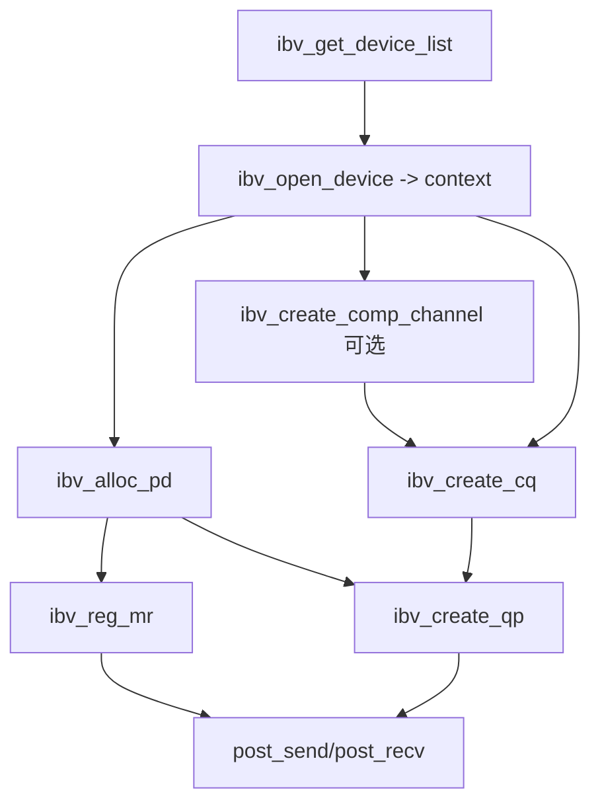
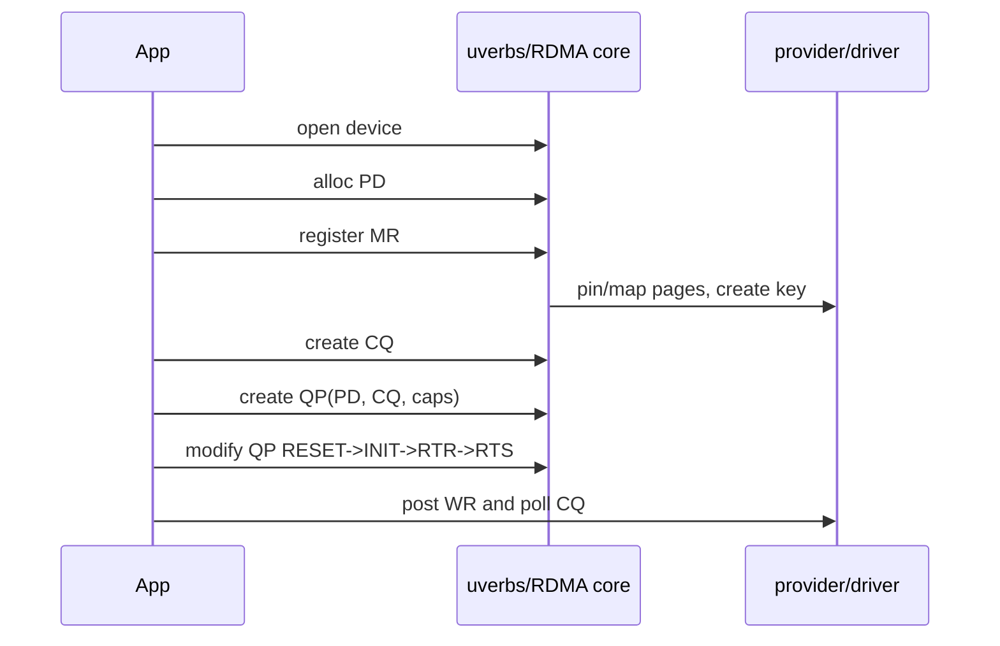
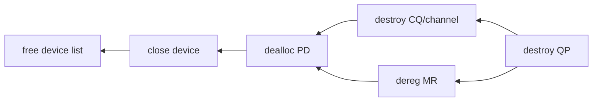
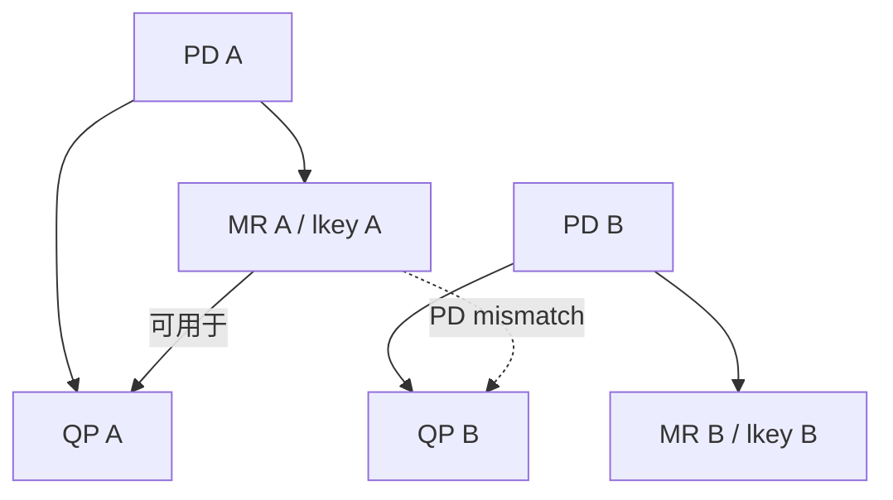
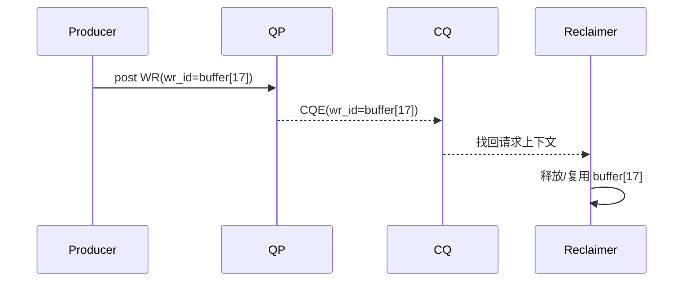

# 02：verbs 对象关系与生命周期

## 对象不是平铺列表

学习 verbs 最危险的方式是背 API 名称。真正需要掌握的是对象的所有权、依赖和销毁约束。



### 核心对象职责

| 对象 | 主要信息 | 常见误区 |
| --- | --- | --- |
| device list | 系统可见 RDMA 设备 | 列表中的名字不等于端口已 ACTIVE |
| context | 一个打开的设备实例 | 不是网络连接，也不是 QP |
| PD | MR/QP 的保护域 | 不提供跨主机身份认证 |
| MR | 地址、长度、权限、key | buffer 分配不等于注册 |
| CQ | 完成记录队列 | CQE 数量不是字节数 |
| QP | SQ/RQ、状态与 transport 上下文 | create 成功后仍处于 RESET |
| AH | UD 路由/链路寻址信息 | RC 通常不在每个 SEND WR 中传 AH |
| SRQ | 多 QP 共享接收队列 | 共享可省内存，也会放大 credit 管理难度 |

## 创建顺序为何重要



QP 创建时引用 PD 和 CQ；WR 又引用 QP 与 MR。因此在仍有 QP/WR 使用 MR 时 deregister MR，或在 QP 存在时销毁 CQ/PD，都违反依赖关系。

## 销毁必须逆序



实际程序还要在销毁前完成以下动作：

1. 停止新 WR 生产者。
2. 明确 outstanding WR 是等待完成、转为 error flush，还是由断连语义终止。
3. 消费或记录必要 CQE，避免把未完成操作静默丢弃。
4. 停止 CQ polling/事件线程，再销毁其引用对象。
5. 清理 TCP/CM 控制连接和工作线程。

## 失败回滚模板

创建过程中任一步都可能失败。C 程序适合使用单出口逆序回滚，但每个标签只释放已经成功创建的资源。

```c
/* 对象按依赖顺序创建，失败时从当前位置逆序回收。 */
ctx = ibv_open_device(dev);
if (!ctx)
    goto out;

pd = ibv_alloc_pd(ctx);
if (!pd)
    goto close_device;

mr = ibv_reg_mr(pd, buf, len, access);
if (!mr)
    goto dealloc_pd;

/* 后续 CQ/QP 创建省略。 */
```

不要用一个 `cleanup()` 无条件销毁所有指针，除非所有句柄初始化为 NULL 且每个销毁函数前都检查状态。

## PD 的组合约束

本地 SGE 的 lkey 必须属于与 QP 兼容的 PD。一个地址区间可注册成多个 MR，但每次注册产生独立 key 和生命周期；这不意味着应用应随意重复注册，注册通常是昂贵控制面操作。



## CQ 容量与 outstanding WR

CQ 大小必须覆盖可能产生 CQE 的 outstanding WR，而不是简单等于 SQ depth。selective signaling 会减少 send CQE，但 recv、error flush、多个 QP 共用 CQ 等因素仍需计算。

一个粗略上界是：

```text
required CQE >= signaled send outstanding
             + receive outstanding that may complete
             + shared QP burst margin
```

CQ overrun 常导致 CQ error，并可能使相关 QP 不可继续使用。它不是“少几条统计”的轻微问题。

## QP cap 是协商前的本地能力

创建 QP 时常指定：

- `max_send_wr` / `max_recv_wr`：SQ/RQ 可容纳的 WR 数。
- `max_send_sge` / `max_recv_sge`：单 WR 可引用的 SGE 数。
- `max_inline_data`：请求的 inline 上限，实际值要读取返回 cap。

设备可能调整请求值。代码应检查创建后返回的 cap，并使 batch、credit 和 buffer 数量不超过实际能力。

## `wr_id` 是软件所有权桥梁

`wr_id` 不会发送给对端，它原样出现在本端 CQE 中。常见用法是编码 buffer index、请求指针或 generation token。



必须保证 `wr_id` 指向的对象活到 CQE 被消费；不能 post 后立即释放请求结构。

## 生命周期验收清单

- 创建、状态迁移、销毁均打印对象标识和错误码。
- 失败路径可在每个创建步骤注入错误并验证无泄漏。
- 连续运行 100 次不出现残留进程、QP、MR 或端口占用。
- 退出时没有 outstanding WR 被无声丢弃。
- `rdma resource show` 前后资源数量能够恢复。

对应实验：[../../lab-rdma-verbs-object-lifecycle/README.md](../../lab-rdma-verbs-object-lifecycle/README.md)。

