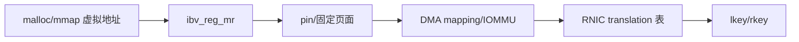
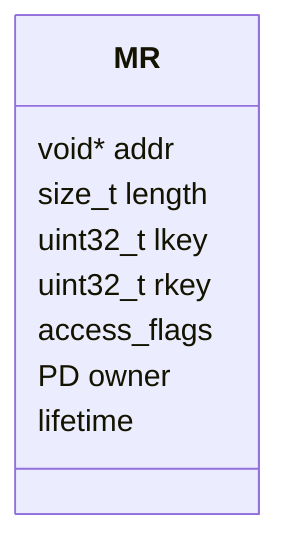
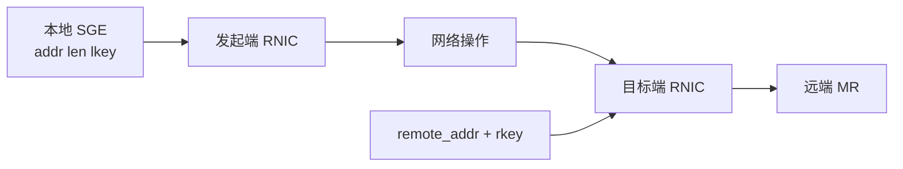
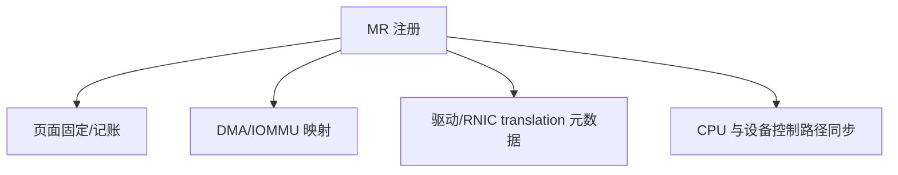
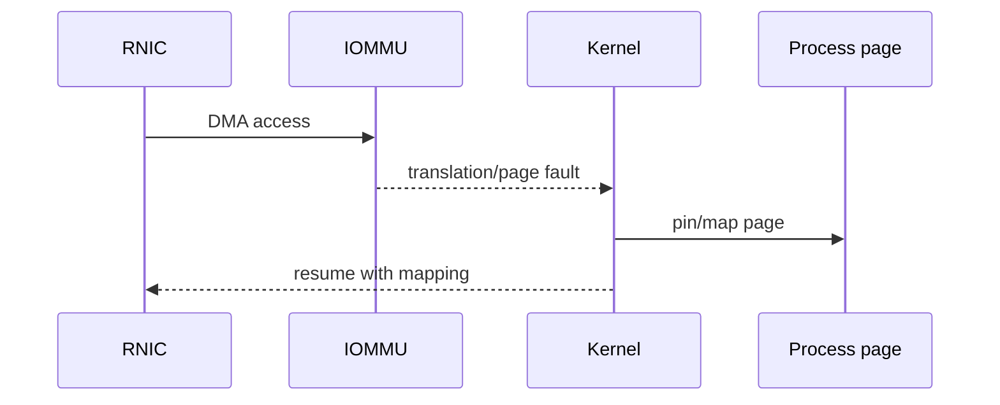
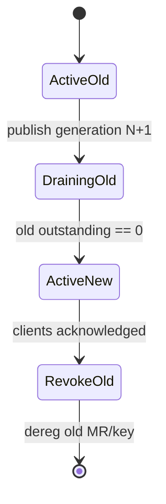

# 03：内存注册、DMA 与访问密钥

## 为什么普通 `malloc()` 不够

CPU 可以通过页表处理缺页、迁移和换页；RNIC 执行 DMA 时不能在每次访问中等待进程缺页处理。因此 RDMA 数据面需要一个稳定、可翻译、带权限的内存注册对象。



具体驱动可能使用 pin、ODP、FRMR 等不同机制，但应用层要抓住三个不变量：地址范围、访问权限和 key 生命周期必须一致。

## MR 包含什么



- `addr + length` 定义合法区间。
- access flags 定义允许的本地/远端动作。
- PD 约束 MR 能和哪些 QP 组合。
- lkey/rkey 是查找和校验 translation/protection 的能力标识，不是地址本身。

## lkey 与 rkey 的方向



| key | 谁提供 | 谁校验 | 用途 |
| --- | --- | --- | --- |
| lkey | 本地 MR | 本地 RNIC | 校验 SGE 是否可被本地 DMA 读/写 |
| rkey | 目标端通过控制面发布 | 目标端 RNIC | 校验远端 READ/WRITE/Atomic |

SEND 的接收端不是由发送端携带 remote address/rkey 定位，而是消费接收方预贴的 RECV SGE，所以它是 two-sided。

## access flags 不是越多越好

常见权限：

| flag | 含义 | 典型场景 |
| --- | --- | --- |
| `IBV_ACCESS_LOCAL_WRITE` | RNIC 可写本地 MR | RECV、RDMA READ destination |
| `IBV_ACCESS_REMOTE_WRITE` | 对端可 RDMA WRITE | 远端数据槽 |
| `IBV_ACCESS_REMOTE_READ` | 对端可 RDMA READ | 可读数据区 |
| `IBV_ACCESS_REMOTE_ATOMIC` | 对端可执行 Atomic | 锁、计数器、credit |

远端写/原子通常要求本地写权限。具体组合必须检查设备和 verbs 约束。生产代码应遵循最小权限，元数据区和 payload 区尽量分 MR 或分 key 发布。

## 地址范围校验

合法访问必须同时满足：

```text
remote_addr >= mr.addr
remote_addr + operation_length <= mr.addr + mr.length
rkey matches current MR/key
requested opcode allowed by access flags
QP and MR protection relationship valid
```

要防止 `addr + len` 整数溢出，常用写法是先确认 `addr >= base`，再比较 `len <= total - (addr - base)`。

## 注册成本来自哪里



所以高性能程序通常在初始化阶段注册大块 arena，再在内部划分固定 buffer，而不是每次请求注册和注销。代价是需要自己管理空闲表、对齐、NUMA 和安全回收。

## Hugepage 的真实作用

RDMA 不要求所有 MR 都来自 hugepage。大页可能带来：

- 更少的页表和 translation 条目。
- 更低的 TLB/MTT 压力。
- 更稳定的大块内存布局。

但它也增加预留、NUMA 放置和碎片管理复杂度。是否提升性能取决于硬件 translation cache、工作集和访问模式，不能只凭“RDMA 就必须大页”下结论。

## ODP 与按需缺页

On-Demand Paging 允许设备在访问时处理尚未建立的页映射，减轻预 pin 大内存的成本。它引入 page fault、失效通知和设备能力依赖，因此更像“注册策略的另一种权衡”，不是免费消除注册成本。



## key 轮换与撤销

注销 MR 或重新注册后，旧 rkey 应视为失效。安全轮换不能只“发一个新 rkey”，还需要：

1. 停止发布旧 generation 的新请求。
2. 等待或拒绝旧 generation 的 outstanding 请求。
3. 创建/更新新 MR 或 key。
4. 通过可信控制面发布 `{addr, length, rkey, generation}`。
5. 确认客户端切换后再回收旧资源。



## buffer 复用与 DMA 完成

发送 buffer 不能在对应 send completion 之前改写，接收 buffer 不能在 receive completion 之前读取或复用。selective signaling 下，不是每个 WR 都有 CQE，程序需要以有序 completion 或批次 generation 推导哪些 unsignaled WR 已经安全完成。

## 常见错误与症状

| 错误 | 可能结果 |
| --- | --- |
| SGE lkey 错/越界 | local protection error |
| remote address/rkey 错 | remote access error，QP 可能进 error |
| RECV MR 缺 `LOCAL_WRITE` | post 或执行失败 |
| deregister 后仍有 WR | 未定义/错误完成/资源破坏风险 |
| buffer 提前复用 | payload 随机损坏，常被误判为网络丢包 |
| 跨 NUMA 注册和访问 | 功能正常但时延/带宽异常 |

对应实验：[../../lab-rdma-memory-region-deep-dive/README.md](../../lab-rdma-memory-region-deep-dive/README.md) 与 [../../project-rdma-one-sided-kv/README.md](../../project-rdma-one-sided-kv/README.md)。

