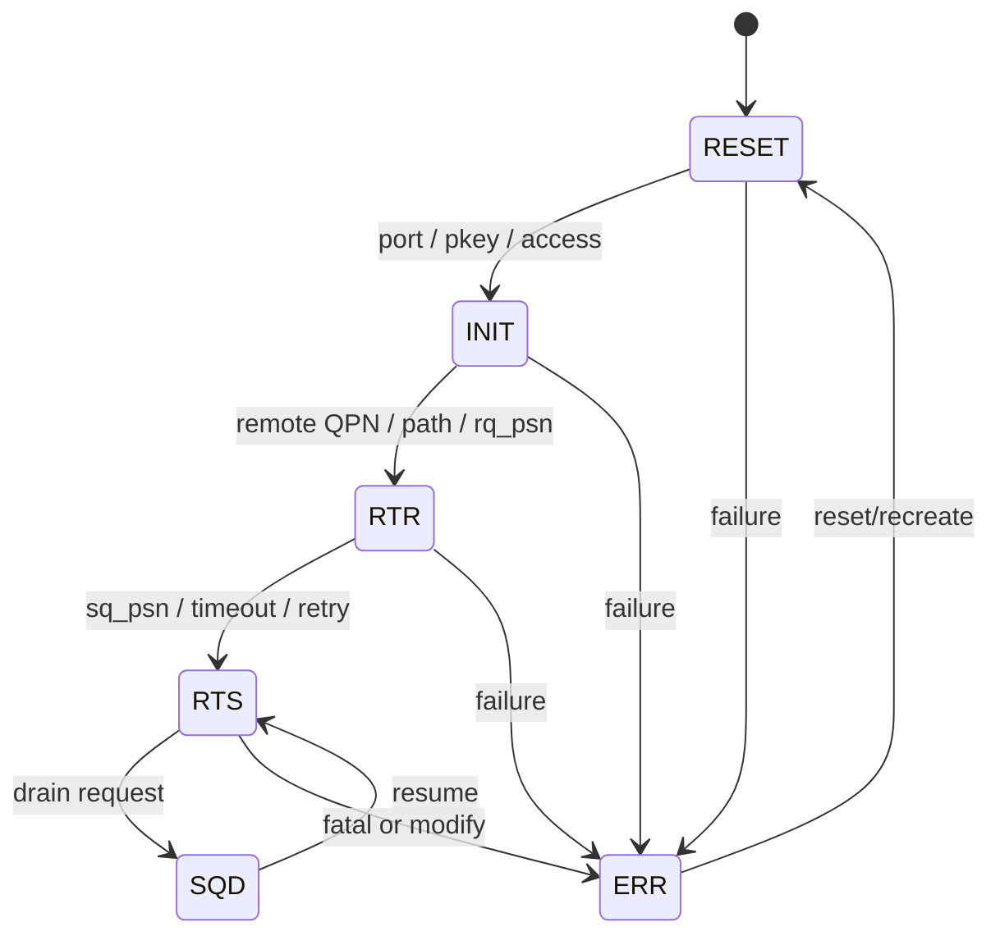
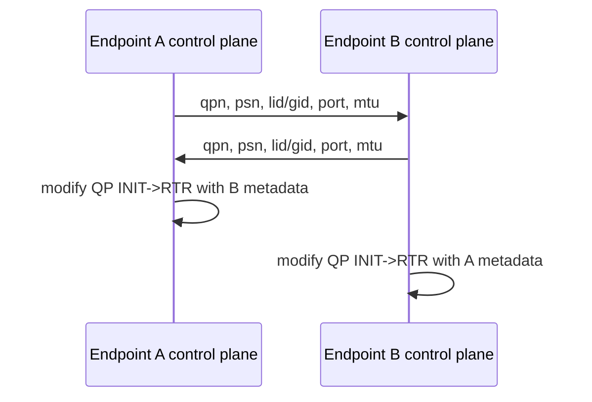
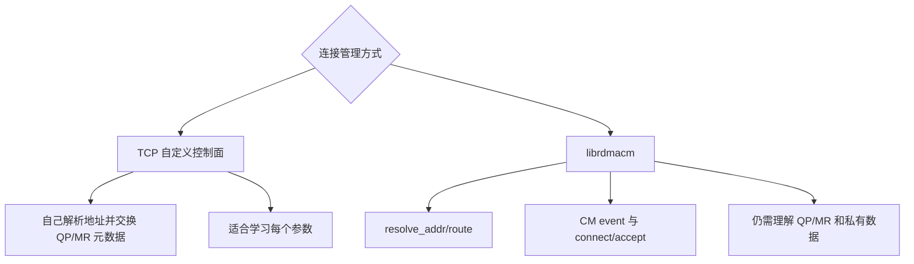
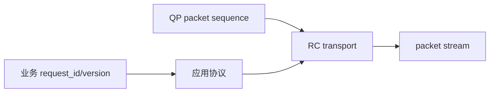

# 04：QP 状态机与控制面

## 为什么创建 QP 后还不能发送

`ibv_create_qp()` 只创建队列和能力边界，RC QP 尚不知道本地端口、对端 QPN、路径、PSN、MTU、重试参数。状态迁移把这些参数分阶段装入 transport context，避免一个半配置对象直接发包。



并非所有 transport 都使用完全相同的属性。例如 UD 不建立可靠连接，不需要 RC 的 destination QP state，但发送 WR 需要 AH、remote QPN 和 Q_Key。

## RESET -> INIT

这一阶段声明本地工作方式：

- `qp_state = IBV_QPS_INIT`
- `port_num`：使用哪个物理/逻辑端口
- `pkey_index`：IB partition 选择；RoCE 环境通常仍需合法索引
- `qp_access_flags`：允许远端 READ/WRITE/Atomic 的能力

常见错误是只在 MR 上设置 remote access，却忘记在 QP INIT 参数中允许对应操作。

## INIT -> RTR

Ready To Receive 需要获得对端和路径信息：

| 参数 | 作用 |
| --- | --- |
| `dest_qp_num` | 对端 QP number |
| `rq_psn` | 期望接收的初始 packet sequence number |
| `path_mtu` | 传输层分包 MTU，双方/路径能力必须兼容 |
| `ah_attr` | LID 或 GRH/GID 路径属性 |
| `max_dest_rd_atomic` | 本端能同时服务的 incoming RDMA READ/Atomic 数 |
| `min_rnr_timer` | RNR NAK 后对端重试前的等待参数 |



## RTR -> RTS

Ready To Send 配置本端发送可靠性：

- `sq_psn`：本端起始发送 PSN。
- `timeout`：等待 ACK/响应的 local ACK timeout 编码。
- `retry_cnt`：普通重试次数。
- `rnr_retry`：收到 Receiver Not Ready 后的重试次数。
- `max_rd_atomic`：本端允许 outstanding RDMA READ/Atomic 的数量。

`max_rd_atomic` 与对端 `max_dest_rd_atomic` 形成配对约束。READ/Atomic 卡住时应同时检查两边，而不是只看发起端。

## 控制面究竟交换什么

最小 RC 元数据通常包含：

```text
protocol_version
qp_num
packet_sequence_number
port_num
lid or gid
gid_index
path_mtu
feature/capability bits
```

one-sided 还需要按资源发布：

```text
remote_virtual_address
rkey
region_length
access mode
generation/version
```

不要直接发送含 padding 的 C struct；应定义固定宽度字段、网络字节序、长度和版本，并校验来自对端的每个值。

## TCP 控制面与 RDMA CM



RDMA CM 简化地址解析和连接事件，但不会替应用设计内存发布、权限、版本、credit 和恢复协议。本仓库 RC client/server 使用 TCP 控制面，目的是把每项元数据显式展示出来。

## GID 与 RoCE 地址选择

RoCE 环境中 GID table 可能同时出现 link-local、IPv4-mapped、IPv6 和不同 RoCE version/type。仅凭固定 `gid_index=0` 很脆弱。

排查顺序：

1. `ibv_devinfo -v` 查看端口 link layer、GID table 和 active MTU。
2. `rdma link show` 确认 RDMA device 与 netdev 的绑定。
3. 根据目标 IP/地址族选择正确 GID，记录 index 和 value。
4. 确认双方 VLAN、路由、MTU 和 RoCE mode 匹配。

## PSN 不是业务序号

Packet Sequence Number 属于 RC transport，用于检测乱序/丢包和可靠重传。它不替代请求 ID、消息序号或业务 generation。应用不能从 CQE 读取 PSN 来做业务去重。



## RNR 是接收 credit 问题

RC SEND 到达时，如果目标 QP/SRQ 没有可用 RECV WQE，会产生 RNR NAK。发送端可能按 `rnr_retry` 重试，但这只掩盖短暂缺口；长期解决应是接收 credit 协议：

- 启动前预贴足够 RECV。
- 每消费一个 RECV CQE，尽快补贴新 RECV。
- 在高负载下监控 posted receive 水位。
- 将应用发送窗口限制在对端公布的 credit 内。

## 状态迁移排障表

| 失败阶段 | 优先检查 |
| --- | --- |
| create QP | PD/CQ、cap 是否超过设备上限、QP type |
| RESET->INIT | port、pkey、access flags、attr mask |
| INIT->RTR | 对端 QPN/PSN、GID/LID、MTU、GRH、rd_atomic |
| RTR->RTS | timeout/retry、sq_psn、max_rd_atomic |
| RTS 后首包失败 | RECV credit、MR/key、路径、双方是否使用同一轮 metadata |

对应实验：[../../lab-rdma-qp-state-machine/README.md](../../lab-rdma-qp-state-machine/README.md) 和 [../../project-rdma-rc-client-server/docs/CONTROL_AND_DATA_PLANE.md](../../project-rdma-rc-client-server/docs/CONTROL_AND_DATA_PLANE.md)。

