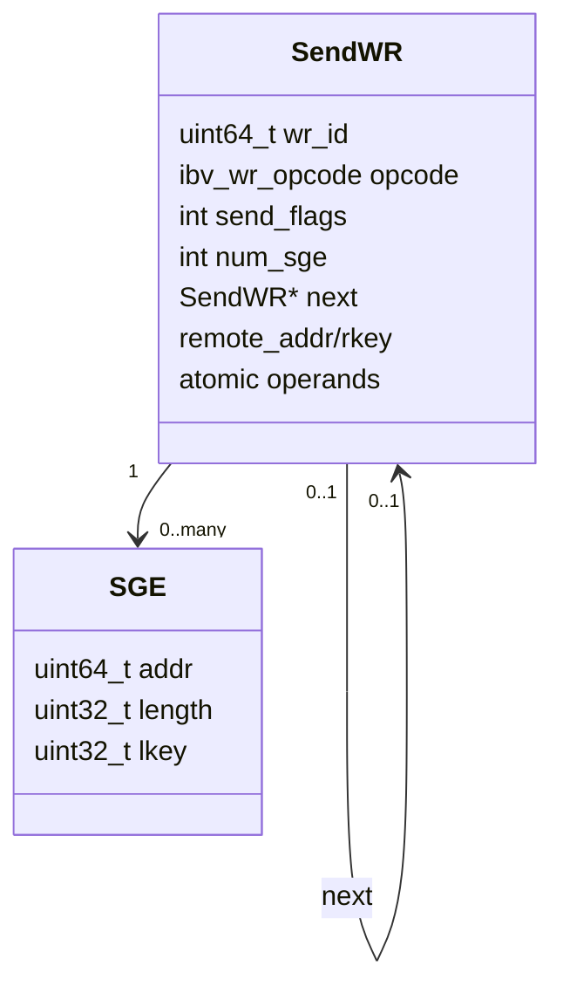
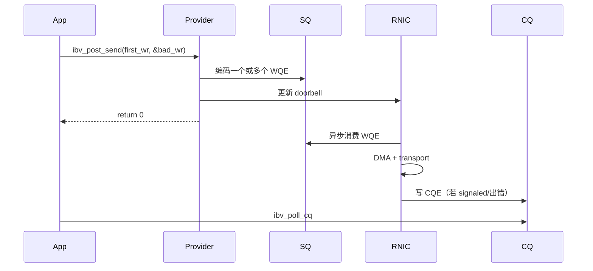
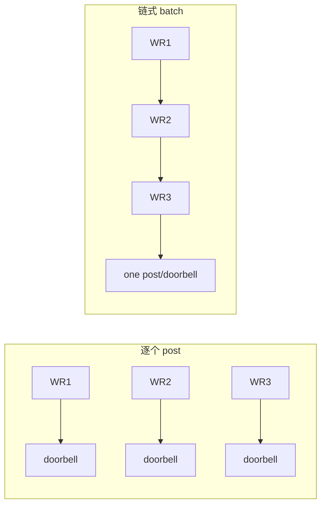
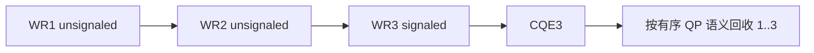
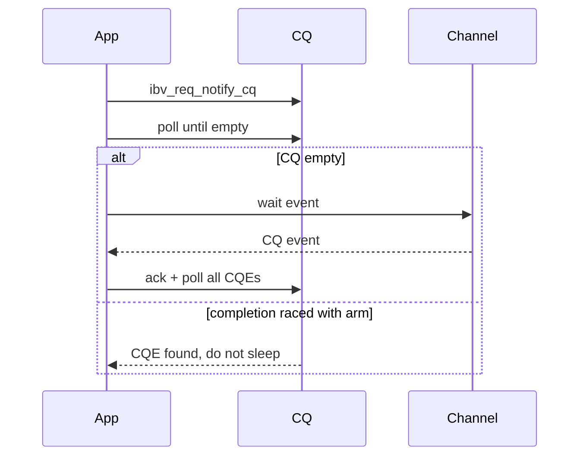

# 05：WR、WQE、Doorbell 与 CQE 数据路径

## 四个名词不要混用

| 名词 | 所在层 | 含义 |
| --- | --- | --- |
| WR | verbs API | 应用构造的 `ibv_send_wr` / `ibv_recv_wr` 链 |
| WQE | provider/硬件队列 | WR 被编码后放入 SQ/RQ 的工作项 |
| doorbell | CPU -> RNIC 通知 | 告诉设备有新的 producer index/WQE |
| CQE | RNIC -> 软件完成 | 记录 WR 的完成状态和标识 |

`ibv_post_send()` 接收 WR 链，但 WQE 物理格式通常由 provider 决定。学习代码时可以从 WR 推理语义，分析硬件性能时才进一步研究特定 RNIC 的 WQE 和 doorbell record。

## SEND WR 的组成



- SEND 使用 SGE 和本地 lkey，不需要 remote address/rkey。
- WRITE/READ 使用本地 SGE，同时携带 remote address/rkey。
- Atomic 还携带 compare/swap 或 add operand，并受对齐和设备能力限制。

## post 是异步提交，不是同步执行



返回非零时，`bad_wr` 指向第一个未被成功提交的 WR；它之前的 WR 可能已经提交，不能简单重试整条链，否则会重复操作。

## batch WR 优化了什么

将多个 WR 用 `next` 链接后一次 post，通常可以减少 API、锁/检查和 doorbell 次数。



batch 不是无限增大：过大的链会增加单批尾延迟、buffer 占用和错误恢复范围。应测量 p50/p99 latency、Mops/s、CPU cycles/op，并同时记录 batch size。

## inline SEND

`IBV_SEND_INLINE` 让小 payload 被复制进 WQE/doorbell path，RNIC 无需再 DMA 读取原 buffer。收益是少一次 PCIe DMA read 和可能更低时延，代价是 WQE 更大、CPU copy 增加且受 `max_inline_data` 限制。

inline 成功 post 后，原 payload buffer 通常可立即复用，因为数据已复制进队列描述；但 WR 上下文和队列容量管理仍需遵守 completion 逻辑。

## signaled 与 unsignaled



selective signaling 减少 CQE 写入和 polling 压力，但必须保证：

- 周期内至少有 signaled WR，避免永远得不到回收点。
- SQ credit 按 post 和完成水位正确计算。
- error completion 可能打破“只有 signaled 才有 CQE”的直觉。
- 不能仅靠 CQE 数量等于 WR 数量来结束测试。

## CQ polling 的正确结构

```c
/* 轮询时必须校验每个 CQE，而不是只看返回数量。 */
for (;;) {
    int n = ibv_poll_cq(cq, budget, wc);
    if (n < 0)
        return -1;
    for (int i = 0; i < n; ++i) {
        if (wc[i].status != IBV_WC_SUCCESS)
            report_wc_error(&wc[i]);
        else
            complete_request(wc[i].wr_id, wc[i].opcode, wc[i].byte_len);
    }
    if (done)
        break;
}
```

关键字段：

| 字段 | 用途 |
| --- | --- |
| `status` | 成功或 local/remote/transport 错误 |
| `wr_id` | 找回本地请求/缓冲区所有权 |
| `opcode` | 区分 SEND、RECV、WRITE、READ 等完成 |
| `byte_len` | 对 RECV 等操作确认实际长度 |
| `wc_flags` | immediate data、GRH 等附加信息 |
| `vendor_err` | 厂商诊断码，应和通用 status 一起记录 |

## CQ event 模式的竞态

典型顺序是 request notification、等待 event、ack event、poll CQ；为避免 arm 与新 CQE 之间的竞态，常用模式是先 arm，再 poll 到空，若为空才阻塞等待。一次 event 可能对应多个 CQE。



## SQ/RQ/CQ 三套 credit

- SQ credit：还能 post 多少 send WR。
- RQ credit：本端还准备了多少 receive buffer。
- CQ capacity：还能容纳多少会产生 completion 的 WR。

任何一套耗尽都可能停机，但症状不同：post 返回 ENOMEM、远端 RNR、CQ overrun。高性能程序要分别统计，不能只维护一个“队列长度”。

## 内存顺序与 doorbell

provider 必须确保 WQE 内容先对设备可见，再敲 doorbell；CQE owner bit/producer index 则保证应用不会读取未完成写入的 CQE。应用应使用 verbs/provider API，不要用普通 C 赋值模仿硬件内存屏障。

对应项目：[../../project-rdma-performance-tuning/README.md](../../project-rdma-performance-tuning/README.md)。

