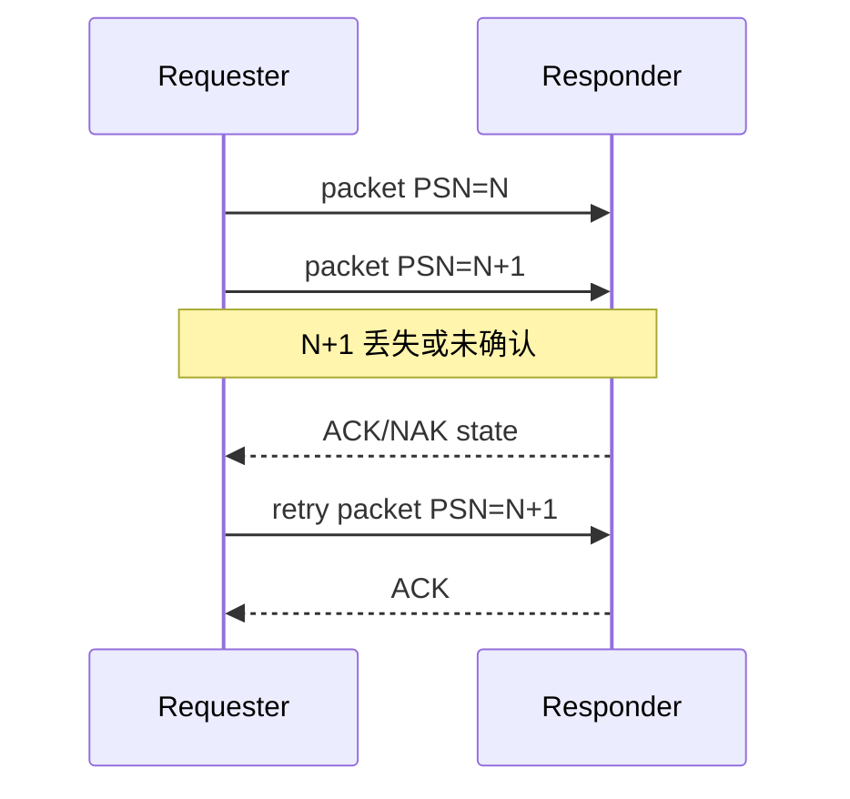
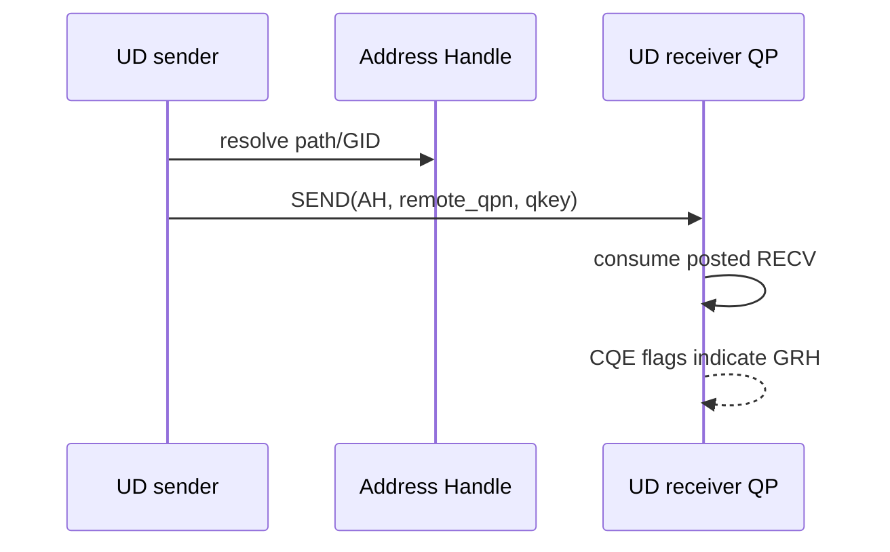
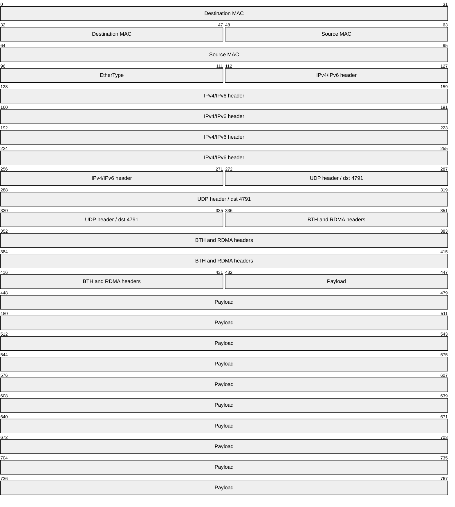
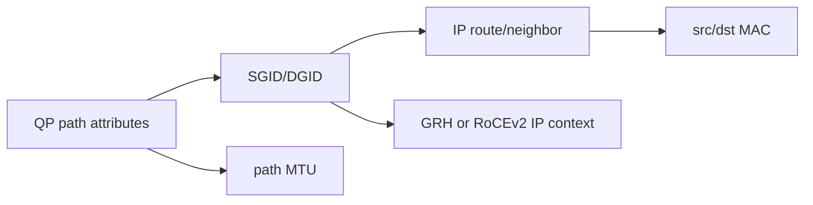
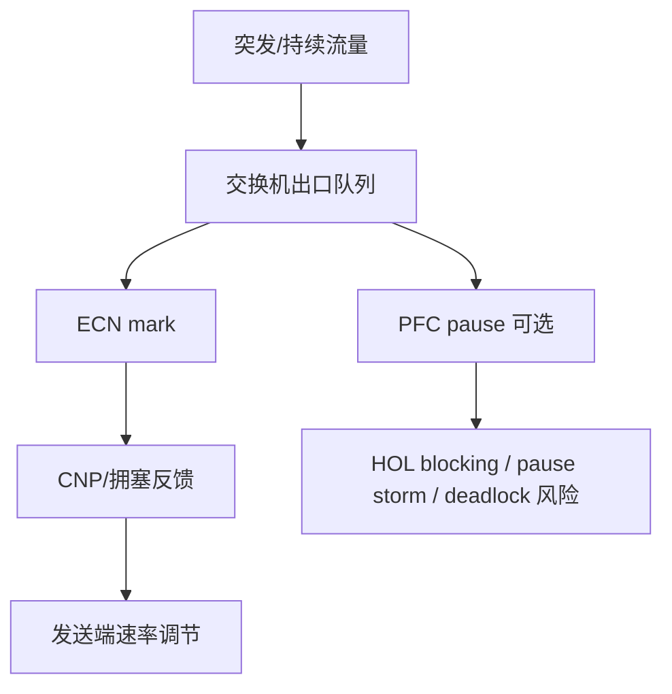

# 06：RC、UC、UD 与 RoCEv2 网络模型

## transport 决定什么

transport 决定端点关系、可靠性、操作集合、排序和接收语义。它不是“链路类型”的同义词：RC/UD 可以运行在 InfiniBand 或 RoCE 相关环境上，而 RoCEv2 描述的是 RDMA transport 在 Ethernet/IP/UDP 上的封装。

## RC、UC、UD 对比

| 维度 | RC | UC | UD |
| --- | --- | --- | --- |
| 连接 | 一对一连接 | 一对一连接 | 无连接数据报 |
| 可靠重传 | 有 | 无 | 无 |
| 顺序 | transport 提供有序语义 | 有限/无重传 | 每个 datagram 独立 |
| SEND/RECV | 支持 | 支持 | 支持 |
| RDMA WRITE | 支持 | 支持 | 不支持 |
| RDMA READ/Atomic | 支持 | 通常不支持 | 不支持 |
| 寻址 | QP 状态保存对端 | QP 状态保存对端 | 每个 SEND 指定 AH/QPN/Q_Key |

设备能力和标准细节应以实际 `ibv_query_device_ex`/provider 为准。

## RC 可靠性从哪里来

可靠性依赖 PSN、ACK/NAK、timeout、retry count、RNR retry 和 QP state。RC 能处理 transport packet 丢失，不等于应用在断连后可以无条件重放非幂等 WRITE/Atomic。

## UD 的接收特点

UD SEND WR 需要 AH、remote QPN、Q_Key。接收 buffer 在常见 verbs 语义下要为 Global Routing Header 预留 40 字节空间；是否有 GRH 由 CQE flag 判断，payload offset 不能硬编码成所有环境都相同却不检查 flag。

UD 不保证到达、顺序和去重。需要可靠消息时，应用必须自己实现 request ID、重传、去重和窗口。

## RoCEv2 封装位置

这是概念图，字段长度会随 IPv4/IPv6、VLAN 和具体 RDMA opcode 变化。RoCEv2 可三层路由，UDP destination port 通常为 4791；源端口常用于 ECMP entropy，不能当作普通应用 UDP socket 使用。

## GID、IP、MAC 如何串起来

故障排查不能只 `ping`：普通 ICMP 通只证明基础 IP 邻接，不证明 GID index、RoCE mode、PFC/ECN、UDP 4791 或 QP path 参数正确。

## MTU 的三层含义

- netdev MTU：Ethernet/IP 接口配置。
- active MTU：RDMA 端口报告的能力。
- QP path MTU：QP transport 分段使用的值。

路径中任何一段不支持所选 MTU，都可能造成丢包、重试或建连问题。Jumbo frame 要端到端一致，包括主机、交换机、VLAN 和虚拟化层。

## RoCE 拥塞不是只开 PFC

- ECN/DCQCN 类机制处理拥塞和速率反馈。
- PFC 通过 priority pause 减少丢包，但可能产生队头阻塞和故障扩散。
- 现代部署可能采用有损 RoCE 设计，依靠重传和更精细拥塞控制；必须依据 RNIC/交换机能力验证。
- DSCP/PCP 到 priority/queue 的映射必须端到端一致。

## 多路径与流哈希

RC QP 通常形成稳定 flow tuple，ECMP 可能把单 QP 固定在一条路径上。增加 QP 可能提高路径利用率，也会增加 QP context、排序和负载均衡复杂度。吞吐测试应记录 QP 数、源 UDP entropy、交换机 ECMP 和每端口计数器。

## 抓包能看到什么

抓包适合确认：

- VLAN/IP/UDP 4791 是否正确。
- 是否持续重传、NAK/RNR 或拥塞反馈。
- 包长、分段和方向。

抓包看不到 RNIC 内部 WQE/CQE、PCIe DMA 和 provider queue 状态。加密或硬件卸载也可能使主机抓包位置看不到完整报文，因此必须结合 `rdma statistic`、ethtool 统计和应用 CQE。

对应实验：[../../lab-rdma-ud-rocev2-model/README.md](../../lab-rdma-ud-rocev2-model/README.md)。

