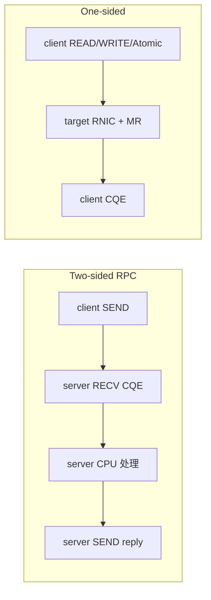
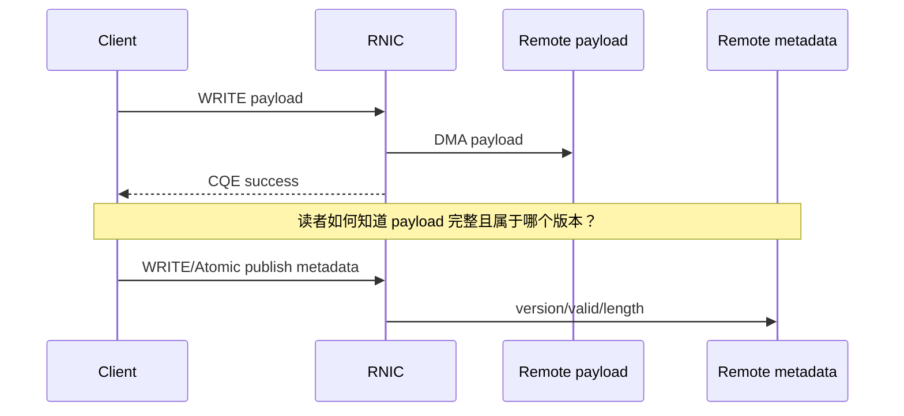
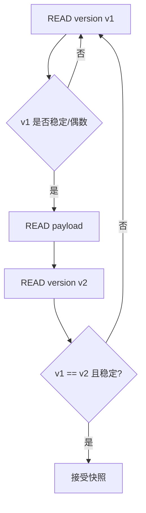
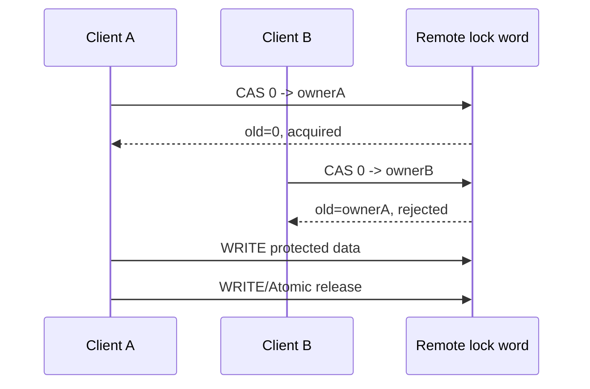
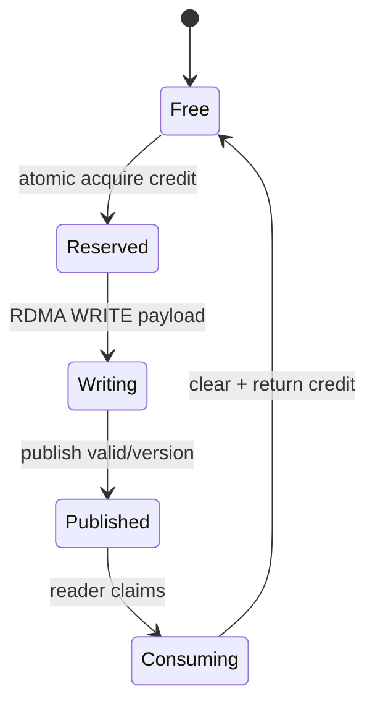
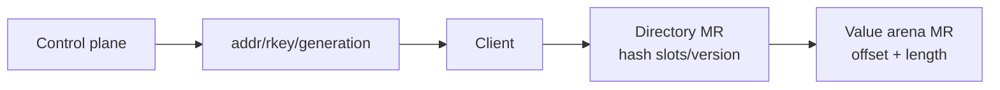
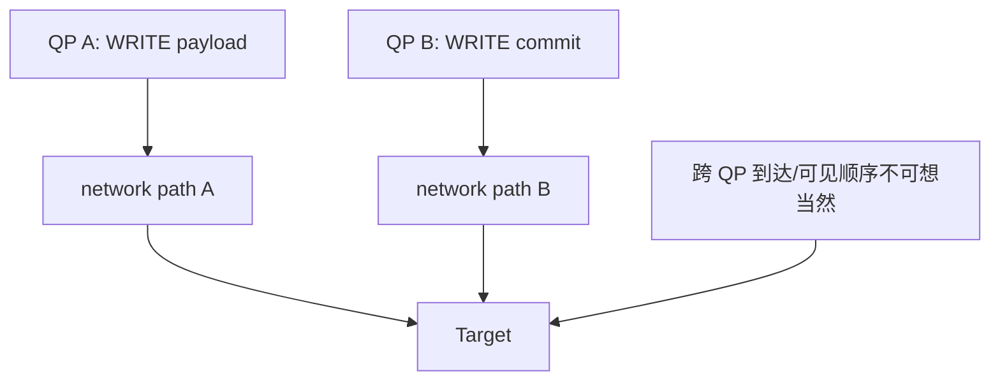

# 07：One-sided、Atomic 与系统一致性

## one-sided 省掉了什么

RDMA READ/WRITE/Atomic 不要求目标 CPU 为每个请求 post RECV、解析消息并复制 payload。目标端仍需预先注册内存、发布元数据、管理权限和生命周期。

one-sided 把远端 CPU 从快路径移开，同时也拿走了一个天然的串行化和权限检查点。复杂性会转移到元数据协议、并发控制和恢复。

## WRITE、READ、Atomic 的方向

| opcode | 本地 SGE 方向 | 远端内存方向 | 本地完成后得到什么 |
| --- | --- | --- | --- |
| RDMA WRITE | RNIC 读取本地 | 写远端 | 写操作满足 transport completion 语义 |
| RDMA READ | RNIC 写本地 | 读远端 | 本地 buffer 含返回数据 |
| FETCH_ADD | RNIC 写返回值 | 远端原子加 | 得到操作前旧值 |
| COMP_SWAP | RNIC 写返回值 | 条件更新远端 | 得到操作前旧值，可判断是否成功 |

远端 Atomic 通常要求特定对齐、长度和设备能力，常见为 8 字节。不要假设任意结构都能原子更新。

## WRITE completion 不等于业务提交

常见发布协议是先写 payload，最后更新一个小的 commit/version 字段；读者先读元数据、读 payload、再复核元数据，避免读到更新中的混合状态。

## Seqlock 风格读取

写者把 version 改为“更新中”，写 payload，再发布稳定的新 version。具体排序必须结合 RNIC ordering、fence、同 QP 操作顺序和目标平台语义验证。

## CAS 锁不是完整事务系统

还必须处理：

- owner 崩溃后锁如何超时/租约回收。
- ABA：值从 A 变 B 又变 A，单纯比较值无法识别 generation。
- client 重试是否会重复执行副作用。
- release 前的写是否按期望对其他 requester 可见。

## credit 是流控，不只是计数器

one-sided 系统常用远端 Atomic 管理 slot/credit。一个可靠 credit 协议至少定义：

1. 获取 credit 与占用 slot 的顺序。
2. 写 payload 和发布完成标志的顺序。
3. consumer 回收 slot 的条件。
4. 超时、客户端死亡和重复归还的处理。
5. counter wrap 和 generation。

## 哈希目录与数据区分离

one-sided KV 可把目录元数据与 value arena 分开：目录项存 key fingerprint、offset、length、version，value 放在大块 MR 中。

这样便于读取和扩容，但 collision、删除、压缩和 rkey rotation 都需要额外协议。不能把一次 hash 命中当作 key 一定相等，必须验证完整 key 或可靠 fingerprint。

## 多 QP 排序边界

同一 RC QP 上的操作有 transport ordering 规则；跨 QP 不应默认存在全局顺序。若 payload 从 QP A 写、commit 从 QP B 写，读者可能先看到 commit。解决方案包括单 QP 发布、显式同步、Atomic generation 或服务端协调。

## durability 是另一层

远端内存是 DRAM 时，WRITE 完成通常不涉及持久化。目标是 persistent memory 时，还要区分数据到达 RNIC、主机内存控制器、CPU cache 与持久介质。需要平台特定 flush/persistence 协议，普通 RDMA CQE 不能自动证明断电持久。

## 设计 one-sided 协议的检查表

- 元数据是否带 version/generation/length/checksum？
- 数据发布与回收是否有明确状态机？
- reader 能否检测 torn/stale read？
- writer 崩溃在每一步会留下什么状态？
- 请求重试是否幂等？
- rkey 撤销时如何 drain outstanding WR？
- 多 client、多 QP 下是否仍成立？

对应项目：[../../project-rdma-one-sided-kv/docs/ARCHITECTURE.md](../../project-rdma-one-sided-kv/docs/ARCHITECTURE.md)。

