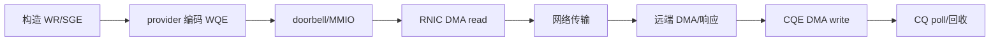
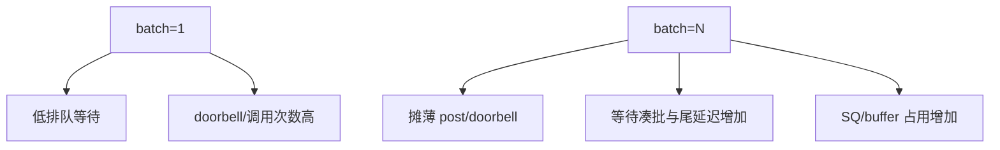
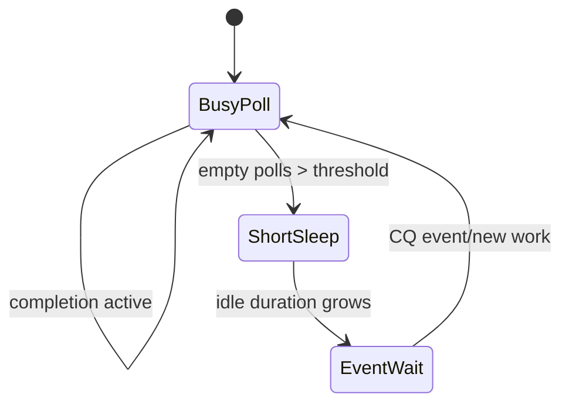
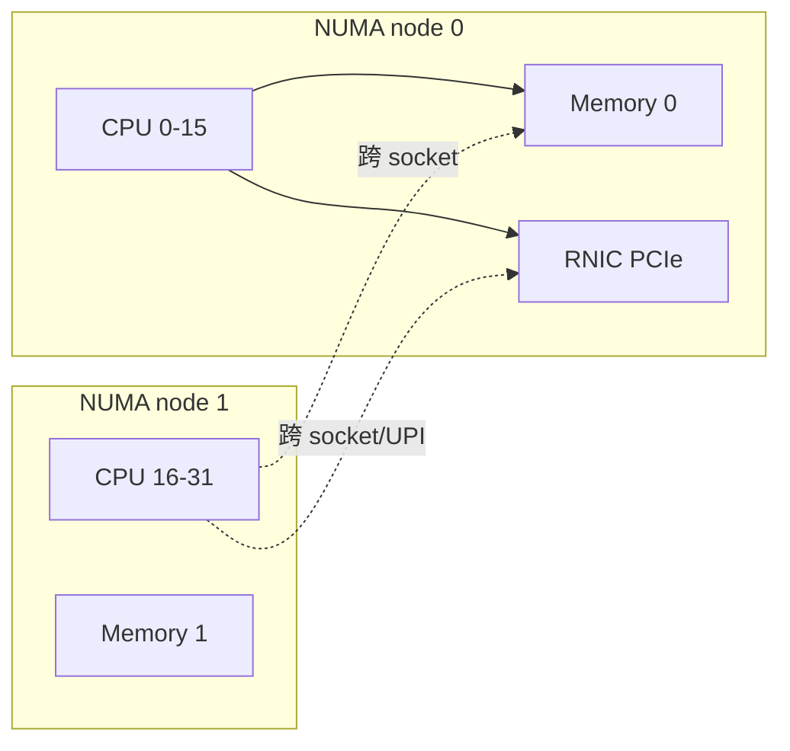
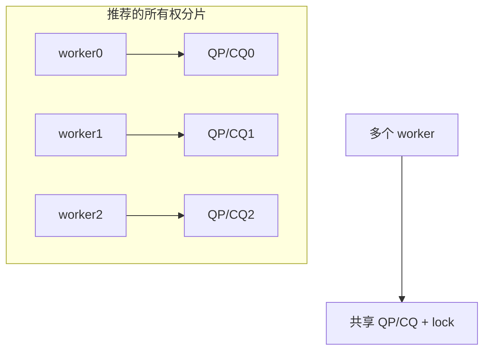

# 08：性能调优、轮询与 NUMA

## 先定义测量对象

RDMA 性能不是一个数字。至少要分开：

| 指标 | 说明 | 常见单位 |
| --- | --- | --- |
| post latency | CPU 构造/提交 WR 的成本 | ns/op、cycles/op |
| completion latency | post 到本地 CQE | us |
| RTT | 请求到响应完成 | us |
| throughput | 单位时间完成操作/字节 | Mops/s、Gb/s |
| tail latency | p95/p99/p99.9 | us |
| CPU efficiency | 每操作 CPU 成本 | cycles/op、core/Gb/s |

测试记录必须带 payload、QP 数、batch、inline、signal interval、poll budget、CPU/NUMA、设备/driver、MTU 和测试时长，否则结果不可比较。

## 一次操作的成本分解



优化项必须对应成本：batch 减 post/doorbell，inline 减小 payload 的 DMA read，selective signaling 减 CQE，poll budget 摊薄函数和分支成本，NUMA 绑定减少远端内存/PCIe 路径。

## single 与 batch



推荐 sweep：`1, 2, 4, 8, 16, 32`。每个点同时比较吞吐和 p99，不要只选择吞吐最高值。

## inline 的拐点

inline 对小消息有利，但超过 WQE inline 容量无法使用。测试时应先查询并记录实际 `max_inline_data`，再 sweep payload。开启 inline 后 buffer 可提前复用的语义也要单独测试，避免性能代码仍无谓等待 completion。

## selective signaling

signal interval 从 1 增大时，CQE 写和 poll 压力降低，但回收粒度变粗。合理区间受 SQ depth、batch 和错误恢复影响。

```text
max unsignaled window < SQ depth - safety_margin
```

每个 signaled completion 可以作为前序有序 WR 的回收水位，但代码必须在 QP error 时处理 flushed completions，不能永久等待正常水位。

## CQ polling 策略

| 策略 | 优点 | 代价 |
| --- | --- | --- |
| busy poll | 最低唤醒时延 | 独占 CPU、功耗高 |
| bounded poll + yield | 降低空转 | scheduler 抖动 |
| event channel | 空闲 CPU 低 | 中断/唤醒与 re-arm 成本 |
| adaptive | 兼顾突发和空闲 | 状态机与参数复杂 |



poll budget 过小会增加调用和分支，过大可能让单 CQ/单 QP 独占 worker。共享 CQ 时还要考虑公平性。

## NUMA 与 PCIe 拓扑



理想基线通常让 polling CPU、QP/CQ 内存、payload MR 和 RNIC 位于同一 NUMA node。需要分别控制：

- 线程 affinity。
- 内存首次触页/`numactl --membind`。
- RNIC PCIe NUMA node。
- IRQ/async event CPU（若使用事件）。

单 NUMA 机器只能验证绑定机制，不能声称已完成本地/跨 NUMA 对比。

## 多 QP、多线程模型



单 worker 独占 QP/CQ 通常减少锁和 cache line 竞争。共享 CQ 可以减少对象数，但 completion dispatch 和公平性更复杂。测试必须区分“增加 QP 带来并行”与“只是增加 context miss”。

## cache 与 false sharing

producer index、consumer index、统计计数器、completion state 被多个核频繁写时会 cache line ping-pong。可用 cache-line 对齐、per-worker counter 和批量汇总减少竞争。MR payload 对齐则要结合消息大小和 NIC DMA，不应机械地把所有对象都填充到大页。

## 测试方法

1. 先 warm up，使 QP/MR translation、CPU frequency 和缓存进入稳定状态。
2. 固定一个变量，其余参数保持不变。
3. 每个点重复多轮，保留原始样本而非只有平均值。
4. 报告 p50/p99、throughput、CPU 和失败/重试计数。
5. 用同一二进制、同一 topology 和同一 payload 做 A/B。
6. RXE 数据只用于功能和相对趋势，硬件结论必须在 RNIC 重跑。

## 推荐实验矩阵

| 维度 | 建议值 |
| --- | --- |
| payload | 8, 64, 256, 1024, 4096 bytes |
| batch | 1, 2, 4, 8, 16, 32 |
| signal interval | 1, 4, 8, 16, 32 |
| poll budget | 1, 8, 16, 32, 64 |
| inline | off/on（不超过实际 cap） |
| CPU/NUMA | unbound、same-node、cross-node |

对应项目：[../../project-rdma-performance-tuning/docs/ARCHITECTURE.md](../../project-rdma-performance-tuning/docs/ARCHITECTURE.md)。

