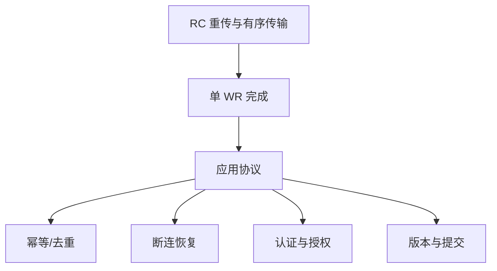
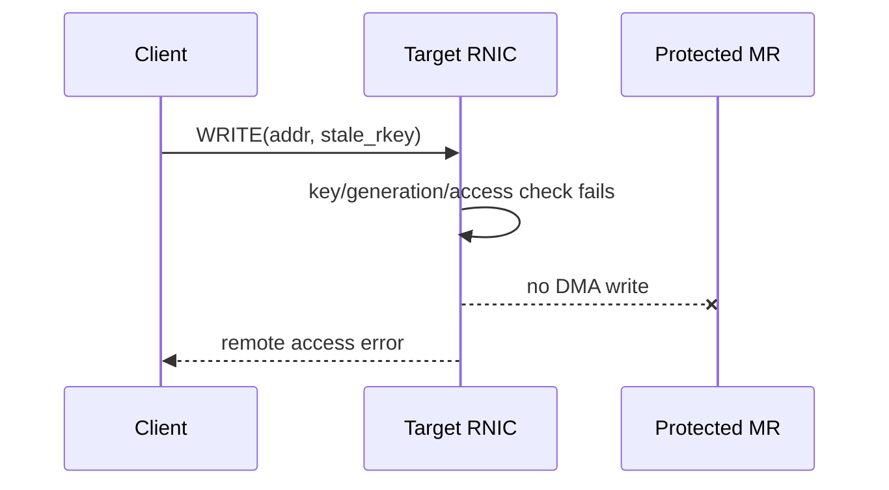
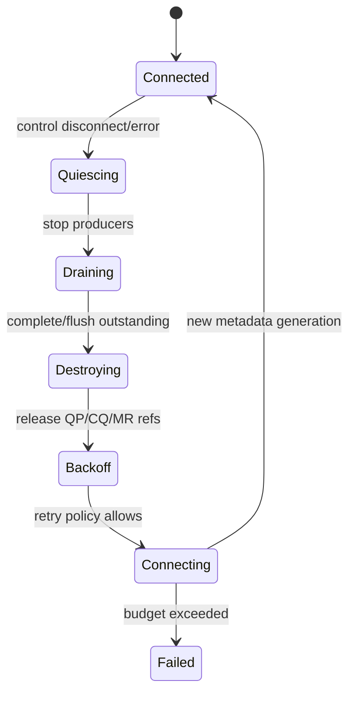
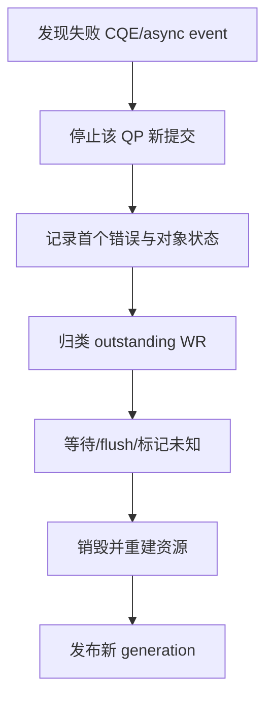

# 09：可靠性、安全边界与故障恢复

## transport 可靠不等于系统可靠

RC 可以重传丢失 packet，但进程崩溃、控制连接断开、rkey 轮换、多 WR 事务和重复请求仍需应用处理。

## 常见 completion error 分类

| 类别 | 典型状态 | 优先方向 |
| --- | --- | --- |
| 本地描述/权限 | local length/protection/QP op error | SGE、lkey、长度、opcode、QP state |
| 远端访问 | remote access/invalid request | rkey、remote addr、MR access、generation |
| 接收资源 | RNR retry exceeded | 对端 RECV credit、SRQ 水位、rnr 参数 |
| 传输重试 | retry exceeded | 路径、对端进程、PSN、MTU、拥塞/丢包 |
| 队列灾难 | CQ overrun/QP fatal | CQ capacity、poller 卡顿、async event |
| flush | WR flushed | 通常是前序 fatal/主动 QP error 的后果 |

看到 flush error 时要找第一个非 flush 错误，flush 往往只是连锁结果。

## wrong-rkey 为什么重要

wrong-rkey 测试验证的是 RNIC 数据面保护边界，而不是“程序能否优雅打印错误”。预期行为应包括：

- 操作不能修改目标外内存。
- 发起端得到明确失败 CQE 或连接错误。
- 双方记录 QP/async 状态。
- cleanup 能完整执行。
- 后续是否重建 QP 由恢复策略明确决定。

## rkey 是 capability，不是身份认证

拥有正确 `{addr, rkey}` 的 peer 可能访问 MR，因此控制面必须：

- 认证 peer，保护元数据传输。
- 只发布必要范围和权限。
- 避免日志、core dump、监控系统泄露长期 key。
- 支持 generation 与撤销。
- 通过网络 ACL/VLAN/tenant 隔离缩小攻击面。

生产部署还要依据 RNIC/平台考虑 IPsec、MACsec 或专有链路保护；verbs 本身不自动加密业务 payload。

## 断连状态机

重连必须创建或确认新的 QP/PSN/metadata generation。不能把旧 outstanding WR 直接挂到新 QP，也不能默认旧 rkey 仍有效。

## 重试与幂等

| 操作 | 盲目重试风险 |
| --- | --- |
| READ | 通常无副作用，但可能读到新 generation |
| 覆盖式 WRITE | 可能幂等，仍需确认目标地址/version 未变化 |
| FETCH_ADD | 重试会重复加 |
| CAS | 返回值丢失后结果不确定，需要 operation ID/状态查询 |
| 申请 slot/credit | 可能重复占用或重复归还 |

因此应用应给非幂等操作分配 request ID，并在服务端/元数据中记录执行状态或设计可查询的 generation。

## 超时不是越短越好

RC timeout、retry、RNR retry 与网络 RTT、拥塞、交换机 buffer 和故障检测目标相关。过短会把瞬时抖动放大为 QP error；过长会让真实故障迟迟无法恢复。应分别定义：

- transport retry budget。
- control-plane heartbeat/lease。
- business request deadline。
- reconnect backoff 和最大次数。

它们处于不同层次，不应共用一个魔法数字。

## CQ/QP 异常后的原则

不要尝试在状态不明的 fatal QP 上继续 post。恢复时必须告知上层哪些请求成功、失败或结果未知。

## 故障注入矩阵

| 注入点 | 预期证据 |
| --- | --- |
| wrong rkey | remote access error，目标未修改 |
| wrong remote address | 边界检查/remote access error |
| 不 post RECV | RNR/retry exhausted，可控退出 |
| RTS 后断开 peer | retry/flush，完整 cleanup |
| CQ poller 暂停 | 队列水位/overrun 风险可观察 |
| stale generation | 控制面或数据面拒绝旧能力 |
| 重复 Atomic 请求 | 去重/状态查询策略生效 |

对应测试：[../../project-rdma-rc-client-server/docs/TEST_FLOW.md](../../project-rdma-rc-client-server/docs/TEST_FLOW.md)。

