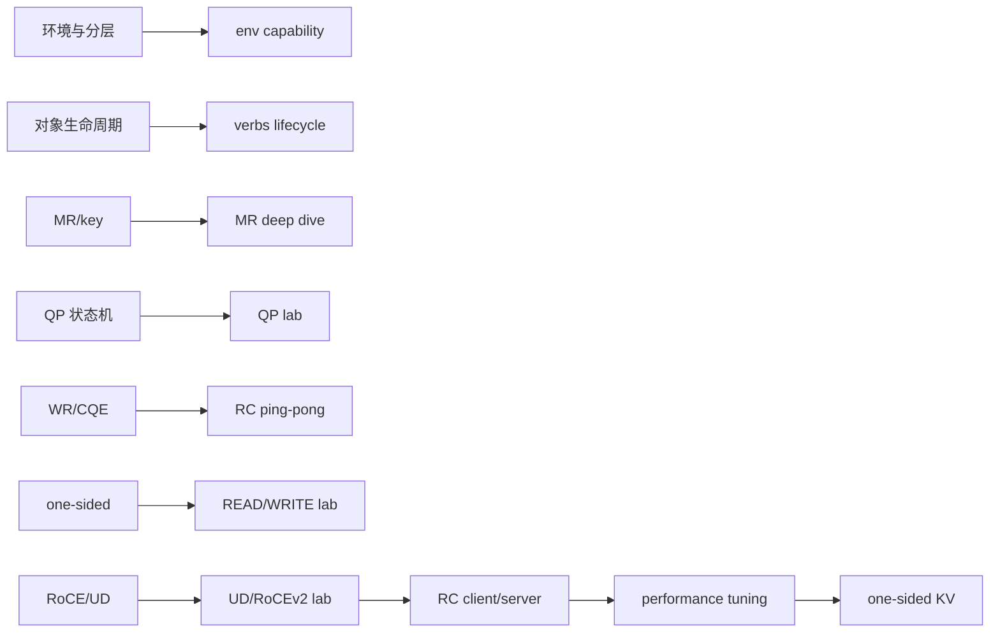
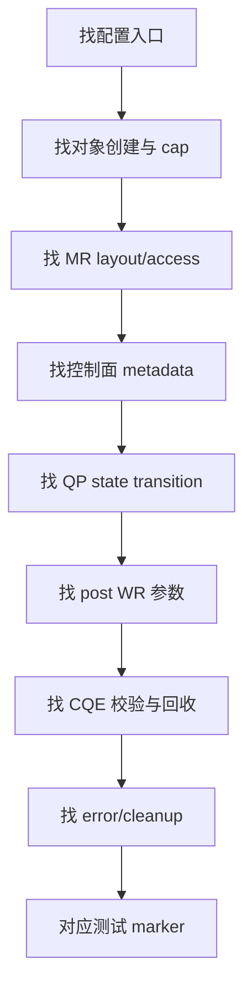
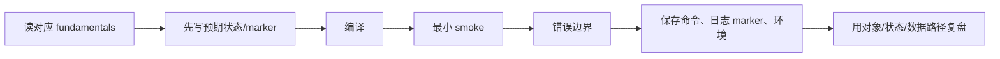

# 10：知识到项目的映射

## 从原理到代码，不跳层

## Phase 映射表

| Phase | 项目 | 阅读前置 | 必看代码/证据 | 通过后应会解释 |
| --- | --- | --- | --- | --- |
| 1 | `lab-rdma-env-capability` | 01、06 | `scripts/01_collect_rdma_capability.sh` | 设备、端口、GID、RXE 与硬件边界 |
| 2 | `lab-rdma-verbs-object-lifecycle` | 02 | `src/rdma_device.c`、`rdma_memory.c`、`rdma_queue.c` | 创建依赖、失败回滚、逆序销毁 |
| 3 | `lab-rdma-memory-region-deep-dive` | 03 | `src/mr_experiments.c` | access flags、lkey/rkey、错误访问 |
| 4 | `lab-rdma-qp-state-machine` | 04 | `src/qp_state.c` | 每次状态迁移需要的参数 |
| 5 | `lab-rdma-rc-pingpong` | 05、06 | `src/main.c`、测试 marker | RECV 预贴、SEND/RECV CQE |
| 6 | `lab-rdma-one-sided-read-write` | 03、05、07 | `src/main.c` | READ/WRITE 的方向和远端 CPU 参与 |
| 7 | `lab-rdma-ud-rocev2-model` | 06 | UD 测试和 GRH marker | AH/Q_Key/QPN、GRH、RoCEv2 封装 |
| 9 | `project-rdma-rc-client-server` | 02-06、09 | `src/control_plane.c`、`rdma_context.c` | 控制面/数据面、故障恢复 |
| 10 | `project-rdma-performance-tuning` | 05、08 | `src/perf_client.c`、sweep scripts | batch/inline/selective/poll/NUMA |
| 11 | `project-rdma-one-sided-kv` | 03、07、09 | client/server、Phase 1-6 records | credit/CAS/directory/rkey rotation |

## 阅读代码的统一方法

不要从 `main()` 第一行逐字读到最后。先用 `rg` 找 `ibv_reg_mr`、`ibv_create_qp`、`ibv_modify_qp`、`ibv_post_`、`ibv_poll_cq` 和 PASS marker，再回看调用上下文。

## 关键 API 到仓库落点

| API/概念 | 推荐搜索目录 |
| --- | --- |
| `ibv_get_device_list/open_device` | lifecycle、RC client/server `rdma_context.c` |
| `ibv_reg_mr` | MR deep dive、one-sided KV |
| `ibv_modify_qp` | QP state lab、RC client/server |
| `ibv_post_recv/send` | ping-pong、performance tuning |
| `IBV_WR_RDMA_WRITE/READ` | one-sided lab、RC project、KV |
| `IBV_WR_ATOMIC_*` | one-sided KV |
| inline/selective | performance tuning `perf_client.c` |
| wrong-rkey/RNR | RC client/server test scripts |

## 每个项目的学习闭环

## 能力分级

| 级别 | 标准 |
| --- | --- |
| 记忆 | 能说出对象/API 名称 |
| 理解 | 能画出依赖、状态和数据路径 |
| 实现 | 能写出正确创建、post、poll、cleanup |
| 验证 | 能设计正向和错误边界测试 |
| 调优 | 能将指标变化归因到具体成本 |
| 工程化 | 能处理并发、版本、恢复、安全和可观测性 |

本 track 的目标至少达到“验证”，performance tuning 和 one-sided KV 推进到“调优/工程化模型”；Soft-RoCE 结果不等于真实 RNIC 生产经验。

## 学习检查点

进入 RC client/server 前，应能独立画出：

1. 对象创建和销毁图。
2. RC QP 状态机及双方交换字段。
3. SEND/RECV 与 WRITE 的 sequence diagram。
4. wrong-rkey 和 RNR 的错误传播。

进入 performance tuning 前，应能计算 SQ/RQ/CQ credit，并区分 post latency、completion latency 与 RTT。

进入 one-sided KV 前，应能说明 version、credit、CAS、rkey generation 和 crash recovery 各自解决什么问题。

