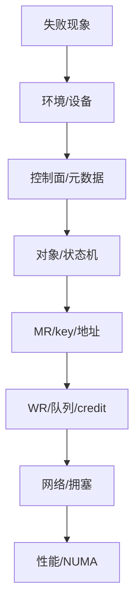
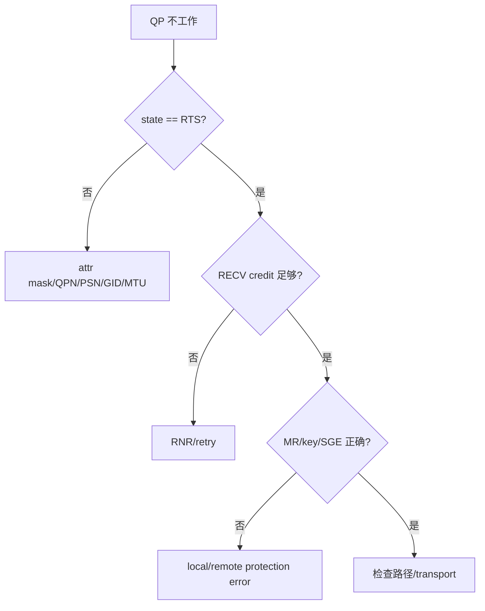
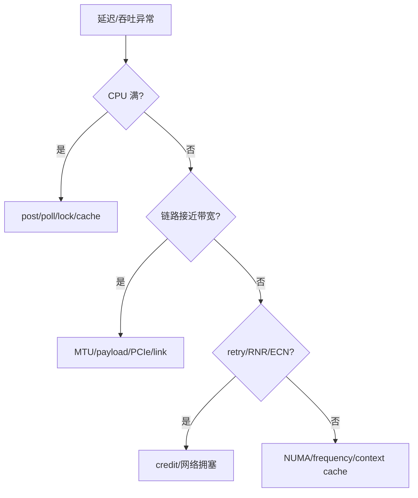

# 11：RDMA 分层排障手册

## 总原则：先确认失败在哪一层



不要一看到 timeout 就抓包，也不要一看到 CQE error 就重装 rdma-core。先保留首个错误和上下文，再按层缩小。

## 第一层：环境与设备

```bash
uname -a
rdma link show
rdma dev show
rdma resource show
ibv_devices
ibv_devinfo -v
ip -details link show
```

记录：设备名、driver/provider、firmware、link layer、port state、active MTU、GID table、netdev、NUMA node。RXE 还要记录绑定 netdev 和内核模块。

## 第二层：控制面

检查双方日志是否属于同一次连接：

```text
protocol version
local/remote QPN
local/remote PSN
GID/LID and index
path MTU
remote addr/length/rkey/generation
feature flags
```

将元数据打印成结构化 marker，避免只写“connected”。错误的字节序、struct padding、旧 generation 很容易在 QP RTS 后才暴露。

## 第三层：对象与 QP

```bash
rdma resource show qp
rdma resource show cq
rdma resource show mr
```

程序应在每次 `ibv_modify_qp()` 后查询并打印 state。若 QP 已 ERR，继续分析后续 flush CQE 没有意义，应找进入 ERR 前的第一个异常。



## 第四层：CQE 必须完整打印

失败时至少记录：

```text
timestamp, role, qp_num, wc.status, ibv_wc_status_str(status),
wc.opcode, wc.wr_id, wc.byte_len, wc.vendor_err,
outstanding_send, posted_recv, cq_poll_count
```

仅打印 `poll failed` 会丢失最有价值的证据。`ibv_poll_cq()` 返回负数是 CQ polling 本身失败；返回正数但 `wc.status != SUCCESS` 是某个 WR 完成失败，两者必须区分。

## 第五层：网络与计数器

```bash
ip -s link show dev <netdev>
ethtool -S <netdev>
rdma statistic show
ss -tnp
tcpdump -ni <netdev> 'udp port 4791'
```

真实环境还应采集交换机端口 discard、ECN mark、PFC pause、buffer occupancy 和路由/ECMP。主机 counters 正常不能证明 fabric 无拥塞。

## 性能异常的二分法



使用 `perf stat` 观察 cycles、instructions、cache misses、context switches；使用 `taskset/numactl` 固定拓扑；使用 TSC 前确认 invariant TSC 和跨核条件。不要在未固定 CPU frequency/NUMA 时解释微秒级差异。

## 常见症状速查

| 症状 | 第一检查点 | 第二检查点 |
| --- | --- | --- |
| `ibv_get_device_list` 为空 | modules/device/provider | 容器设备映射/权限 |
| QP 卡在 RTR | 对端 QPN/PSN/GID | MTU/port/attr mask |
| 首个 SEND RNR | 是否预贴 RECV | RQ depth/补贴线程 |
| local protection | SGE addr/len/lkey | MR PD/access/lifetime |
| remote access | remote addr/rkey | generation/access flags |
| retry exceeded | 对端存活/路径 | PSN/MTU/拥塞 |
| CQE 长期不来 | 是否 signaled | doorbell/QP state/网络 |
| 吞吐上不去 | batch/doorbell | link/PCIe/NUMA/单 QP path |
| p99 抖动 | scheduler/IRQ | 凑批、CQ budget、拥塞 |

## Marker 驱动的日志读取

省额度和人工排障都应先 grep marker：

```bash
grep -E 'PASS|FAIL|ERROR|wc_status|vendor_err|QP_|RKEY|RNR|retry|cleanup' tests/*.log
```

只有 marker 指向异常阶段时，再读取该阶段前后 30-50 行。不要先 `cat` 数万行完整日志。

## 最小复现记录模板

```text
date / host / kernel / rdma-core / provider
RDMA device / port / GID / MTU / NUMA
exact build command
exact run command（敏感凭据使用占位符）
configuration: opcode, payload, QP, batch, signal, inline
first failing marker/CQE
expected vs actual
cleanup result
```

完整执行流程见 [../../tests/TEST_FLOW.md](../../tests/TEST_FLOW.md)。

