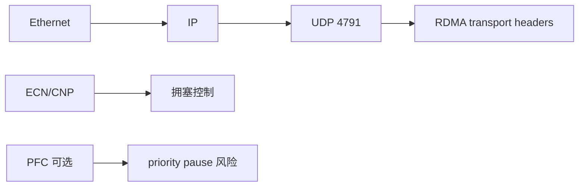

# 12：RDMA 速记卡与自测题

## 一页对象卡

| 问题 | 20 秒答案 |
| --- | --- |
| context 是什么？ | 打开的 RDMA device 用户态上下文，是后续对象和命令入口，不是连接。 |
| PD 做什么？ | 约束 QP、MR 等对象能否组合，形成设备内保护域。 |
| MR 做什么？ | 把地址范围、DMA translation、权限和 lkey/rkey 绑定到生命周期。 |
| QP 是什么？ | SQ/RQ 加 transport 状态、序号、路径和重试上下文。 |
| CQ 是什么？ | RNIC 写入 CQE，应用据此回收请求和 buffer。 |
| WR/WQE 差别？ | WR 是 verbs 软件描述，WQE 是 provider/硬件队列格式。 |

## 一页路径卡


必须能逐段解释：谁写、谁读、校验哪个 key、何时可复用 buffer、错误写到哪里。

## SEND 与 WRITE

| 问题 | SEND/RECV | RDMA WRITE |
| --- | --- | --- |
| 远端要 post RECV？ | 要 | 不要 |
| 发起端携带 remote addr/rkey？ | 不要 | 要 |
| 远端有 RECV CQE？ | 有 | 普通 WRITE 通常没有 |
| 适合 | 消息通知/RPC | 已知远端内存布局的数据写入 |

## 五个高频陷阱

1. `ibv_post_send()` 成功不等于 WR 已完成。
2. CQ event 不等于一个 CQE，收到 event 后仍要 poll。
3. RC 可靠不等于应用操作可安全重试。
4. rkey 不是加密身份，泄露后会扩大远端访问能力。
5. RXE 功能 PASS 不等于 RNIC 性能结论。

## QP 状态卡


自测：为什么 `max_rd_atomic` 和 `max_dest_rd_atomic` 要分别配置？为什么 SEND 可在 RTS 发起，但对端还必须有 RECV credit？

## MR 与 key 卡

```text
lkey = 本地 SGE 给本地 RNIC 的访问凭据
rkey = remote_addr 给目标 RNIC 的远端访问凭据
合法访问 = 地址范围 + key + access + PD/QP 关系 + 生命周期
```

自测：为什么只修改 remote address 可能得到 remote access error？为什么 deregister 后旧 rkey 不能继续使用？

## 性能卡

| 优化 | 主要减少 | 主要代价 |
| --- | --- | --- |
| batch WR | post/doorbell 次数 | 凑批和回收粒度 |
| inline | 小消息 DMA read | WQE 空间与 CPU copy |
| selective signaling | CQE 和 poll 压力 | completion 水位更复杂 |
| busy poll | 唤醒时延 | CPU/功耗 |
| same NUMA | 跨 socket 访问 | 绑核与部署约束 |

自测：为什么 batch 吞吐提高时 p99 可能恶化？为什么 signal interval 不能无限增加？

## RoCE 卡



自测：ping 通为什么不能证明 RoCE QP 能工作？GID index、MTU、ECN/PFC 分别在哪一层？

## One-sided 卡

```text
one-sided = 目标 CPU 不参与每个数据操作
one-sided != 无控制面
CQE success != business commit
Atomic != transaction
```

自测：如何用 version 实现稳定读取？CAS holder 崩溃后锁如何回收？跨 QP 发布为什么需要额外同步？

## 故障卡

| marker/error | 优先联想 |
| --- | --- |
| RNR | 接收方没 RECV credit |
| local protection | 本地 SGE/lkey/长度/PD |
| remote access | remote addr/rkey/access/generation |
| retry exceeded | 对端/路径/PSN/MTU/拥塞 |
| flushed | 前序 fatal 或 QP 被置 ERR |
| CQ overrun | CQ 容量或 poller 停顿 |

## 口述练习

尝试不用文档完成以下讲解，每题控制在两分钟：

1. 从 `ibv_get_device_list()` 到第一个 RC SEND CQE 的完整路径。
2. SEND/RECV 和 RDMA WRITE 在远端资源准备上的区别。
3. wrong-rkey 如何被检测、如何传播、程序如何清理。
4. batch、inline、selective signaling 如何组合，如何设计对比实验。
5. one-sided KV 如何发布 value、检测并发更新、轮换 rkey。
6. Soft-RoCE 验证结果迁移到真实 RNIC 前还缺哪些证据。

能稳定回答这些问题，再进入项目代码会快得多。

