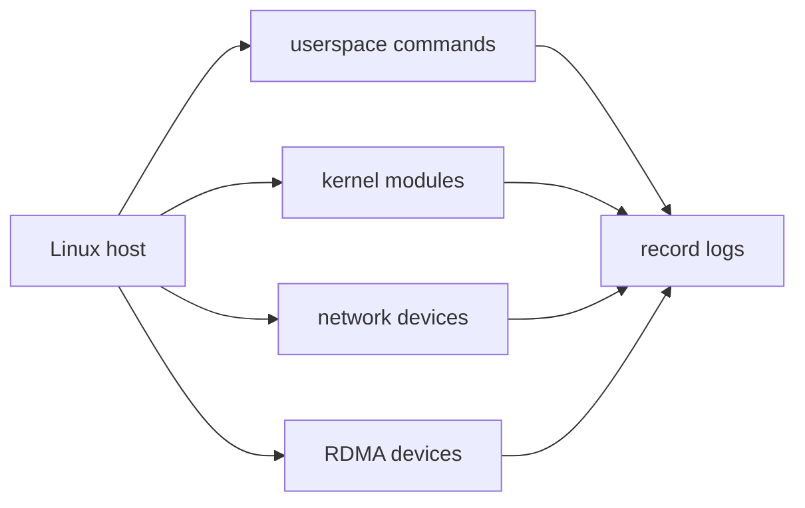

# 01_OVERVIEW

## 本 lab 做什么

RDMA 环境不是纯软件问题。verbs 程序能否运行，取决于至少四层：

- 用户态工具：`ibv_devices`、`ibv_devinfo`、`rdma`。
- 用户态库：`libibverbs`、provider。
- 内核模块：`ib_core`、`rdma_cm`、具体 HCA driver 或 `rdma_rxe`。
- 设备路径：真实 HCA、虚拟网卡、Soft-RoCE。

本 lab 先采集这些边界，不做破坏性配置。

## 采集对象

## 预期结果

如果测试机没有 RDMA 硬件，这不是失败。只要记录清楚，就可以决定下一步：

- 安装工具链。
- 尝试 Soft-RoCE。
- 换真实 RDMA/RoCE 测试环境。
- 继续做纯模型文档和离线代码阅读。
