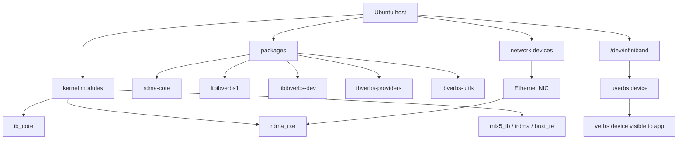
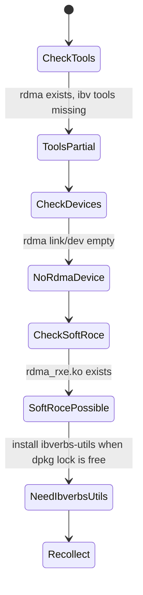
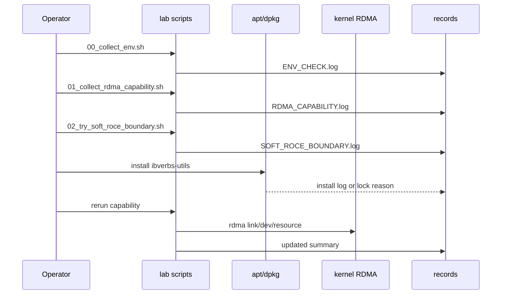

# 04_DEEP_LEARNING

## 本 lab 为什么从 capability boundary 开始

RDMA 的失败点比 DPDK 更分散。DPDK pcap PMD 或 net_null 还能在软件里构造大量实验，但 RDMA verbs 依赖用户态库、provider、内核 RDMA subsystem、设备节点、HCA 或 Soft-RoCE。缺任何一层，verbs 程序都会失败。

因此 Phase 1 不直接写 ping-pong，而是先回答三个问题：

1. 当前机器有没有 RDMA 工具链？
2. 当前机器有没有 verbs device？
3. 如果没有真实 HCA，能不能用 Soft-RoCE 继续学习？

## 能力分层图



## 每个工具在学什么

| 命令 | 学习目标 | 结果怎么解读 |
| --- | --- | --- |
| `command -v ibv_devices` | verbs 工具是否安装 | 缺失通常说明 `ibverbs-utils` 未安装 |
| `command -v ibv_devinfo` | 是否能查看 verbs device 详细能力 | 缺失同上 |
| `command -v rdma` | RDMA netlink 工具是否可用 | Ubuntu 上通常来自 `iproute2` |
| `ibv_devices` | libibverbs 能发现哪些设备 | 有 device 才能进入真实 verbs object 实验 |
| `ibv_devinfo -v` | port、GID、transport、capability | 后续 RC/UD/RoCEv2 参数来源 |
| `rdma link` | RDMA link 和 netdev 绑定关系 | Soft-RoCE 或 RoCE 设备会出现在这里 |
| `rdma dev` | kernel RDMA device 列表 | 和 verbs 视角互相校验 |
| `rdma resource show` | QP/CQ/MR 等资源统计 | 后续验证对象创建是否真的生效 |
| `modinfo rdma_rxe` | 内核是否有 Soft-RoCE 模块 | 有模块才可能用普通以太网继续学习 |

## 当前测试机第一轮结论

记录目录：

```text
records/20260630-221920-rdma-env/
```



实际结果：

| 检查项 | 结果 | 学习意义 |
| --- | --- | --- |
| `rdma` | 存在 | 可以通过 RDMA netlink 观察 link/dev/resource |
| `ibv_devices` | 缺失 | 需要 `ibverbs-utils`，否则无法从 verbs 视角看 device |
| `ibv_devinfo` | 缺失 | 需要 `ibverbs-utils`，否则无法看 port/GID/capability |
| `rdma link` | 空 | 当前没有 kernel RDMA link |
| `rdma dev` | 空 | 当前没有 kernel RDMA device |
| `rdma_rxe.ko` | 存在 | 可以继续评估 Soft-RoCE |
| `ib_core` | 已加载 | RDMA core 内核层已存在 |

## 缺失组件：`ibverbs-utils`

`ibverbs-utils` 提供的是诊断工具，不是 verbs 程序运行所需的全部库。当前测试机已经有：

- `rdma-core`
- `libibverbs1`
- `libibverbs-dev`
- `ibverbs-providers`

但缺：

- `ibv_devices`
- `ibv_devinfo`

这意味着：

- 可能能编译 verbs 程序，但缺少关键观察工具。
- 无法确认 verbs provider 是否能枚举 device。
- 后续做 MR/QP/CQ 前，应该先补齐它。

补齐方式：

```bash
sudo apt-get install -y ibverbs-utils
```

本轮尝试安装时，dpkg 锁被 `unattended-upgrade` 占用，所以没有强行继续。这个动作保留在：

```text
records/20260630-221920-rdma-env/INSTALL_IBVERBS_UTILS.log
```

## Soft-RoCE 为什么是下一步

测试机是 VMware 虚拟机，当前 PCI 设备是 Intel 82545EM 和 VMware VMXNET3，没有 Mellanox/Intel E810 等 RDMA HCA。真实 HCA 不存在时，Soft-RoCE 是合理学习路径。

Soft-RoCE 的学习价值：


它能帮助学习：

- verbs device discovery。
- MR 注册和 key。
- CQ/QP 创建和状态迁移。
- Send/Recv completion 语义。

它不能证明：

- 真实 RDMA NIC offload。
- PCIe DMA 性能。
- 数据中心 RoCE 拥塞控制。

## 推荐的 Phase 1 收敛流程



## 面试表达

可以这样讲：

“我进入 RDMA 前先做 capability boundary。因为 RDMA 问题不一定是代码问题，可能是 `ibverbs-utils` 缺失、provider 缺失、内核没有 `rdma_rxe`、没有 `/dev/infiniband/uverbsX`，或者根本没有 HCA。我的第一步会记录 `rdma link/dev/resource`、`ibv_devices`、`ibv_devinfo`、`modinfo rdma_rxe`，再决定是真硬件路径、Soft-RoCE 路径，还是环境阻塞。”
