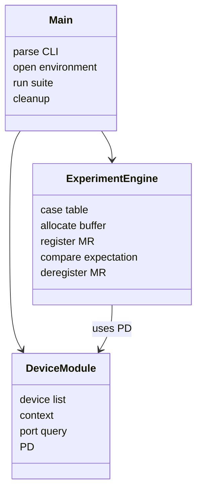
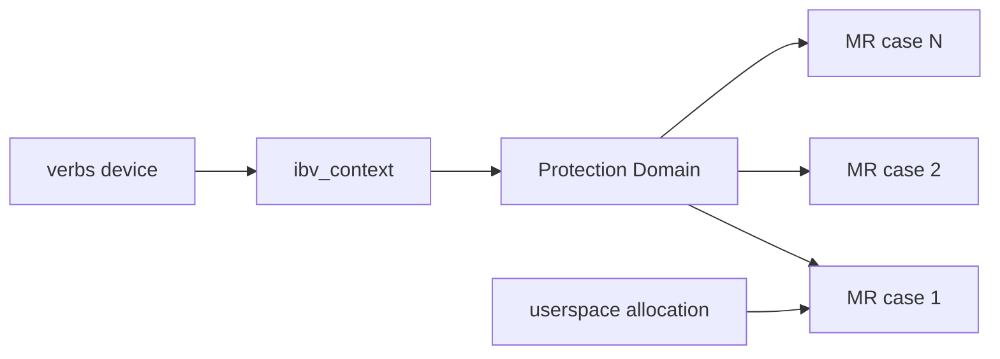
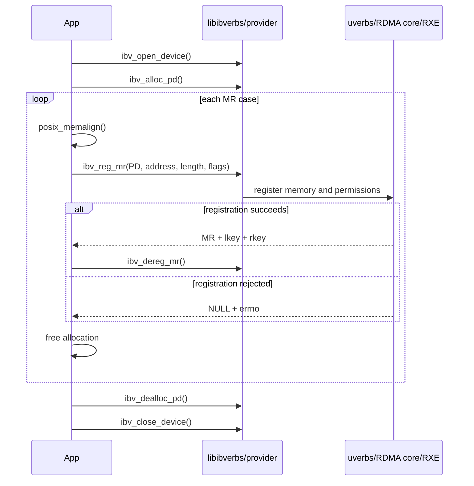
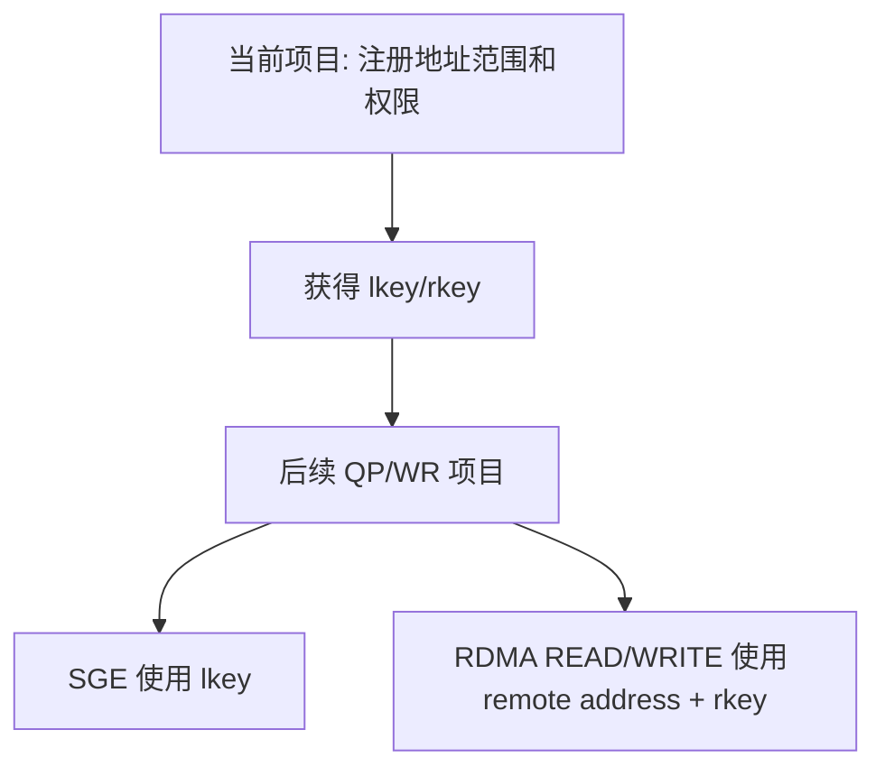
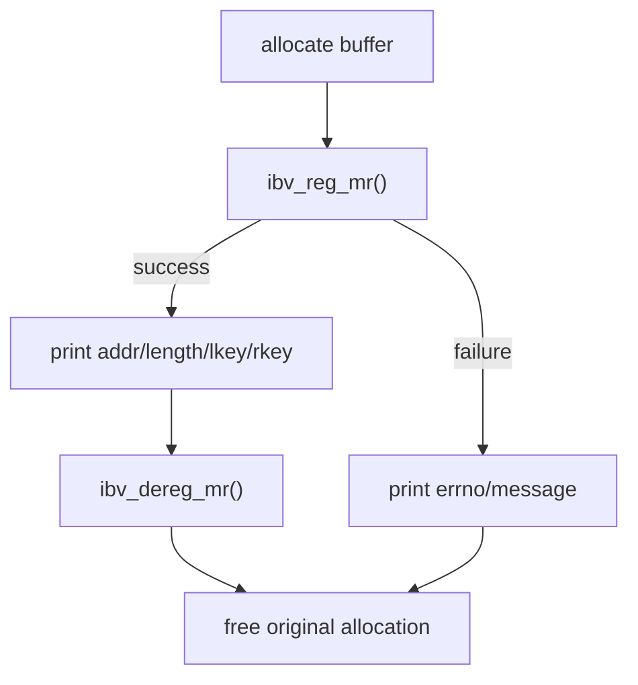

# MR 实验工程架构

## 模块关系

对象生命周期被刻意缩小为：

每个 case 都独立分配 buffer、调用 `ibv_reg_mr()`、记录 key/errno、注销 MR 并释放 buffer。这样一个 case 的 key 和资源不会污染下一个 case。

## 调用时序

## 控制面边界

当前项目不创建 QP，所以只能证明 provider 接受或拒绝某种 MR 配置，不能证明远端操作一定成功。

## 错误与清理

非对齐 case 中，注册地址是 `allocation + 1`，但 `free()` 必须接收原始 `allocation`，不能释放偏移后的地址。
