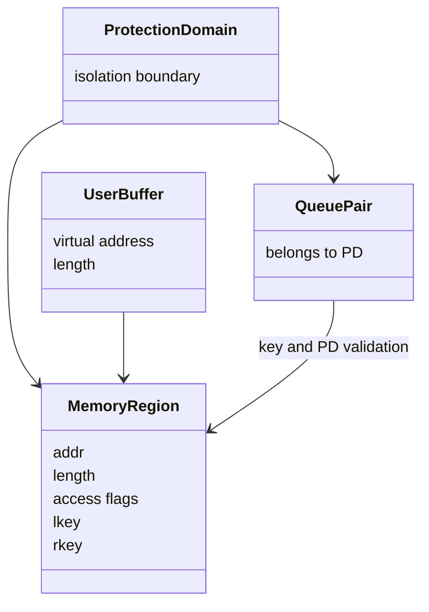
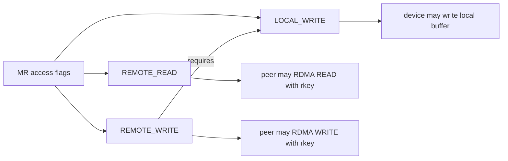
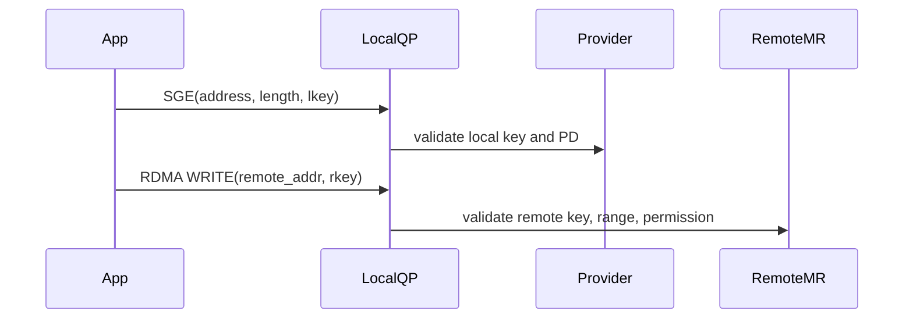
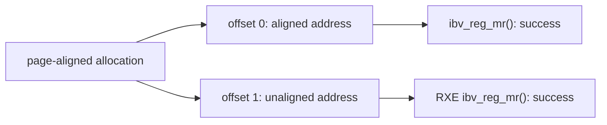
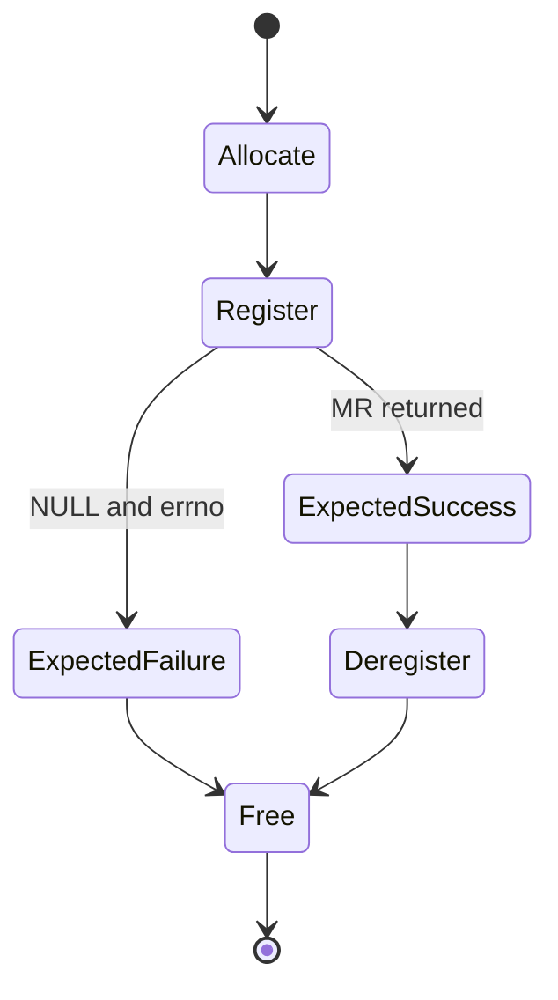
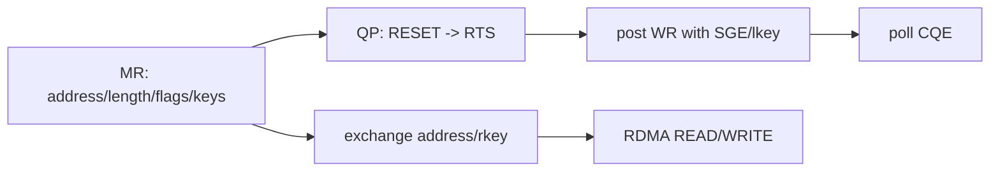

# Memory Region 深度原理

## 普通内存为什么还要注册

CPU 能访问虚拟地址，并不等于 RDMA device/provider 可以安全执行 DMA。MR 注册建立四类关系：地址范围、PD、访问权限和 key。

不同 provider 可能使用 pin pages、DMA mapping、ODP 或软件映射，因此不能把 `ibv_reg_mr()` 简化为单一“锁页”动作。稳定语义是：provider 接受一个受 PD 和权限约束的可访问区域。

## access flags

| flag | 语义 | 当前 RXE 注册结果 |
| --- | --- | --- |
| `LOCAL_WRITE` | 本地设备可写该 MR | 成功 |
| `REMOTE_READ` | 持有正确 rkey/address 的远端可读 | 单独成功 |
| `REMOTE_WRITE` | 远端可写 | 单独使用失败，`EINVAL` |
| 三者组合 | 常见可读写 MR | 成功 |

`REMOTE_WRITE` 要求 `LOCAL_WRITE`，因为远端写最终仍会修改本地内存。注册成功只是授权建立，远端仍需正确 QP 状态、地址、长度和 rkey。

## lkey 与 rkey

- `lkey` 放在本地 SGE 中，证明本地地址范围已注册且属于正确 PD。
- `rkey` 与远端虚拟地址一起交给对端，是 one-sided 操作的能力凭证。
- `ibv_dereg_mr()` 后旧 key 不应继续使用。
- key 不是加密密钥，不能代替连接鉴权和密钥交换安全设计。

## 地址对齐实验

当前 RXE/provider 接受 `allocation + 1`、长度 8191 的注册请求。这说明 verbs API 并不普遍要求用户地址页对齐，但不能推导所有 RNIC/provider 在性能、页映射和限制上完全相同。

页对齐仍有价值：更容易控制页覆盖范围、hugepage 布局、DMA 映射粒度和性能实验变量。

## 测试矩阵的逻辑

实验把“预期失败”也视为 case PASS。例如 `REMOTE_WRITE` 缺少 `LOCAL_WRITE` 时，provider 返回 `EINVAL` 正是要验证的规则，而不是项目失败。

## 与后续项目的关系

MR 项目解决的是“哪些内存被授权”；QP 状态机解决“端点如何进入可通信状态”；RC ping-pong 才验证 WR、SGE、CQE 和真实数据移动。

