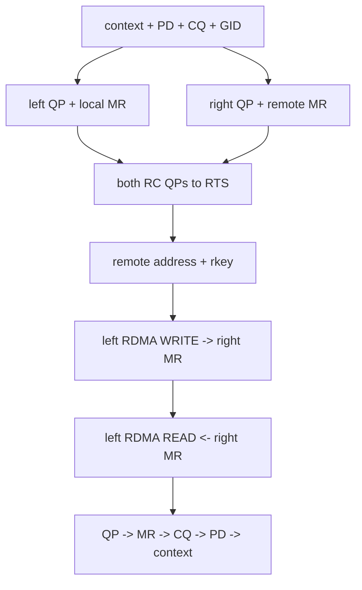
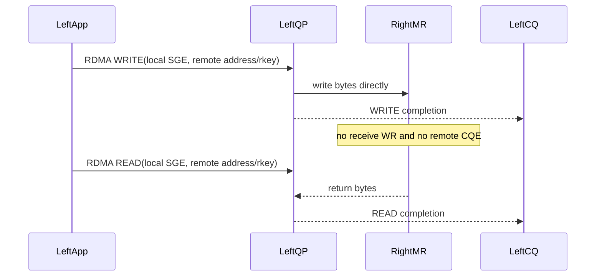
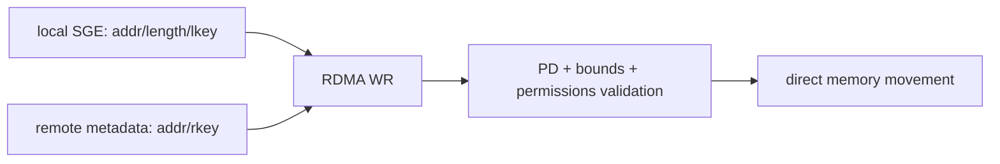

# One-Sided 工程架构

```mermaid
flowchart TD
    Env["context + PD + CQ + GID"] --> L["left QP + local MR"]
    Env --> R["right QP + remote MR"]
    L --> RTS["both RC QPs to RTS"]
    R --> RTS
    RTS --> Meta["remote address + rkey"]
    Meta --> Write["left RDMA WRITE -> right MR"]
    Write --> Read["left RDMA READ <- right MR"]
    Read --> Cleanup["QP -> MR -> CQ -> PD -> context"]
```

两个 QP 位于同一进程是为了直接观察远端 buffer；verbs 语义仍然要求 address/rkey，并经过 RXE RC transport。

```mermaid
sequenceDiagram
    participant LeftApp
    participant LeftQP
    participant RightMR
    participant LeftCQ
    LeftApp->>LeftQP: RDMA WRITE(local SGE, remote address/rkey)
    LeftQP->>RightMR: write bytes directly
    LeftQP-->>LeftCQ: WRITE completion
    Note over RightMR: no receive WR and no remote CQE
    LeftApp->>LeftQP: RDMA READ(local SGE, remote address/rkey)
    RightMR-->>LeftQP: return bytes
    LeftQP-->>LeftCQ: READ completion
```

```mermaid
flowchart LR
    Local["local SGE: addr/length/lkey"] --> WR["RDMA WR"]
    Remote["remote metadata: addr/rkey"] --> WR
    WR --> Validate["PD + bounds + permissions validation"]
    Validate --> Data["direct memory movement"]
```
