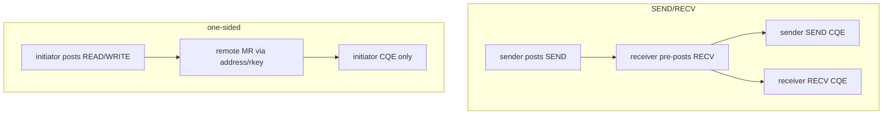
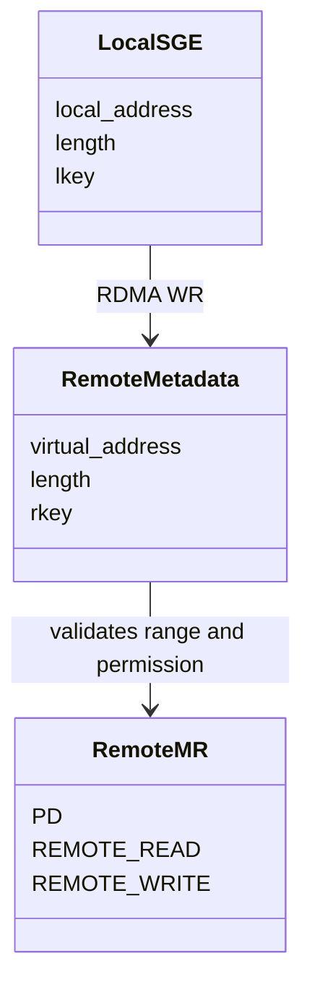
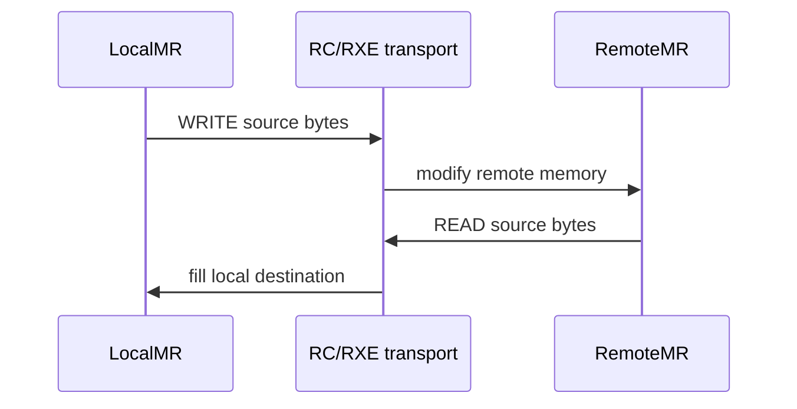
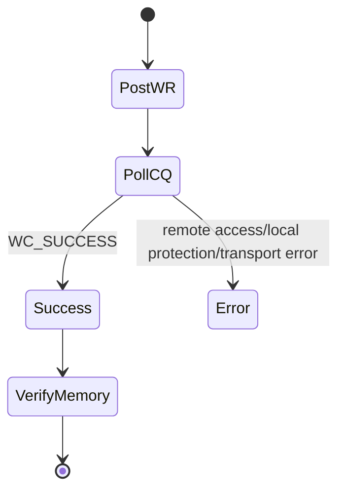

# One-Sided RDMA 深度原理

## 与 SEND/RECV 的区别

one-sided 的“单边”指数据操作不要求远端应用为每次请求 post receive 或处理 CQE，不代表远端完全不参与连接建立、MR 注册和元数据授权。

## address 与 rkey

- 本地 SGE 的 lkey 授权设备访问发起端内存。
- remote address 定位远端虚拟地址范围。
- rkey 授权该 QP 执行远端读或写。
- 长度越界、错误 rkey 或缺少 access flag 会产生 work completion error。

## WRITE 与 READ 方向

RDMA WRITE：本地 MR 是 source，远端 MR 是 destination。RDMA READ：远端 MR 是 source，本地 MR 是 destination，因此本地 MR 需要 LOCAL_WRITE。

## 完成语义

CQE success 证明 transport/provider 完成了请求；实验仍检查目标 buffer 内容，避免把“完成”与“业务数据正确”混为一谈。

## 安全边界

rkey 不是加密密钥。生产系统仍需认证连接、限制 MR 范围和生命周期、避免长期暴露大内存，并在授权结束后注销 MR。远端拿到 address/rkey 后具备直接访问能力，这是性能来源，也是安全责任。
