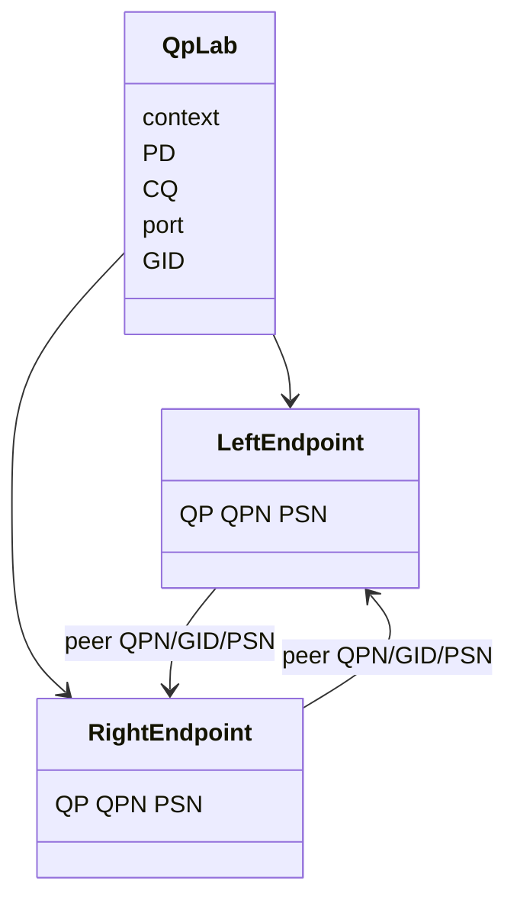
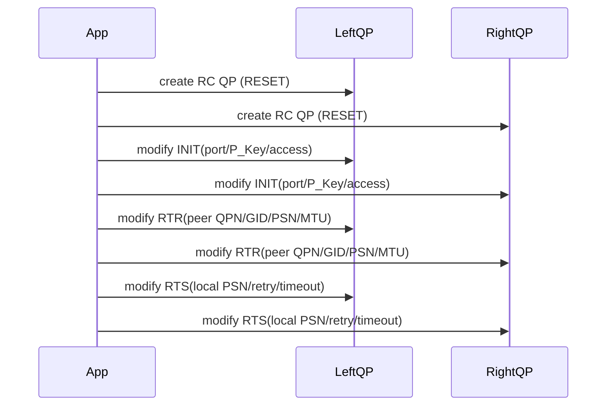
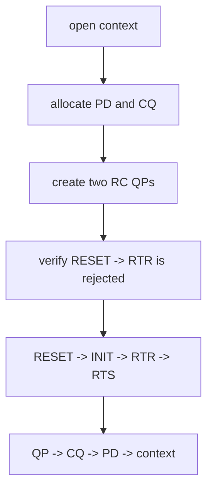

# QP 状态机工程架构

```mermaid
classDiagram
    class QpLab {
      context
      PD
      CQ
      port
      GID
    }
    class LeftEndpoint { QP QPN PSN }
    class RightEndpoint { QP QPN PSN }
    QpLab --> LeftEndpoint
    QpLab --> RightEndpoint
    LeftEndpoint --> RightEndpoint : peer QPN/GID/PSN
    RightEndpoint --> LeftEndpoint : peer QPN/GID/PSN
```

两个 QP 共用 context、PD、CQ 和本机 GID，但拥有独立 QPN 与 PSN。这样可以在单机 RXE 上学习连接参数，不提前引入网络协议交换代码。

```mermaid
sequenceDiagram
    participant App
    participant LeftQP
    participant RightQP
    App->>LeftQP: create RC QP (RESET)
    App->>RightQP: create RC QP (RESET)
    App->>LeftQP: modify INIT(port/P_Key/access)
    App->>RightQP: modify INIT(port/P_Key/access)
    App->>LeftQP: modify RTR(peer QPN/GID/PSN/MTU)
    App->>RightQP: modify RTR(peer QPN/GID/PSN/MTU)
    App->>LeftQP: modify RTS(local PSN/retry/timeout)
    App->>RightQP: modify RTS(local PSN/retry/timeout)
```

```mermaid
flowchart TD
    Open["open context"] --> Shared["allocate PD and CQ"]
    Shared --> Pair["create two RC QPs"]
    Pair --> Negative["verify RESET -> RTR is rejected"]
    Negative --> State["RESET -> INIT -> RTR -> RTS"]
    State --> Cleanup["QP -> CQ -> PD -> context"]
```
