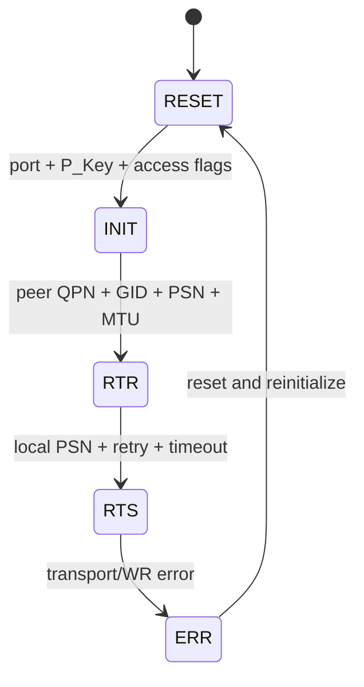
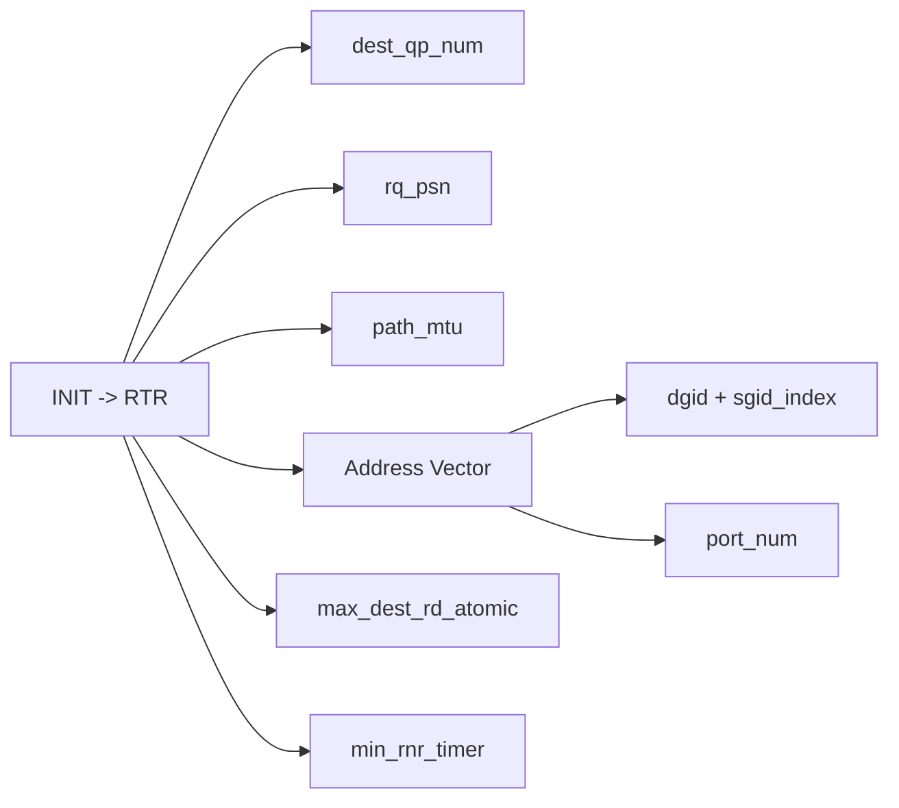
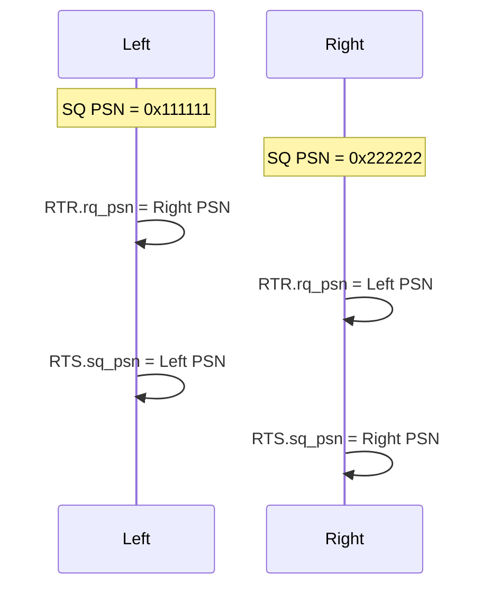
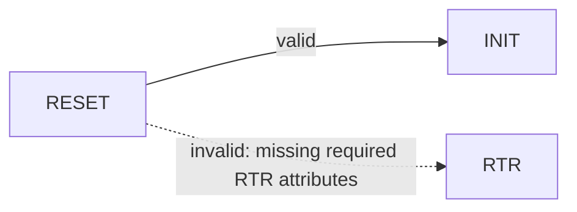

# RC QP 状态机深度解析

## 状态与职责



- RESET：对象存在，但没有本地端口和连接信息。
- INIT：确定本地 port、P_Key、允许的 remote read/write/atomic 权限。
- RTR：Receive Queue 可以接收，必须知道对端 QPN、对端起始 PSN 和路径。
- RTS：Send Queue 可以发送，补齐本地 SQ PSN、timeout 和 retry。

## RTR 为什么参数最多



RC 是连接型 transport。RTR 需要描述“从哪里接收、对端是谁、路径怎么走”。RoCE 使用 GID/GRH；InfiniBand 传统路径可使用 LID。

## PSN 与可靠性

PSN 是 24-bit Packet Sequence Number。双方各自选择发送起始 PSN；本端进入 RTR 时填写对端 PSN，进入 RTS 时填写本端 PSN。



## GID index 实测边界

当前 `rxe0` GID 表：

```text
GID[0] fe80::20c:29ff:fef8:f678
GID[1] fe80::34
```

`ens34` 固定绑定 GID[1] 对应地址。使用 index 0，或在 GID[1] 仍处于 IPv6 `tentative` 状态时，`INIT -> RTR` 返回 `ETIMEDOUT`；DAD 完成后使用 index 1，双方进入 RTS。这说明 GID 不只是一个非零值，还必须对应当前可解析、已生效的本地路径。

## 非法跳转



测试额外创建一个 QP，只携带 `IBV_QP_STATE` 请求 RESET 直接到 RTR，RXE 返回 `EINVAL`。预期失败是状态机约束的实验证据。

本项目达到 RTS 只证明控制面连接状态完整；没有 post receive/send，也没有 CQE，因此不能宣称数据收发已完成。
