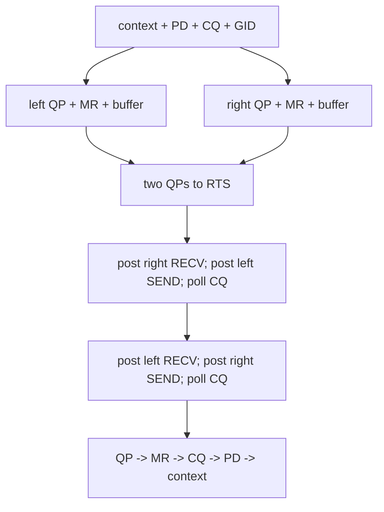
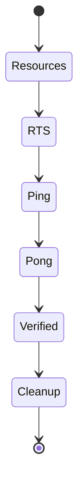

# RC Ping-Pong 工程架构

```mermaid
flowchart TD
    Env["context + PD + CQ + GID"] --> L["left QP + MR + buffer"]
    Env --> R["right QP + MR + buffer"]
    L --> Connect["two QPs to RTS"]
    R --> Connect
    Connect --> Ping["post right RECV; post left SEND; poll CQ"]
    Ping --> Pong["post left RECV; post right SEND; poll CQ"]
    Pong --> Cleanup["QP -> MR -> CQ -> PD -> context"]
```

本项目把连接建立和数据传输放在一个可执行程序中，便于逐步观察。后续可将连接参数交换拆为 client/server 两进程。

```mermaid
stateDiagram-v2
    [*] --> Resources
    Resources --> RTS
    RTS --> Ping
    Ping --> Pong
    Pong --> Verified
    Verified --> Cleanup
    Cleanup --> [*]
```
