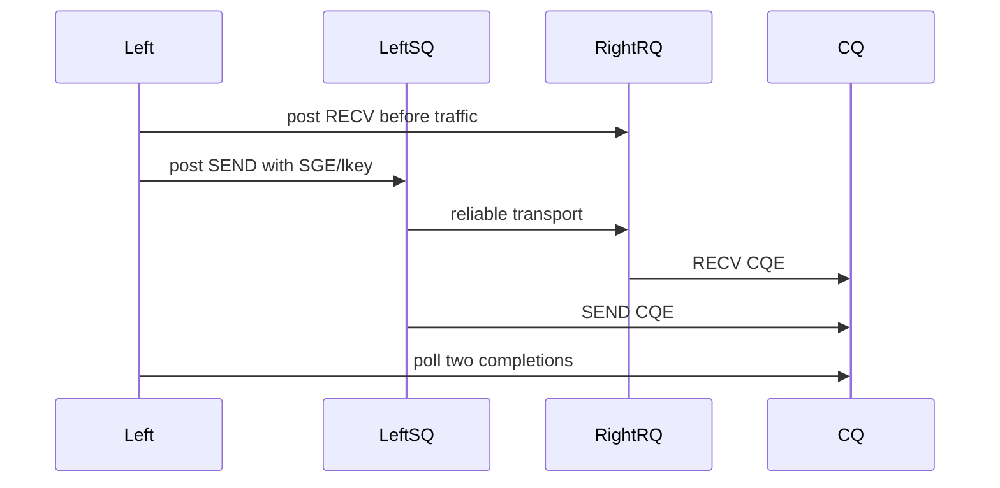
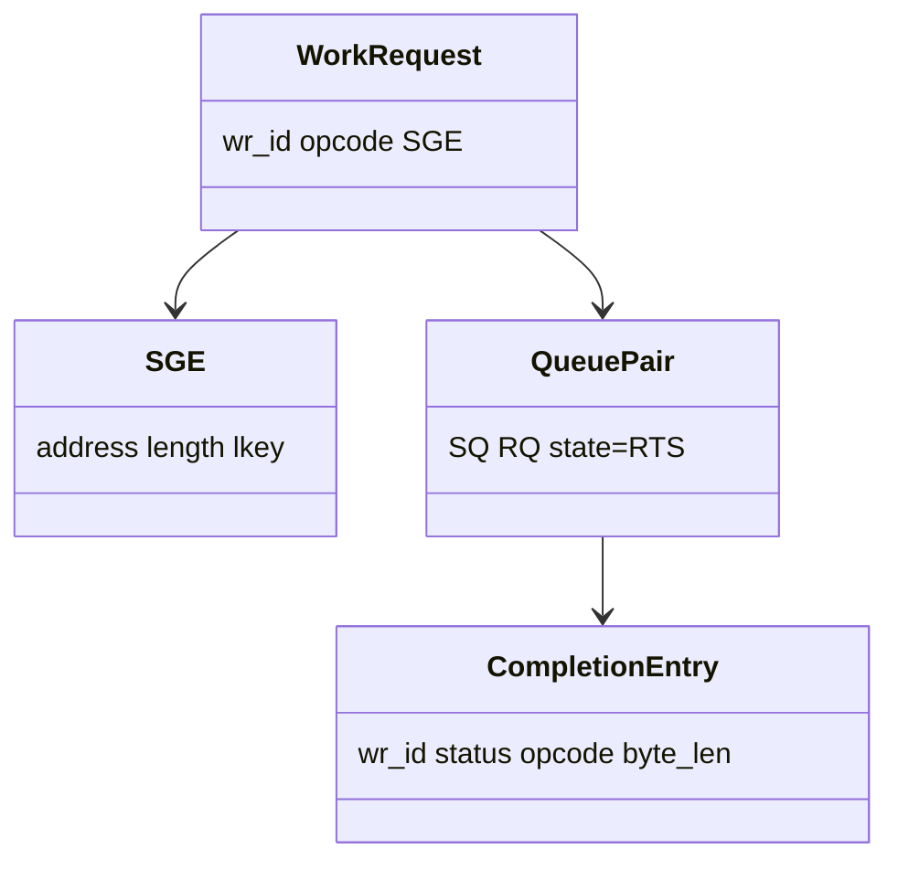

# RC Send/Recv 数据路径

Receive WR 必须提前进入 RQ。否则发送端可能遇到 Receiver Not Ready，并依赖 RNR retry。

- `wr_id` 由应用定义，用于把 CQE 关联回业务请求。
- SGE 的 lkey 授权本地设备访问已注册 MR。
- SEND CQE 的 `byte_len` 通常不用于表达发送长度；RECV CQE 的 `byte_len` 表示收到的字节数。
- `IBV_SEND_SIGNALED` 要求为 SEND 生成 CQE。

当前实验在同一进程中使用两个 QP，已经经过 RXE transport 和 CQ 语义，但没有验证跨主机网络、丢包、拥塞或真实 RNIC 性能。
