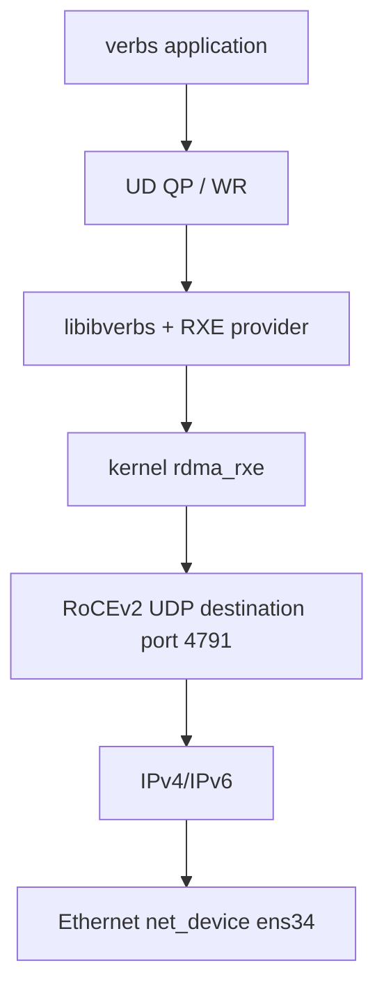
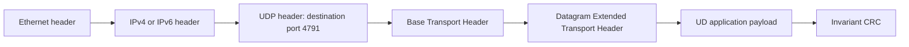
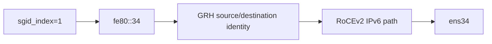

# RoCEv2 Packet Model

## 系统位置

RoCEv2 是可路由的 RDMA over Converged Ethernet 形式，使用 UDP/IP 承载 RDMA transport headers。UDP 端口通常为 4791，但可靠性语义来自 RDMA transport，而不是 UDP 自身。

UD 常包含 DETH，用于承载 source QP、Q_Key 等 datagram 信息。具体 header 长度与 opcode、IPv4/IPv6、扩展头有关，图用于建立分层模型，不代替抓包逐字段解析。

## GID 到网络地址

测试机必须等待 `fe80::34` 完成 IPv6 DAD。GID 不存在或仍 tentative 时，AH/路径解析可能失败。

## Soft-RoCE 能证明什么

RXE 能验证 verbs API、UD 状态、AH/Q_Key、GRH offset 和 CQE 语义；不能证明 RNIC offload、PCIe DMA、PFC/ECN、硬件吞吐或时延。性能与拥塞结论必须在真实 RNIC 和交换网络上测试。
