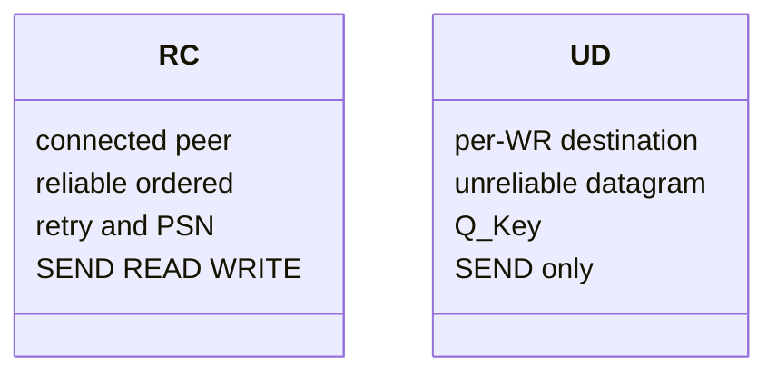
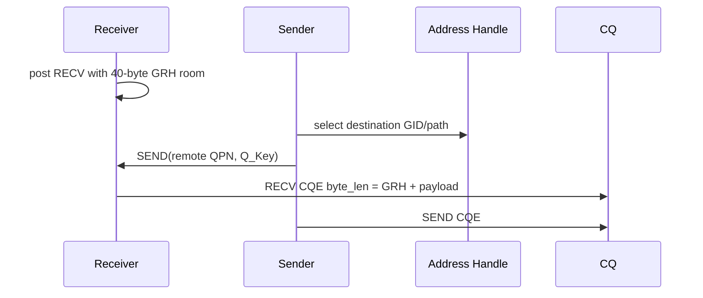
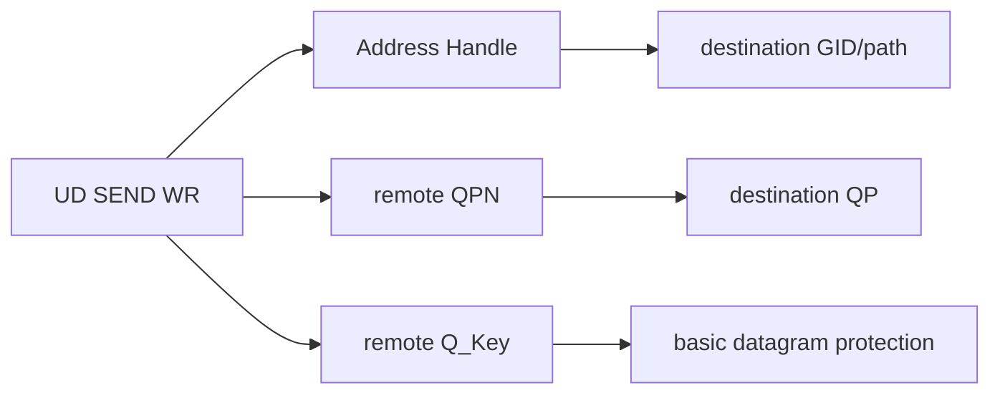
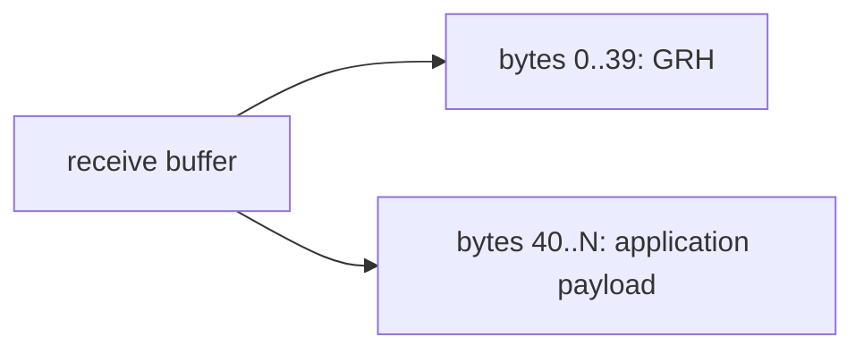

# UD Transport 深度原理

## UD 与 RC

UD QP 不在 RTR 阶段绑定唯一对端。每个 SEND WR 都携带 AH、remote QPN、remote Qkey，因此同一个 QP 可向多个目的地发送。

## Q_Key

Q_Key 是 UD QP 的基础保护字段。发送 WR 的 `remote_qkey` 必须符合接收 QP 配置。它不是加密认证，也不能提供 RC 的连接语义。

## GRH 接收偏移

本次 payload 长 24 字节，RECV CQE `byte_len=64`，验证了 `40 + 24`。应用从 `buffer + 40` 读取 payload。

## 可靠性边界

UD 不保证送达、不保证顺序、不自动消除重复。CQE success 只描述本地发送或本次接收完成，不等价于应用级可靠交付。需要可靠消息时，应用必须设计 sequence、ack、timeout、retry 和去重。
